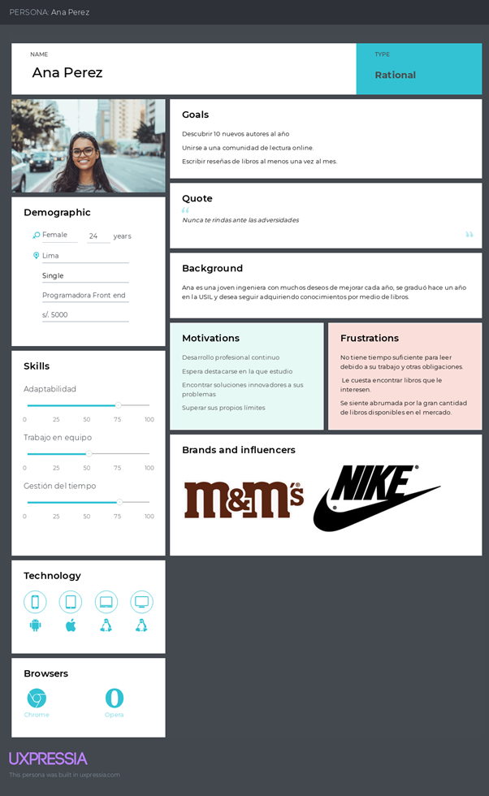
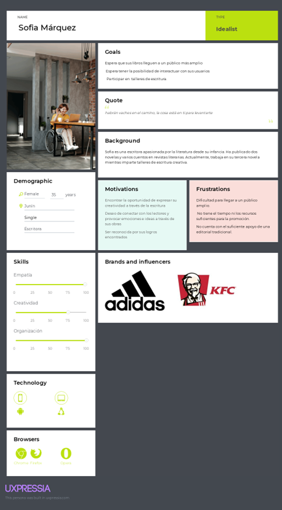
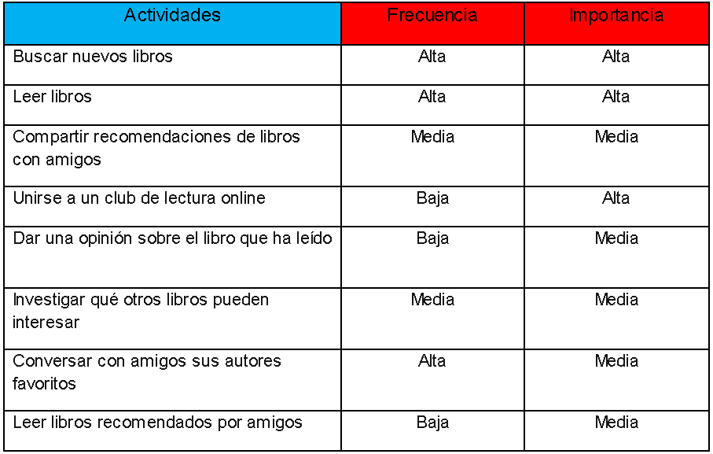
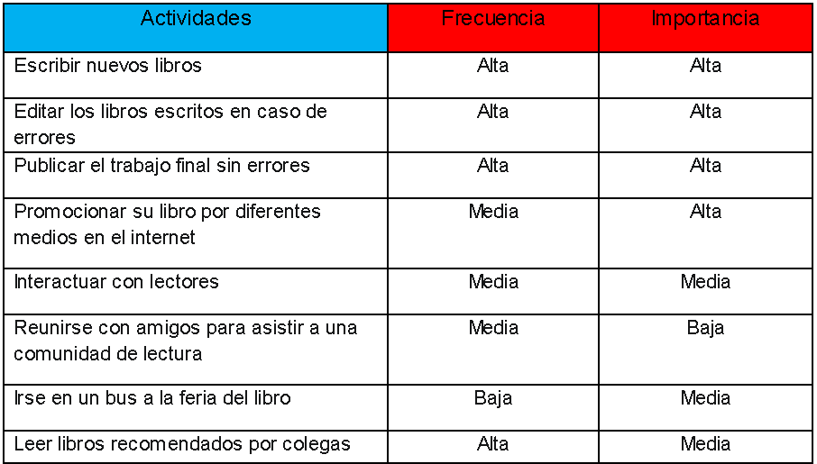
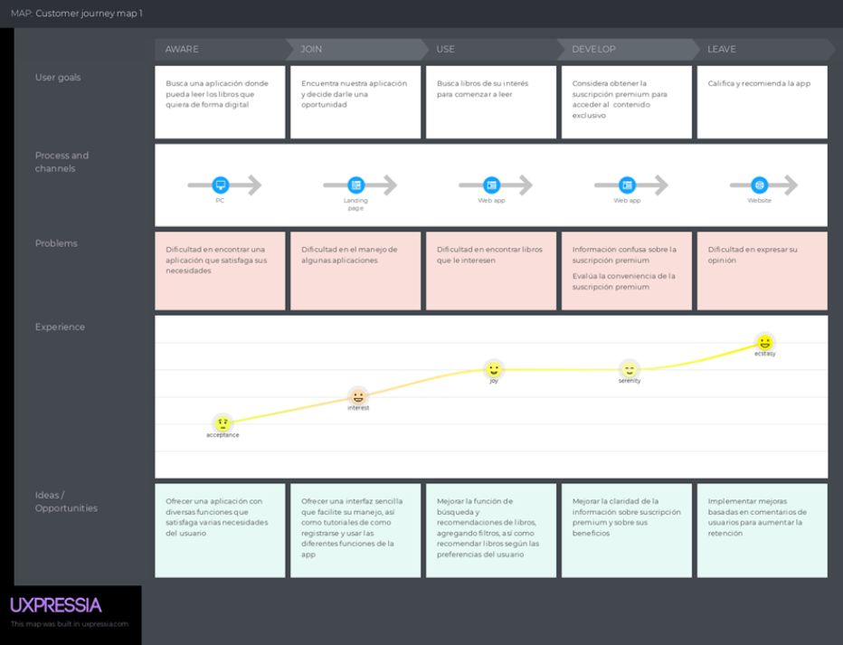
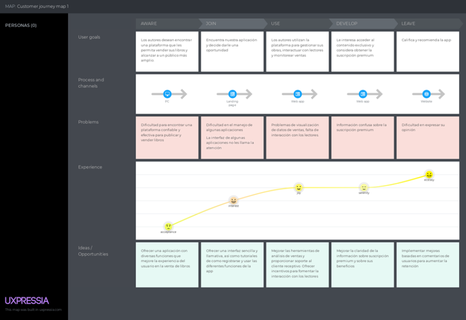
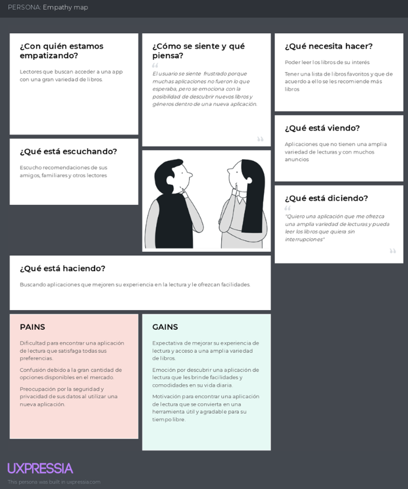
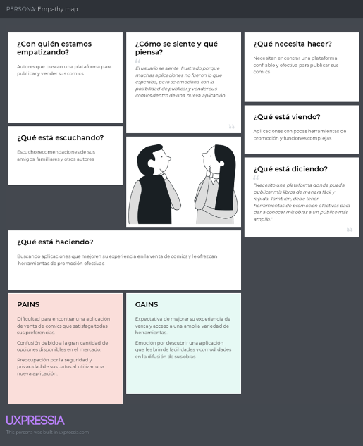
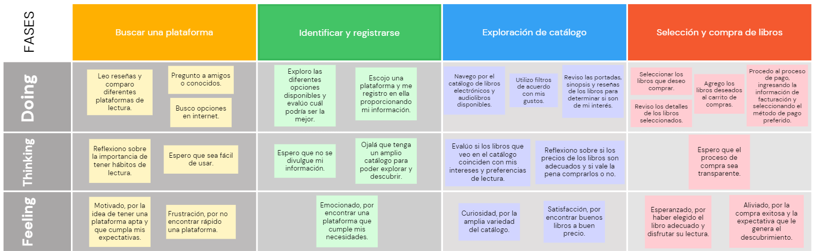
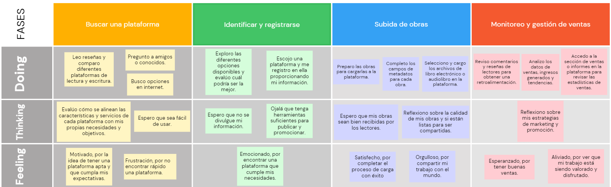

<h2>Universidad Peruana de Ciencias Aplicadas</h2>

<h2>Informe del Trabajo Final</h2>

<h3>Curso: Desarrollo de Aplicaciones Open Source</h3>
<h3>Carrera: Ingeniería de Software </h3>
<h3>Sección: SW56</h3>
<h3>Profesor: Efraín Ricardo Bautista Ubillús</h3>

<strong>Startup:</strong> XXXXXXX

<strong>Producto:</strong> XXXXXXX

<h3>Integrantes:</h3>

<ul>
  <li>Iparraguirre Rueda, Cristian Luis (u202113111)</li>
  <li>XXXXXXX (XXXXXXX)</li>
  <li>XXXXXXX (XXXXXXX)</li>
  <li>XXXXXXX (XXXXXXX)</li>
  <li>XXXXXXX (XXXXXXX)</li>
</ul>

**<h3>Septiembre, 2024</h3>**

# Registro de Versiones del Informe

| Versión | Fecha | Autor | Descripción de modificación |
|--------------|--------------|--------------|--------------|
| TB1           | 04/09/2024      | - Iparraguirre Rueda, Cristian Luis - XXXXXXX - XXXXXXX - XXXXXXX - XXXXXXX    | Implementación del capítulo 1 al 5      |

# Project Report Collaboration Insights

# Contenido
- [Registro de Versiones del Informe](#registro-de-versiones-del-informe)
- [Project Report Collaboration Insights](#project-report-collaboration-insights)
- [Contenido](#contenido)
- [Student Outcome](#student-outcome)
- [Capítulo I: Introducción](#capítulo-i-introducción)
  - [1.1. Startup Profile](#11-startup-profile)
    - [1.1.1. Descripción de la Startup](#111-descripción-de-la-startup)
    - [1.1.2. Perfiles de integrantes del equipo](#112-perfiles-de-integrantes-del-equipo)
  - [1.2. Solution Profile](#12-solution-profile)
    - [1.2.1. Antecedentes y problemática](#121-antecedentes-y-problemática)
    - [1.2.2. Lean UX Process](#122-lean-ux-process)
      - [1.2.2.1. Lean UX Problem Statements](#1221-lean-ux-problem-statements)
      - [1.2.2.2. Lean UX Assumptions](#1222-lean-ux-assumptions)
      - [1.2.2.3. Lean UX Hypothesis Statements](#1223-lean-ux-hypothesis-statements)
      - [1.2.2.4. Lean UX Canvas](#1224-lean-ux-canvas)
  - [1.3. Segmentos objetivo](#13-segmentos-objetivo)
- [Capítulo II: Requirements Elicitation \& Analysis](#capítulo-ii-requirements-elicitation--analysis)
  - [2.1. Competidores](#21-competidores)
    - [2.1.1. Análisis competitivo](#211-análisis-competitivo)
    - [2.1.2. Estrategias y tácticas frente a competidores](#212-estrategias-y-tácticas-frente-a-competidores)
  - [2.2. Entrevistas](#22-entrevistas)
    - [2.2.1. Diseño de entrevistas](#221-diseño-de-entrevistas)
    - [2.2.2. Registro de entrevistas](#222-registro-de-entrevistas)
    - [2.2.3. Análisis de entrevistas](#223-análisis-de-entrevistas)
  - [2.3. Needfinding](#23-needfinding)
    - [2.3.1. User Personas](#231-user-personas)
    - [2.3.2. User Task Matrix](#232-user-task-matrix)
    - [2.3.3. User Journey Mapping](#233-user-journey-mapping)
    - [2.3.4. Empathy Mapping](#234-empathy-mapping)
    - [2.3.5. As-is Scenario Mapping](#235-as-is-scenario-mapping)
  - [2.4. Ubiquitous Language](#24-ubiquitous-language)
- [Capítulo III: Requirements Specification](#capítulo-iii-requirements-specification)
  - [3.1. To-Be Scenario Mapping](#31-to-be-scenario-mapping)
  - [3.2. User Stories](#32-user-stories)
  - [3.3. Impact Mapping](#33-impact-mapping)
  - [3.4. Product Backlog](#34-product-backlog)
- [Capítulo IV: Product Design](#capítulo-iv-product-design)
  - [4.1. Style Guidelines](#41-style-guidelines)
    - [4.1.1. General Style Guidelines](#411-general-style-guidelines)
    - [4.1.2. Web Style Guidelines](#412-web-style-guidelines)
  - [4.2. Information Architecture](#42-information-architecture)
    - [4.2.1. Organization Systems](#421-organization-systems)
    - [4.2.2. Labeling Systems](#422-labeling-systems)
    - [4.2.3. SEO Tags and Meta Tags](#423-seo-tags-and-meta-tags)
    - [4.2.4. Searching Systems](#424-searching-systems)
    - [4.2.5. Navigation Systems](#425-navigation-systems)
  - [4.3. Landing Page UI Design](#43-landing-page-ui-design)
    - [4.3.1. Landing Page Wireframe](#431-landing-page-wireframe)
    - [4.3.2. Landing Page Mock-up](#432-landing-page-mock-up)
  - [4.4. Web Applications UX/UI Design](#44-web-applications-uxui-design)
    - [4.4.1. Web Applications Wireframes](#441-web-applications-wireframes)
    - [4.4.2. Web Applications Wireflow Diagrams](#442-web-applications-wireflow-diagrams)
    - [4.4.2. Web Applications Mock-ups](#442-web-applications-mock-ups)
    - [4.4.3. Web Applications User Flow Diagrams](#443-web-applications-user-flow-diagrams)
  - [4.5. Web Applications Prototyping](#45-web-applications-prototyping)
  - [4.6. Domain-Driven Software Architecture](#46-domain-driven-software-architecture)
    - [4.6.1. Software Architecture Context Diagram](#461-software-architecture-context-diagram)
    - [4.6.2. Software Architecture Container Diagrams](#462-software-architecture-container-diagrams)
    - [4.6.3. Software Architecture Components Diagrams](#463-software-architecture-components-diagrams)
  - [4.7. Software Object-Oriented Design](#47-software-object-oriented-design)
    - [4.7.1. Class Diagrams](#471-class-diagrams)
    - [4.7.2. Class Dictionary](#472-class-dictionary)
  - [4.8. Database Design](#48-database-design)
    - [4.8.1. Database Diagram](#481-database-diagram)
- [Capítulo V: Product Implementation, Validation \& Deployment](#capítulo-v-product-implementation-validation--deployment)
  - [5.1. Software Configuration Management](#51-software-configuration-management)
    - [5.1.1. Software Development Environment Configuration](#511-software-development-environment-configuration)
    - [5.1.2. Source Code Management](#512-source-code-management)
    - [5.1.3. Source Code Style Guide \& Conventions](#513-source-code-style-guide--conventions)
    - [5.1.4. Software Deployment Configuration](#514-software-deployment-configuration)
  - [5.2. Landing Page, Services \& Applications Implementation](#52-landing-page-services--applications-implementation)
    - [5.2.X. Sprint n](#52x-sprint-n)
      - [5.2.X.1. Sprint Planning n](#52x1-sprint-planning-n)
      - [5.2.X.2. Sprint Backlog n](#52x2-sprint-backlog-n)
      - [5.2.X.3. Development Evidence for Sprint Review](#52x3-development-evidence-for-sprint-review)
      - [5.2.X.4. Testing Suite Evidence for Sprint Review](#52x4-testing-suite-evidence-for-sprint-review)
      - [5.2.X.5. Execution Evidence for Sprint Review](#52x5-execution-evidence-for-sprint-review)
      - [5.2.X.6. Services Documentation Evidence for Sprint Review](#52x6-services-documentation-evidence-for-sprint-review)
      - [5.2.X.7. Software Deployment Evidence for Sprint Review](#52x7-software-deployment-evidence-for-sprint-review)
      - [5.2.X.8. Team Collaboration Insights during Sprint](#52x8-team-collaboration-insights-during-sprint)
  - [5.3. Validation Interviews](#53-validation-interviews)
    - [5.3.1. Diseño de Entrevistas](#531-diseño-de-entrevistas)
    - [5.3.2. Registro de Entrevistas](#532-registro-de-entrevistas)
    - [5.3.3. Evaluaciones según heurísticas](#533-evaluaciones-según-heurísticas)
  - [5.4. Video About-the-Product](#54-video-about-the-product)
- [Conclusiones](#conclusiones)
  - [Conclusiones y recomendaciones](#conclusiones-y-recomendaciones)
  - [Video About-the-Team](#video-about-the-team)
- [Bibliografía](#bibliografía)
- [Anexos](#anexos)

# Student Outcome
# Capítulo I: Introducción
## 1.1. Startup Profile
### 1.1.1. Descripción de la Startup
### 1.1.2. Perfiles de integrantes del equipo
## 1.2. Solution Profile
### 1.2.1. Antecedentes y problemática
### 1.2.2. Lean UX Process
#### 1.2.2.1. Lean UX Problem Statements
#### 1.2.2.2. Lean UX Assumptions
#### 1.2.2.3. Lean UX Hypothesis Statements
#### 1.2.2.4. Lean UX Canvas
## 1.3. Segmentos objetivo
# Capítulo II: Requirements Elicitation & Analysis
## 2.1. Competidores
Algunos de los competidores a los que Feather Book podría enfrentarse son:
<ul>
    <li>
        <b>Goodreads: </b>Plataforma líder en la recomendación de libros, donde los usuarios pueden descubrir nuevos títulos, llevar un registro de los libros que han leído y conectarse con otros lectores. Ofrece funciones como 
        reseñas de libros, listas de lectura y grupos de discusión.
    </li>
    <li>
        <b>Scribd: </b>Plataforma de suscripción que ofrece acceso a una amplia variedad de libros electrónicos, audiolibros, revistas y documentos. Los usuarios pagan una tarifa mensual para acceder a contenido ilimitado, lo que
        les permite explorar de una amplia gama de material de lectura.
    </li>
    <li>
        <b>Audible: </b>Plataforma de audiolibros propiedad de Amazon, que ofrece una amplia selección de audiolibros narrados por profesionales. Los usuarios pueden comprar audiolibros individualmente o suscribirse a un plan 
        mensual. También ofrece contenido exclusivo y original.
    </li>
</ul>

### 2.1.1. Análisis competitivo
<table><tr><th colspan="16" valign="top"><b>Competitive Analysis Landscape</b></th></tr>
<tr><td colspan="9" valign="top">¿Por qué llevar a cabo este análisis?  </td><td colspan="7" valign="top">Este análisis se lleva a cabo para poder investigar, analizar y comparar el comportamiento de los competidores directos o indirectos en el mercado.</td></tr>
<tr><td colspan="6" valign="top">
<b>Nombre</b>

</td><td colspan="3" valign="top"><b>Feather Book</b></td><td colspan="3" valign="top"><b>Goodreads</b></td><td colspan="3" valign="top"><b>Scribd</b></td><td valign="top"><b>Audible</b></td></tr>
<tr><td colspan="6" valign="top"><b>Logo</b> </td><td colspan="3" valign="top"></td><td colspan="3" valign="top"></td><td colspan="3" valign="top"><td valign="top"></tr>
<tr><td colspan="3" rowspan="4" valign="top"><b>Perfil</b></td><td colspan="3" rowspan="2" valign="top"><b>Overview</b></td><td colspan="3" rowspan="2" valign="top">Plataforma diseñada para</b> promover hábitos de lectura mediante tecnologías innovadoras que facilitan el acceso, distribución y creación de contenido. Su objetivo principal es fomentar la sostenibilidad a largo plazo. Además, cuenta con una tienda integrada donde los usuarios pueden comprar libros electrónicos, audiolibros y otros productos relacionados con la lectura. </td><td colspan="3" rowspan="2" valign="top">Plataforma diseñada para ayudar a los lectores a descubrir, seguir y compartir sus libros favoritos. Su objetivo principal es conectar a los lectores, permitiéndoles descubrir nuevos títulos, llevar un registro de lo que han leído y lo que desean leer, además de proporcionarles reseñas y recomendaciones de otros usuarios.</td><td colspan="3" rowspan="2" valign="top">Plataforma de suscripción que ofrece acceso ilimitado a una amplia variedad de libros electrónicos, audiolibros, revistas y documentos. Su objetivo principal es proporcionar a los usuarios una experiencia de lectura completa y personalizada, permitiéndoles explorar y disfrutar de una amplia gama de contenido bajo un modelo de suscripción mensual.</td><td rowspan="2" valign="top">Plataforma líder en audiolibros que ofrece a los usuarios acceso a una extensa biblioteca de títulos narrados por profesionales. Su objetivo principal es brindar una experiencia de lectura inmersiva y conveniente, permitiendo a los usuarios disfrutar de libros mientras realizan otras actividades, como conducir, hacer ejercicio o relajarse. </td></tr>
<tr></tr>
<tr><td colspan="3" rowspan="2" valign="top"><b>Ventaja competitiva ¿Qué valor ofrece a los clientes?</b></td><td colspan="3" rowspan="2" valign="top">Acceso conveniente a una amplia variedad de contenido de lectura, una experiencia premium sin publicidad y un entorno seguro para disfrutar de la lectura.</td><td colspan="3" rowspan="2" valign="top">Facilidad en el descubrimiento de libros, la interacción social entre los lectores y la personalización de recomendaciones.</td><td colspan="3" rowspan="2" valign="top">Amplia selección de contenido, conveniencia de acceso, recomendaciones personalizadas y un modelo de suscripción rentable.</td><td rowspan="2" valign="top">Amplia selección de audiolibros de alta calidad, narraciones profesionales, flexibilidad de acceso y funciones adicionales exclusivas.</td></tr>
<tr></tr>
<tr><td colspan="3" rowspan="2" valign="top"><b>Perfil de Marketing</b></td><td colspan="3" valign="top"><b>Mercado objetivo</b></td><td colspan="3" valign="top">Lectores apasionados, usuarios digitales, suscriptores de servicios de lectura y personas interesadas en participar en una comunidad de lectura en línea.</td><td colspan="3" valign="top">Lectores apasionados, profesionales del mundo editorial, grupos de lectura y clubes literarios, así como a personas interesadas en la crítica y el análisis literario.</td><td colspan="3" valign="top">lectores ávidos, personas ocupadas que valoran la conveniencia, una audiencia diversa con diferentes intereses de lectura, y aquellos que buscan material educativo y de aprendizaje.</td><td valign="top">Amantes de los audiolibros, personas que buscan multitarea, aquellos con discapacidades visuales o dificultades de lectura.</td></tr>
<tr><td colspan="3" valign="top"><b>Estrategias de Marketing</b></td><td colspan="3" valign="top">
Presencia en redes sociales. Landing page atractiva. Participación en consorcios de lectura.

Ofertas por nuevo lanzamiento.

Colaboraciones con influencers.
</td><td colspan="3" valign="top">
Construir una comunidad activa de lectores, ofreciendo características como grupos de lectura y reseñas.

Promocionar nuevos lanzamientos.
</td><td colspan="3" valign="top">Ofrece períodos de prueba gratuitos y promociones para destacar su amplia selección de contenido. Colaboraciones con influencers para aumentar su alcance entre el público objetivo.</td><td valign="top">
Patrocinios y asociaciones con eventos y celebridades.

Programas de recomendación para aumentar su base de usuarios y generar lealtad entre los clientes existentes.

</td></tr>
<tr><td colspan="3" rowspan="3" valign="top"><b>Perfil de producto</b></td><td colspan="3" valign="top"><b>Productos y Servicios</b></td><td colspan="3" valign="top">Una plataforma de lectura digital, dos planes de suscripción, una tienda integrada, funciones de comunidad y colaboraciones con autores y editores.</td><td colspan="3" valign="top">Ofrece una plataforma en línea integral que facilita el descubrimiento de libros, el seguimiento de la lectura y la interacción con una comunidad de lectores.</td><td colspan="3" valign="top">Ofrece una suscripción de contenido ilimitado que permite a los usuarios acceder a una amplia variedad de material de lectura en diferentes formatos.</td><td valign="top">ofrece una amplia gama de audiolibros y contenido adicional, con una suscripción mensual que permite a los usuarios acceder al contenido en múltiples plataformas</td></tr>
<tr><td colspan="3" valign="top"><b>Precios y Costos</b></td><td colspan="3" valign="top">Ofrece una suscripción mensual que brinda a los usuarios acceso a contenido exclusivo, recomendaciones personalizadas, comentar y calificar libros a $8.95 USD al mes. Además, otra suscripción mensual con capacidad de comunicación con autores, descuentos y preventa exclusiva a $18.95 USD.</td><td colspan="3" valign="top">Ofrece opciones publicitarias pagadas para autores y editores que deseen promocionar sus libros de manera destacada por $19.95 USD.</td><td colspan="3" valign="top">Ofrece una suscripción mensual que proporciona acceso ilimitado a su biblioteca de libros electrónicos, audiolibros, revistas y documentos. Los precios de estas suscripciones pueden oscilar entre aproximadamente $8.99 a $9.99 USD por mes.</td><td valign="top">
La suscripción mensual a Audible generalmente cuesta alrededor de $14.95 por mes. Esta tarifa mensual incluye un crédito que puede canjearse por un audiolibro.

El costo de los audiolibros individuales varía según el título y la duración del libro. Los precios pueden oscilar entre $10 y $40 por audiolibro.
</td></tr>
<tr><td colspan="3" valign="top"><b>Canales de distribución</b></td><td colspan="3" valign="top">
- Página web

- Aplicaciones móviles en dispositivos iOS y Android.

</td><td colspan="3" valign="top">
- Página web

- Aplicaciones móviles en dispositivos iOS y Android.
</td><td colspan="3" valign="top">
- Página web

- Aplicaciones móviles en dispositivos iOS y Android.
</td><td valign="top">
- Página web

- Aplicaciones móviles en dispositivos iOS y Android.
</td></tr>
<tr><td colspan="3" rowspan="4" valign="top"><b>Análisis FODA</b></td><td colspan="3" valign="top"><b>Fortalezas</b></td><td colspan="3" valign="top">
- Plataforma integral

- Suscripción premium

- Tienda integrada

- Enfoque a la comunidad

- Interfaz de usuario llamativo
</td><td colspan="3" valign="top">
- Gran comunidad de lectores

- Funciones de descubrimiento

- Integración con otras plataformas

- Plataforma diversificada
</td><td colspan="3" valign="top">
- Amplia variedad de contenido

- Modelo de suscripción ilimitada

- Flexibilidad de acceso

- Funciones de personalización
</td><td valign="top">
- Gran selección de audiolibros

- Calidad de producción

- Flexibilidad de acceso

- Programas y contenido adicional
</td></tr>
<tr><td colspan="3" valign="top"><b>Debilidades</b></td><td colspan="3" valign="top">
- Competencia feroz

- Dependencia de la tecnología
</td><td colspan="3" valign="top">
- Interfaz de usuario

- Funcionalidades limitadas

- Calidad de las reseñas

- Competencia
</td><td colspan="3" valign="top">
- Limitaciones de disponibilidad

- Rotación de contenido

- Experiencia del usuario

- Competencia
</td><td valign="top">
- Modelo de suscripción

- Precios individuales

- Limitaciones regionales

- Competencia
</td></tr>
<tr><td colspan="3" valign="top"><b>Oportunidades</b></td><td colspan="3" valign="top">
- Expansión internacional

- Colaboraciones estratégicas

- Innovación tecnológica
</td><td colspan="3" valign="top">
- Expansión internacional

- Innovación en la experiencia del usuario

- Colaboraciones estratégicas
</td><td colspan="3" valign="top">
- Expansión internacional

- Colaboraciones con editores y autores

- Innovación tecnológica
</td><td valign="top">
- Expansión internacional

- Colaboraciones con autores y celebridades

- Innovación en la experiencia del usuario
</td></tr>
<tr><td colspan="3" valign="top"><b>Amenazas</b></td><td colspan="3" valign="top">
- Competencia de otras plataformas de suscripción

- Problemas legales de derechos de autor

- Limitaciones de catálogo

- Cambios en las preferencias de los usuarios
</td><td colspan="3" valign="top">
- Competencia de otras plataformas

- Cambios en los hábitos de lectura

- Problemas de privacidad y seguridad

- Cambios en las políticas de la empresa matriz
</td><td colspan="3" valign="top">
- Competencia de otras plataformas de suscripción

- Problemas legales de derechos de autor

- Limitaciones de catálogo

- Cambios en las preferencias de los usuarios
</td><td valign="top">
- Competencia de otras plataformas de audiolibros

- Cambios en el mercado editorial

- Precios de audiolibros

- Cambio en los hábitos de consumo
</td></tr>
</table>

### 2.1.2. Estrategias y tácticas frente a competidores

  
**Estrategia de distinción:**

Para diferenciarnos, hemos creado un club de lectura virtual en el que los usuarios podrán debatir libros seleccionados directamente con los autores. Estos eventos incluirán sesiones de preguntas y respuestas en vivo, paneles de discusión y oportunidades para interactuar de manera cercana con los escritores. También ofreceremos talleres en línea impartidos por autores y profesionales de la industria editorial. Además, implementaremos una inteligencia artificial que proporcionará recomendaciones de lectura altamente personalizadas, basadas en las preferencias, historial de lectura y actividades de cada usuario dentro de la plataforma, asegurando una experiencia única y adaptada a sus intereses.

**Estrategia de liderazgo en costos:**

Nos centraremos en minimizar los costos operativos y ofrecer precios competitivos para nuestras suscripciones premium y productos en la tienda integrada. Para lograrlo, optimizaremos procesos internos, negociaremos acuerdos favorables con proveedores y aprovecharemos tecnologías eficientes que reduzcan los gastos. Al mantener bajos los costos, Feather Book podrá ofrecer tarifas más atractivas para sus usuarios, aumentando su competitividad en el mercado y capturando una mayor cuota de clientes, todo mientras mantenemos la calidad del servicio.

**Estrategia de mercadotecnia:**

Implementamos diversas estrategias de mercadotecnia, como campañas publicitarias en línea dirigidas a audiencias específicas interesadas en la lectura y los libros electrónicos. Utilizamos redes sociales como Instagram, Twitter, Facebook y LinkedIn para promover contenido, interactuar con la comunidad lectora, responder preguntas y compartir novedades de la plataforma. Además, colaboramos con influencers del ámbito literario para promocionar Feather Book. Para atraer a nuevos usuarios, también lanzamos ofertas promocionales, como períodos de prueba gratuitos para la suscripción premium y descuentos en la tienda integrada, incentivando a más personas a probar la plataforma.

**Tácticas:**

Nuestras tácticas incluyen llevar a cabo investigaciones exhaustivas del mercado digital para comprender mejor las necesidades insatisfechas de los usuarios en el ámbito de la lectura. Esta información nos permite adaptar nuestro sistema de manera precisa para satisfacer esas demandas específicas, asegurando que nuestras soluciones estén alineadas con las expectativas del mercado. Con este enfoque, logramos ofrecer una experiencia de lectura más satisfactoria y relevante para nuestros usuarios, diferenciándonos al responder de manera efectiva a sus necesidades.

## 2.2. Entrevistas
### 2.2.1. Diseño de entrevistas
Lectores
<ol>
    <li>¿Qué géneros literarios prefieres leer?
</li>
    <li>¿Cuál es tu mayor desafío al encontrar tiempo para leer?
</li>
    <li>¿Qué te motiva a seguir leyendo un libro hasta el final?
</li>
    <li>¿Qué tipo de funciones o características te resultan más atractivas en una aplicación de lectura?
</li>
    <li>¿Qué otros tipos de contenido relacionado con la lectura te interesaría encontrar en la aplicación?
</li>
    <li>¿Cómo te gustaría interactuar con otros lectores en la aplicación?
</li>
    <li>¿Qué medidas de seguridad y privacidad consideras más importantes al usar una aplicación de lectura?
</li>
    <li>¿Qué estrategias te ayudarían a mantener un hábito de lectura constante?
</li>
    <li>¿Qué aspectos te resultan más atractivos al comprar libros electrónicos o audiolibros en línea?
</li>
    <li>¿Qué te hace abandonar la lectura de un libro antes de terminarlo?
</li>
    <li>¿Qué tipo de recompensas o beneficios te gustaría obtener por ser un usuario leal de la aplicación?
</li>
    <li>¿Cómo te gustaría que la aplicación te ayudara a descubrir nuevos títulos y autores de interés?</li>
</ol>

Autores

<ol>
    <li>¿En qué géneros te especializas como escritor? ¿Qué te atrae de esos géneros?
    </li>
    <li>¿Podrías describir tu proceso creativo? ¿Cómo se te ocurren las ideas para tus historias?
    </li>
    <li>¿Qué herramientas o recursos utilizas para escribir? ¿Hay algún software o aplicación que te sea indispensable?
    </li>
    <li>¿Cómo te mantienes motivado y disciplinado para escribir con regularidad?
    </li>
    <li>¿Qué papel juega la lectura en tu vida como autor? ¿Cómo influyen tus lecturas en tu propia escritura?
    </li>
    <li>¿Has tenido la oportunidad de publicar tu trabajo? ¿En qué plataformas o formatos has publicado?
    </li>
    <li>¿Cómo te ha impactado la tecnología en tu experiencia como escritor? ¿Utilizas alguna herramienta digital para la escritura o la promoción de tu trabajo?
    </li>
    <li>¿Has participado en talleres de escritura o comunidades de autores? ¿Qué beneficios has obtenido de estas experiencias?
    </li>
    <li>¿Cuáles son tus principales desafíos como autor? ¿Qué obstáculos has enfrentado en tu carrera?
    </li>
    <li>¿Qué consejos le darías a un aspirante a escritor que está empezando su camino?
    </li>
    <li>¿Qué te parece la idea de una aplicación dedicada a fomentar la lectura? ¿Qué funcionalidades te gustaría que tuviera una aplicación así para ser útil a los autores?
    </li>
    <li>¿Cómo te gustaría que la aplicación te ayudara a mejorar tu experiencia como autor? ¿Qué beneficios esperas obtener de su uso?</li>
</ol>

### 2.2.2. Registro de entrevistas
### Lectores:

### Autores:
Entrevistada #1: Aleshka Fernandez

<ul>
    <li>
        Sexo: Femenino
    </li>
    <li>
        Edad: 24 años
    </li>
    <li>
        Distrito en el que vive: San Borja
    </li>
</ul>
Entrevista:
<ul>
    <li>
        Link: <a href="https://www.youtube.com/watch?v=V8NYPikl5B8">Click para ver entrevista</a>
    </li>
    <li>
        Duración: 10:45
    </li>
      <li>
        Entrevistador: La Torre Valle, Franz Jair 
    </li>
</ul>

Resumen:

    Entrevistamos a Aleshka Fernández, de 24 años, quien se siente atraída principalmente por los géneros de fantasía y terror. Aleshka menciona que suele utilizar Google Docs para escribir y prefiere no tener distracciones digitales ni acceder a redes sociales durante ese tiempo. Destaca la importancia de la lectura para ampliar su vocabulario y encontrar referencias para sus personajes. Comenzó su trayectoria en Wattpad y luego llevó algunos de sus cuentos cortos a Webtoon. Para promocionar sus historias, utiliza Twitter e Instagram. Además, ha participado en talleres de autores, los cuales le resultaron muy útiles para conocer la experiencia de otros escritores y superar bloqueos creativos. Una de sus mayores dificultades es mantenerse relevante en el medio, ya que requiere mucha creatividad. Sus consejos para los aspirantes son leer mucho, buscar referentes y nutrirse de información sobre los temas que desean abordar. Considera que una aplicación útil debería tener una buena recepción de archivos, un espacio para publicar borradores, un foro de interacción y actividades recurrentes como charlas para discutir trabajos destacados. Espera que la aplicación le ayude a divulgar su trabajo, impulse a escritores nuevos, ofrezca sugerencias de búsqueda y brinde recomendaciones constantes.

### 2.2.3. Análisis de entrevistas
## 2.3. Needfinding
### 2.3.1. User Personas
### Lectores:

### Autores:

### 2.3.2. User Task Matrix
### Lectores:

### Autores:

### 2.3.3. User Journey Mapping
### Lectores:

### Autores:

### 2.3.4. Empathy Mapping
### Lectores:

### Autores:

### 2.3.5. As-is Scenario Mapping
### Lectores:

### Autores:

## 2.4. Ubiquitous Language
# Capítulo III: Requirements Specification
## 3.1. To-Be Scenario Mapping
## 3.2. User Stories
## 3.3. Impact Mapping
## 3.4. Product Backlog
# Capítulo IV: Product Design
## 4.1. Style Guidelines
### 4.1.1. General Style Guidelines
### 4.1.2. Web Style Guidelines
## 4.2. Information Architecture
### 4.2.1. Organization Systems
### 4.2.2. Labeling Systems
### 4.2.3. SEO Tags and Meta Tags
### 4.2.4. Searching Systems
### 4.2.5. Navigation Systems
## 4.3. Landing Page UI Design
### 4.3.1. Landing Page Wireframe
### 4.3.2. Landing Page Mock-up
## 4.4. Web Applications UX/UI Design
### 4.4.1. Web Applications Wireframes
### 4.4.2. Web Applications Wireflow Diagrams
### 4.4.2. Web Applications Mock-ups
### 4.4.3. Web Applications User Flow Diagrams
## 4.5. Web Applications Prototyping
## 4.6. Domain-Driven Software Architecture
### 4.6.1. Software Architecture Context Diagram
### 4.6.2. Software Architecture Container Diagrams
### 4.6.3. Software Architecture Components Diagrams
## 4.7. Software Object-Oriented Design
### 4.7.1. Class Diagrams
### 4.7.2. Class Dictionary
## 4.8. Database Design
### 4.8.1. Database Diagram
# Capítulo V: Product Implementation, Validation & Deployment
## 5.1. Software Configuration Management
### 5.1.1. Software Development Environment Configuration
### 5.1.2. Source Code Management
### 5.1.3. Source Code Style Guide & Conventions
### 5.1.4. Software Deployment Configuration
## 5.2. Landing Page, Services & Applications Implementation
### 5.2.X. Sprint n
#### 5.2.X.1. Sprint Planning n
#### 5.2.X.2. Sprint Backlog n
#### 5.2.X.3. Development Evidence for Sprint Review
#### 5.2.X.4. Testing Suite Evidence for Sprint Review
#### 5.2.X.5. Execution Evidence for Sprint Review
#### 5.2.X.6. Services Documentation Evidence for Sprint Review
#### 5.2.X.7. Software Deployment Evidence for Sprint Review
#### 5.2.X.8. Team Collaboration Insights during Sprint
## 5.3. Validation Interviews
### 5.3.1. Diseño de Entrevistas
### 5.3.2. Registro de Entrevistas
### 5.3.3. Evaluaciones según heurísticas
## 5.4. Video About-the-Product
# Conclusiones
## Conclusiones y recomendaciones
## Video About-the-Team
# Bibliografía
# Anexos
