<h2>Universidad Peruana de Ciencias Aplicadas</h2>

<h2>Informe del Trabajo Final</h2>

<h3>Curso: Desarrollo de Aplicaciones Open Source</h3>
<h3>Carrera: Ingeniería de Software </h3>
<h3>Sección: SW56</h3>
<h3>Profesor: Efraín Ricardo Bautista Ubillús</h3>

<strong>Startup:</strong> FeatherBook Team
<strong>Producto:</strong> FeatherBook

<h3>Integrantes:</h3>

<ul>
  <li>Iparraguirre Rueda, Cristian Luis (u202113111)</li>
  <li>Fernández Remón Roy (U20221B778)</li>
  <li>Rioja Nuñez, Franco Diego (u202221597)</li>
  <li>Burga Loarte, Anaely (u202118264)</li>
  <li>La Torre Valle, Franz Jair (u202012378)</li>
</ul>

**<h3>Septiembre, 2024</h3>**

# Registro de Versiones del Informe

| Versión | Fecha | Autor                                                                                                     | Descripción de modificación |
|--------------|--------------|-----------------------------------------------------------------------------------------------------------|--------------|
| TB1           | 04/09/2024      | - Iparraguirre Rueda, Cristian Luis - Rioja Nuñez, Franco Diego - Fenández Remón Roy - Anaely Burga Loarte - La Torre Valle, Franz Jair | Implementación del capítulo 1 al 5      |

# Project Report Collaboration Insights

# Contenido
- [Registro de Versiones del Informe](#registro-de-versiones-del-informe)
- [Project Report Collaboration Insights](#project-report-collaboration-insights)
- [Contenido](#contenido)
- [Student Outcome](#student-outcome)
- [Capítulo I: Introducción](#capítulo-i-introducción)
  - [1.1. Startup Profile](#11-startup-profile)
    - [1.1.1. Descripción de la Startup](#111-descripción-de-la-startup)
    - [1.1.2. Perfiles de integrantes del equipo](#112-perfiles-de-integrantes-del-equipo)
  - [1.2. Solution Profile](#12-solution-profile)
    - [1.2.1. Antecedentes y problemática](#121-antecedentes-y-problemática)
    - [1.2.2. Lean UX Process](#122-lean-ux-process)
      - [1.2.2.1. Lean UX Problem Statements](#1221-lean-ux-problem-statements)
      - [1.2.2.2. Lean UX Assumptions](#1222-lean-ux-assumptions)
      - [1.2.2.3. Lean UX Hypothesis Statements](#1223-lean-ux-hypothesis-statements)
      - [1.2.2.4. Lean UX Canvas](#1224-lean-ux-canvas)
  - [1.3. Segmentos objetivo](#13-segmentos-objetivo)
- [Capítulo II: Requirements Elicitation \& Analysis](#capítulo-ii-requirements-elicitation--analysis)
  - [2.1. Competidores](#21-competidores)
    - [2.1.1. Análisis competitivo](#211-análisis-competitivo)
    - [2.1.2. Estrategias y tácticas frente a competidores](#212-estrategias-y-tácticas-frente-a-competidores)
  - [2.2. Entrevistas](#22-entrevistas)
    - [2.2.1. Diseño de entrevistas](#221-diseño-de-entrevistas)
    - [2.2.2. Registro de entrevistas](#222-registro-de-entrevistas)
    - [Lectores:](#lectores)
    - [Autores:](#autores)
    - [2.2.3. Análisis de entrevistas](#223-análisis-de-entrevistas)
    - [Segmento Objetivo #1: Lectores](#segmento-objetivo-1-lectores)
    - [Segmento Objetivo #2:  Autores](#segmento-objetivo-2--autores)
  - [2.3. Needfinding](#23-needfinding)
    - [2.3.1. User Personas](#231-user-personas)
    - [Lectores:](#lectores-1)
    - [Autores:](#autores-1)
    - [2.3.2. User Task Matrix](#232-user-task-matrix)
    - [Lectores:](#lectores-2)
    - [Autores:](#autores-2)
    - [2.3.3. User Journey Mapping](#233-user-journey-mapping)
    - [Lectores:](#lectores-3)
    - [Autores:](#autores-3)
    - [2.3.4. Empathy Mapping](#234-empathy-mapping)
    - [Lectores:](#lectores-4)
    - [Autores:](#autores-4)
    - [2.3.5. As-is Scenario Mapping](#235-as-is-scenario-mapping)
    - [Lectores:](#lectores-5)
    - [Autores:](#autores-5)
  - [2.4. Ubiquitous Language](#24-ubiquitous-language)
- [Capítulo III: Requirements Specification](#capítulo-iii-requirements-specification)
  - [3.1. To-Be Scenario Mapping](#31-to-be-scenario-mapping)
      - [Segmento: Lectores](#segmento-lectores)
      - [Segmento: Autores](#segmento-autores)
  - [3.2. User Stories](#32-user-stories)
  - [3.3. Impact Mapping](#33-impact-mapping)
  - [3.4. Product Backlog](#34-product-backlog)
- [Product Backlog](#product-backlog)
- [Capítulo IV: Product Design](#capítulo-iv-product-design)
  - [4.1. Style Guidelines](#41-style-guidelines)
    - [4.1.1. General Style Guidelines](#411-general-style-guidelines)
    - [4.1.2. Web Style Guidelines](#412-web-style-guidelines)
  - [4.2. Information Architecture](#42-information-architecture)
    - [4.2.1. Organization Systems](#421-organization-systems)
    - [4.2.2. Labeling Systems](#422-labeling-systems)
    - [4.2.3. SEO Tags and Meta Tags](#423-seo-tags-and-meta-tags)
    - [4.2.4. Searching Systems](#424-searching-systems)
    - [4.2.5. Navigation Systems](#425-navigation-systems)
  - [4.3. Landing Page UI Design](#43-landing-page-ui-design)
    - [4.3.1. Landing Page Wireframe](#431-landing-page-wireframe)
    - [4.3.2. Landing Page Mock-up](#432-landing-page-mock-up)
  - [4.4. Web Applications UX/UI Design](#44-web-applications-uxui-design)
    - [4.4.1. Web Applications Wireflow Diagrams](#441-web-applications-wireflow-diagrams)
    - [4.4.2. Web Applications Mock-ups](#442-web-applications-mock-ups)
    - [4.4.3. Web Applications User Flow Diagrams](#443-web-applications-user-flow-diagrams)
  - [4.5. Web Applications Prototyping](#45-web-applications-prototyping)
  - [4.6. Domain-Driven Software Architecture](#46-domain-driven-software-architecture)
    - [4.6.1. Software Architecture Context Diagram](#461-software-architecture-context-diagram)
    - [4.6.2. Software Architecture Container Diagrams](#462-software-architecture-container-diagrams)
    - [4.6.3. Software Architecture Components Diagrams](#463-software-architecture-components-diagrams)
  - [4.7. Software Object-Oriented Design](#47-software-object-oriented-design)
    - [4.7.1. Class Diagrams](#471-class-diagrams)
    - [4.7.2. Class Dictionary](#472-class-dictionary)
- [Clases y Atributos en Inglés](#clases-y-atributos-en-inglés)
  - [4.8. Database Design](#48-database-design)
    - [4.8.1. Database Diagram](#481-database-diagram)
- [Capítulo V: Product Implementation, Validation \& Deployment](#capítulo-v-product-implementation-validation--deployment)
  - [5.1. Software Configuration Management](#51-software-configuration-management)
    - [5.1.1. Software Development Environment Configuration](#511-software-development-environment-configuration)
    - [5.1.2. Source Code Management](#512-source-code-management)
    - [5.1.3. Source Code Style Guide \& Conventions](#513-source-code-style-guide--conventions)
    - [5.1.4. Software Deployment Configuration](#514-software-deployment-configuration)
  - [5.2. Landing Page, Services \& Applications Implementation](#52-landing-page-services--applications-implementation)
    - [5.2.1 Sprint 1](#521-sprint-1)
      - [5.2.1.1. Sprint Planning 1](#5211-sprint-planning-1)
      - [5.2.1.2. Sprint Backlog 1](#5212-sprint-backlog-1)
      - [5.2.1.3. Development Evidence for Sprint Review](#5213-development-evidence-for-sprint-review)
      - [5.2.1.4. Testing Suite Evidence for Sprint Review](#5214-testing-suite-evidence-for-sprint-review)
        - [Unit Tests](#unit-tests)
        - [Integration Tests](#integration-tests)
        - [Repositorio y Commits relacionados con Testing:](#repositorio-y-commits-relacionados-con-testing)
      - [5.2.1.5.](#5215)
      - [5.2.1.6. Services Documentation Evidence for Sprint Review](#5216-services-documentation-evidence-for-sprint-review)
      - [5.2.1.7. Software Deployment Evidence for Sprint Review](#5217-software-deployment-evidence-for-sprint-review)
      - [5.2.1.8. Team Collaboration Insights during Sprint](#5218-team-collaboration-insights-during-sprint)
    - [5.2.2. Sprint 2](#522-sprint-2)
      - [5.2.2.1. Sprint Planning 2](#5221-sprint-planning-2)
      - [5.2.2.2. Sprint Backlog 2](#5222-sprint-backlog-2)
      - [5.2.2.3. Development Evidence for Sprint Review](#5223-development-evidence-for-sprint-review)
      - [5.2.2.4. Testing Suite Evidence for Sprint Review](#5224-testing-suite-evidence-for-sprint-review)
        - [Unit Tests](#unit-tests-1)
        - [Acceptance Tests](#acceptance-tests)
        - [Repositorio y Commits relacionados con Testing:](#repositorio-y-commits-relacionados-con-testing-1)
      - [5.2.2.5. Execution Evidence for Sprint Review](#5225-execution-evidence-for-sprint-review)
      - [5.2.2.6. Services Documentation Evidence for Sprint Review](#5226-services-documentation-evidence-for-sprint-review)
      - [5.2.2.7. Software Deployment Evidence for Sprint Review](#5227-software-deployment-evidence-for-sprint-review)
      - [5.2.2.8. Team Collaboration Insights during Sprint](#5228-team-collaboration-insights-during-sprint)
  - [5.3. Validation Interviews](#53-validation-interviews)
    - [5.3.1. Diseño de Entrevistas](#531-diseño-de-entrevistas)
    - [5.3.2. Registro de Entrevistas](#532-registro-de-entrevistas)
    - [5.3.3. Evaluaciones según heurísticas](#533-evaluaciones-según-heurísticas)
  - [5.4. Video About-the-Product](#54-video-about-the-product)
- [Conclusiones](#conclusiones)
  - [Conclusiones y recomendaciones](#conclusiones-y-recomendaciones)
  - [Video About-the-Team](#video-about-the-team)
- [Bibliografía](#bibliografía)
- [Anexos](#anexos)

# Student Outcome
| Criterio Específico | Acciones realizadas | Conclusiones |
|---------|---------|---------|
| Comunica oralmente sus ideas y/o resultados con objetividad a público de diferentes especialidades y niveles jerárquicos, en el marco del desarrollo de un proyecto en ingeniería. | **TB1**   Iparraguirre Rueda, Cristian Luis   - En el contexto de FeatherBook, es fundamental que los resultados del desarrollo tecnológico sean comunicados de manera clara y objetiva a autores y lectores. Esto asegura que todos los usuarios de la plataforma comprendan las funciones clave, como las recomendaciones personalizadas y los eventos exclusivos, independientemente de su nivel técnico.   Fernández Remón Roy   - Dado que FeatherBook conecta a autores, lectores y colaboradores de diferentes especialidades, es importante ajustar la forma en que se presentan los resultados del proyecto. Esto garantiza que los detalles técnicos sean entendidos por ingenieros y especialistas, mientras que otros aspectos sean claros para los autores y lectores.   Rioja Nuñez, Franco Diego   - La habilidad de comunicar los avances del proyecto de manera objetiva y comprensible permite implementar mejoras en la plataforma, asegurando que tanto lectores como autores puedan disfrutar de una experiencia más atractiva e interactiva, según los resultados de las actualizaciones y nuevas funcionalidades.   Burga Loarte, Anaely   - Comunicar los avances del proyecto a diferentes equipos (técnico, marketing, editorial) ayuda a integrar las perspectivas de cada área, fomentando una colaboración efectiva que impulse el crecimiento de FeatherBook como la plataforma líder en lectura digital.   La Torre Valle, Franz Jair   - Comunicar los resultados y avances del proyecto a los niveles jerárquicos de la empresa, desde los desarrolladores hasta los directores, asegura que las decisiones estratégicas se tomen con base en datos objetivos, lo que beneficia tanto la implementación de nuevas funciones como la experiencia general del usuario.   | En el desarrollo de FeatherBook, la comunicación efectiva y objetiva de los avances y resultados es clave para garantizar que tanto los autores, lectores, equipos técnicos y niveles jerárquicos comprendan el progreso del proyecto. Adaptar la información según el público permite que todas las partes involucradas, independientemente de su nivel de especialización, colaboren de manera eficiente. Esto no solo mejora la experiencia del usuario final, sino que también asegura que las decisiones estratégicas dentro de la startup se basen en información clara, fomentando la innovación y el liderazgo en la lectura digital. |
| Comunica en forma escrita ideas y/o resultados con objetividad a público de diferentes especialidades y niveles jerárquicos, en el marco del desarrollo de un proyecto en ingeniería. | **TB1**   Iparraguirre Rueda, Cristian Luis   - Es esencial que en FeatherBook se comuniquen por escrito los avances del proyecto de manera clara y objetiva, tanto para el equipo técnico como para el público no especializado, como autores y lectores. Esto facilita la comprensión de nuevas funciones y asegura que todos los involucrados estén alineados con los objetivos del proyecto.   Fernández Remón Roy   - La forma de comunicar resultados varía según el público al que se dirijan los reportes y documentos escritos. Mientras que los ingenieros y desarrolladores necesitan detalles técnicos precisos, los autores y ejecutivos requieren un enfoque más accesible que resuma los beneficios y funcionalidades de la plataforma.   Rioja Nuñez, Franco Diego   - En FeatherBook, comunicar los resultados de manera estructurada y objetiva en documentos escritos permite a los niveles jerárquicos más altos tomar decisiones estratégicas informadas. Esto asegura que el proyecto avance de acuerdo con la visión de la empresa y que los recursos se asignen de manera efectiva.   Burga Loarte, Anaely   - Al redactar documentos que describan el progreso del proyecto, es importante ser transparente y objetivo, destacando tanto los éxitos como los desafíos. Esto permite a todas las partes, desde desarrolladores hasta directores, estar al tanto de la realidad del proyecto y trabajar de manera colaborativa en soluciones.   La Torre Valle, Franz Jair   - La comunicación escrita clara y objetiva de los resultados permite que diferentes equipos de FeatherBook (tecnología, marketing, editorial) trabajen de manera más coordinada. Al tener un entendimiento común de los avances y necesidades del proyecto, se mejora la colaboración interdisciplinaria, logrando un producto final más robusto y atractivo.   | En el desarrollo de FeatherBook, la comunicación escrita clara y objetiva es fundamental para asegurar que los avances y resultados del proyecto sean comprendidos por todas las partes involucradas, independientemente de su especialización o nivel jerárquico. Adaptar el lenguaje según la audiencia facilita la toma de decisiones estratégicas y fomenta la colaboración interdisciplinaria, garantizando que tanto el equipo técnico como los autores, lectores y ejecutivos tengan una visión alineada del progreso y los objetivos de la plataforma. |

# Capítulo I: Introducción
## 1.1. Startup Profile
### 1.1.1. Descripción de la Startup

FeatherBook es una startup innovadora que busca transformar la forma en que las personas disfrutan la lectura mediante el uso de tecnología avanzada. Nos especializamos en crear un entorno dinámico que 	conecta a autores y lectores, ofreciendo una experiencia de lectura más inmersiva y accesible. A través de herramientas como recomendaciones personalizadas, foros de libros y eventos exclusivos con 		autores. Nuestra plataforma ofrece una extensa variedad de libros electrónicos, audiolibros y contenido exclusivo disponible tanto en nuestra tienda como a través de nuestra suscripción premium. Con el lanzamiento de FeatherBook, nuestra propuesta estrella, prometemos llevar la lectura digital a otro nivel, todo mientras garantizamos la máxima seguridad y privacidad para nuestros usuarios. Con FeatherBook, leer nunca ha sido tan atractivo ni tan interactivo. 

<ul>
        <li>
            <b>Misión:</b>
        </li>
        En FeatherBook, nuestra misión es inspirar y enriquecer la vida de las personas mediante la lectura. Nos esforzamos por ofrecer un acceso fácil y conveniente a una extensa variedad de contenidos 		literarios, al tiempo que apoyamos a autores emergentes y fomentamos su visibilidad. Nuestro objetivo es conectar a los lectores con experiencias significativas que fortalezcan y profundicen su amor por 	los libros, creando un espacio donde la pasión por la lectura pueda florecer y expandirse.
        <li>
            <b>Visión:</b>
        </li>
        Aspiramos a ser la plataforma líder en lectura digital, ofreciendo acceso a contenido literario de alta calidad. Queremos ser el destino preferido de los lectores para descubrir, compartir y disfrutar 	historias que los transporten a nuevos mundos.
</ul>

### 1.1.2. Perfiles de integrantes del equipo
<TABLE BORDER>
	<TR>
		<TH><h2>Intregantes</h2></TH> 
		<TH><h2>Descripción</h2></TH>
	</TR>
  <TR>
		<td style="text-align: center" align="center">
 Cristian Luis Iparraguirre Rueda - U202113111   
</td> 
		<td style="text-align: center" align="center">Soy una persona con habilidades de aprendizaje rápido, lo que me permite optimizar tanto mi trabajo individual como en equipo para alcanzar los objetivos establecidos. Tengo experiencia trabajando en equipo, contribuyendo con ideas creativas y soluciones prácticas. Me apasiona aprender sobre nuevas tecnologías y mantengo una actitud perseverante en el desarrollo de cualquier proyecto. Tengo conocimientos sólidos en C++, Java, Python, SQL y NoSQL, así como en el desarrollo web con HTML, CSS y JavaScript. Mi enfoque está en la resolución de problemas a través de la programación y en el manejo de bases de datos. Disfruto aprendiendo y explorando nuevas tecnologías, lo que me permite optimizar mis proyectos para que se completen de manera innovadora y efectiva.</td>
	</TR>
	<TR>
		<td style="text-align: center" align="center">
 Franco Diego Rioja Nuñez - U202221597  
</td>
		<td style="text-align: center" align="center">Soy una persona creativa y que le gusta ayudar en todo lo posible en la realización de los trabajos. Me desenvuelvo bien al tabajar en grupo y suelo ayudar cuando ya esta terminada mi parte del trabajo. Tengo conocimientos de en C++, HTML, CSS, SQL y Python. Me fue bien en el curso de Base de Datos y se me da bien la elaboración de consultas complejas.</td>
	</TR>
  	<TR>
		<td style="text-align: center" align="center">
 Roy Fernández Remón - U20221B778  
</td> 
		<td style="text-align: center" align="center">Me llamo Roy Fernández Remón y estudio la carrera de Ingeniería de Software, actualmente estoy en el 6to ciclo de la carrera. Soy una persona dedicada a mis estudios y trabajos, y me gusta ser responsable con las actividades académicas.</td>
	</TR>
    <TR>
		<td style="text-align: center" align="center">
 Anaely Burga Loarte - U202118264  
</td> 
		<td style="text-align: center" align="center">Soy estudiante del quinto ciclo de la carrera Ingeniería de Software. Mis pasatiempos son escuchar música, ver películas y leer. Me considero responsable y perseverante. En términos de habilidades, tengo experiencia en programación, especialmente en los lenguajes C++, html y css. Cont coribuiré con mis habilidades y conocimientos a este proyecto, y estoy seguro de que, con trabajo en equipo, alcanzaremos buenos resultados.
</td>
	</TR>
    <TR>
		<td style="text-align: center" align="center">
 Franz Jair La Torre Valle - U202012378  
</td> 
		<td style="text-align: center" align="center">Soy estudiante de la carrera de Ingeniería de Software en la UPC, tengo conocimientos básicos sobre programación en el lenguaje de C++ y Python, conocimiento sobre configuración de redes y aplicación de la complejidad algorítmica. Siempre dispuesto a trabajar en equipo, me considero una persona paciente y respetuosa que tiene como objetivo llevar a cabo este proyecto de forma satisfactoria.</td>
	</TR>
</TABLE>

## 1.2. Solution Profile
### 1.2.1. Antecedentes y problemática

    Según el INEI, el 91.3 % de las personas mayores de 6 años acceden a internet a través de un celular, el medio más utilizado para la lectura (82.7 %), seguido por periódicos (63.4 %), libros (47.3 %) y revistas (22.5 %) (Ministerio de Cultura, 2022). La Encuesta Nacional de Lectura (ENL) de 2022 revela que el 47.3 % de los ciudadanos leyó al menos un libro en el último año, mayormente en su casa (90 %), en el trabajo (30.3 %) o en transporte público (12.8 %). En promedio, los adultos leen 1.9 libros al año, de los cuales el 31.1 % son textos académicos y el 68.5 % son de interés personal.

Morales y Ramírez (2023) señalan que la falta de interés en la lectura se debe principalmente a la falta de tiempo y desinterés. En cuanto a los medios físicos, el 80 % de la población menciona desinterés, y solo el 7.4 % lo atribuye a razones económicas. En medios digitales, el 60 % indica falta de interés y el 30 % nunca ha utilizado plataformas virtuales, mientras que el 68.3 % menciona que no lee por falta de tiempo.
    <ul>
        <li>
            Who (Quién): La problemática involucra a las personas que día a día presentan inconvenientes, excusas o un total desinterés por la lectura voluntaria.
        </li>
        <li>
            What (Qué): El desafío es crear una plataforma digital que conecte de manera directa y efectiva a los usuarios con bibliotecas en línea, para poder leer lo que les sea conveniente.
        </li>
        <li>
            Where (Dónde): La problemática es relevante a nivel mundial, pero el proceso inicial de prueba e implementación se realizará en la ciudad de Lima, Perú. 
        </li>
        <li>
            When (Cuándo): La necesidad de una solución más eficaz para el acceso a medios de lectura se ha visto incrementado con la llegada de la pandemia y ante el alto nivel de analfabetismo en nuestro país.
        </li>
        <li>
            Why (Por qué): Se aborda esta problemática para facilitar el acceso a la información, mejorar la educación en el país y fomentar la lectura en todo el país
        </li>
        <li>
            How (Cómo): La solución implica el desarrollo de una plataforma de lectura, en que los usuarios vean fomentados sus hábitos de lectura mediante el uso de tecnologías que facilitan el acceso, la distribución 
            y la creación de contenidos. Para garantizar su sostenibilidad a largo plazo, se han establecido estrategias clave, como una suscripción premium que brindará a los usuarios acceso a contenido exclusivo, 
            funciones avanzadas y una experiencia sin publicidad. 
        </li>
        <li>
            How Much (Cuánto): La solución afecta tanto de manera individual como de manera colectiva. Además, se establecerán acuerdos con editores y autores para ofrecer una amplia variedad de títulos a precios competitivos.
            Los ingresos generados por las ventas en la tienda contribuirán significativamente a la sostenibilidad financiera de la aplicación.
        </li>
    </ul>

### 1.2.2. Lean UX Process
#### 1.2.2.1. Lean UX Problem Statements

	<ul>
		<li>
			A pesar del notable aumento en la popularidad de la lectura digital y la disponibilidad sin precedentes de una amplia diversidad de contenido, aún persisten numerosos obstáculos que dificultan que los lectores se comprometan con hábitos de lectura regulares y gratificantes. ¿Cómo podemos superar los desafíos que enfrentan los lectores en la era digital para fomentar hábitos de lectura consistentes y satisfactorios, aprovechando las ventajas de la tecnología y ofreciendo experiencias de lectura más atractivas y personalizadas?
		</li>
		<li>
			A pesar de la abundancia de opciones disponibles en el ámbito de la lectura digital, es común que muchos lectores experimenten una profunda frustración debido a la ausencia de interacción y comunidad que enriquezca su experiencia de lectura. ¿Cómo podemos mejorar la interacción y construir comunidad en la experiencia de lectura digital para satisfacer las necesidades de los lectores?
		</li>
		<li>
			A pesar del deseo de muchos lectores de interactuar directamente con sus autores favoritos, actualmente existe una brecha en la comunicación entre autores y lectores en el mundo digital. ¿Cómo podemos facilitar una conexión más significativa y directa entre autores y lectores a través de nuestra plataforma, ofreciendo funciones como sesiones de preguntas y respuestas en línea, eventos exclusivos y la posibilidad de enviar comentarios y preguntas directamente a los autores?
		</li>
		<li>
			Notamos que existen numerosas opciones de lectura digital disponibles, muchos lectores encuentran frustrante la falta de interacción y comunidad en torno a su experiencia de lectura. ¿Cómo podemos mejorar la participación y el compromiso de los lectores mediante la creación de una plataforma que facilite la formación de clubes de lectura virtuales, eventos con autores y discusiones en línea, todo mientras garantizamos la seguridad y privacidad de los usuarios?
		</li>
	</ul>

#### 1.2.2.2. Lean UX Assumptions
<b>Business Assumptions:</b>

    <ul>
        <li>
            Existe una necesidad en el mercado para una plataforma que fomente y motive los hábitos de lectura entre la población, lo que respalda la demanda de una plataforma como FeatherBook.
        </li>
        <li>
            Los autores y lectores están dispuestos y son capaces de participar activamente en la plataforma, contribuyendo con contenido, colaboración y retroalimentación para enriquecer la experiencia de lectura.
        </li>
        <li>
            Nuestros usuarios estarán dispuestos a pagar por una suscripción premium que les brinde acceso a contenido exclusivo y funciones avanzadas, lo que generará ingresos recurrentes y fomentará la lealtad de los usuarios.
        </li>
        <li>
            La plataforma será capaz de operar con éxito a través de una combinación de recursos humanos y tecnológicos.
        </li>
        <li>
            Los usuarios estarán dispuestos a comprar libros electrónicos, audiolibros y otros productos relacionados con la lectura a través de la tienda integrada de FeatherBook, lo que contribuirá significativamente a la sostenibilidad financiera de la aplicación.
        </li>
        <li>
            Los usuarios valoran altamente la seguridad y privacidad de sus datos personales, es por lo que la implementación de medidas robustas de seguridad en la aplicación garantizará la confianza y satisfacción de los usuarios.
        </li>
        <li>
            FeatherBook respetará la originalidad y legalidad de los trabajos ofrecidos. Esto implica garantizar que todos los contenidos sean legales y no infrinjan derechos de autor, así como también fomentar la creación de contenido original y respetar los derechos de propiedad intelectual de autores y editores.
        </li>
        <li>
            El modelo de negocio incluye ingresos provenientes de suscripciones premium y ventas en la tienda integrada, es viable y sostenible a largo plazo, a su vez permitirá el crecimiento y mantenimiento de la plataforma.
        </li>
        <li>
            Nuestra competencia principal en el mercado son otras plataformas y aplicativos existentes que brindan servicios similares al nuestro como “Goodreads”, “Scribd” y “Audible”.
        </li>
        <li>
            Nuestro mayor riesgo es el control de la calidad del contenido y la falta de apoyo continuo por parte de autores y lectores.
        </li>
        <li>
            Resolveremos esto estableciendo verificaciones adecuadas de calidad de contenido. Además, se realizarán campañas de marketing, se promoverán algún tipo de reconocimientos y se obtendrán alianzas estratégicas con la industria editorial.
        </li>
    </ul>

 
<b>User Assumptions:</b>

    <ul>
        <li><b>¿Quién es nuestro usuario?</b></li>
        Nuestro usuario principal es un amante de la lectura, que puede variar en edad, género y preferencias de lectura.
        <li><b>¿Dónde encaja mi producto en su trabajo o vida?</b></li>
        FeatherBook encaja en la vida de nuestro usuario al proporcionarles una plataforma conveniente y accesible para descubrir, acceder y disfrutar de una amplia gama de contenido de lectura. Puede ser utilizado en su tiempo libre en casa, durante viajes, en pausas en el trabajo, o en cualquier momento en que deseen sumergirse en una buena lectura.
        <li><b>¿Qué problemas tiene nuestro cliente y cómo se puede resolver?</b></li>
        Algunos usuarios pueden experimentar interrupciones en su experiencia de lectura debido a problemas como la falta de sincronización entre dispositivos o la dificultad para encontrar nuevos libros que les interesen. Esto se puede solucionar con la sincronización del progreso de lectura entre dispositivos, recomendaciones personalizadas basadas en intereses de lectura y la capacidad de interactuar con autores y otros lectores, lo que mejora la experiencia de lectura y ayuda a mantener a los usuarios comprometidos y satisfechos.
        <li><b>¿Cuándo y cómo es nuestro producto usado?</b></li>
        Se podrá acceder a nuestra plataforma por medio de la web a cualquier hora del día ofreciendo flexibilidad. Cada uno de los usuarios lo usará en momentos específicos, ya sea mientras viajan en transporte público, durante su tiempo libre en casa, o antes de ir a dormir.
        <li><b>¿Qué características son importantes?</b></li>
        En primer lugar, se debe priorizar la facilidad de uso de la plataforma. Luego, debemos garantizar su correcto funcionamiento para satisfacer a cada uno de los usuarios. Además, se debe enfocar la seguridad en cuanto a la información de usuarios, también se debe considerar su compatibilidad con diferentes sistemas y dispositivos. Finalmente, la plataforma debe ser escalable para manejar una amplia selección de títulos y a manera que crezca se expanda correctamente.
        <li><b>¿Cómo debe verse nuestro producto y cómo debe comportarse?</b></li>
        Nuestro producto debe tener una interfaz limpia y moderna, con un diseño atractivo y fácil de navegar. Además, debe comportarse de manera rápida y fluida evitando largos tiempos de espera. Igualmente, debe contar con medidas de seguridad y privacidad, guardando información de cada usuario.
    </ul>

 
<b>Business Outcomes:</b>

    <ul>
        <li>
            Generar un impacto positivo en hábitos de lectura y creatividad.
        </li>
        <li>
            Colaboraciones exitosas con autores y lectores.
        </li>
        <li>
            Aumento del impacto social y usuarios suscritos.
        </li>
        <li>
            Fortalecimiento de alianzas con la industria editorial.
        </li>
        <li>
            Generar ingresos mediante publicidad y nuestros usuarios premium.
        </li>
        <li>
            Divulgar la plataforma para ser usada como la principal en este rubro.
        </li>
    </ul>

 
<b>User Outcomes & Benefits:</b>

    <ul>
        <li>
            Acceso conveniente a una amplia variedad de contenido de lectura.
        </li>
        <li>
            Ahorro de tiempo y esfuerzo al evitar la necesidad de visitar librerías físicas para comprar libros.
        </li>
        <li>
            Descubrimiento de nuevos títulos y autores.
        </li>
        <li>
            Interacción con la comunidad de lectores y autores.
        </li>
        <li>
            Flexibilidad y portabilidad de momentos y lugares en donde se puede acceder a la plataforma.
        </li>
    </ul>

#### 1.2.2.3. Lean UX Hypothesis Statements

	
**Hipótesis 1:**

Creemos que los lectores necesitan una forma conveniente y atractiva de acceder a una amplia variedad de libros. Sabremos que hemos tenido éxito cuando nuestra aplicación se convierta en parte de su rutina diaria para descubrir y leer libros.

**Hipótesis 2:**

Creemos que los autores necesitan una plataforma que les permita alcanzar a una audiencia más amplia y aumentar las ventas de sus libros. Sabremos que hemos tenido éxito cuando los autores experimenten un aumento en las ventas y visibilidad de sus obras después de utilizar nuestra plataforma.

**Hipótesis 3:**

Creemos que los lectores necesitan una forma conveniente de comprar libros electrónicos y audiolibros. Sabremos que hemos tenido éxito cuando nuestra tienda integrada sea la principal opción para adquirir contenido de lectura digital.

**Hipótesis 4:**

Creemos que la privacidad y seguridad de los datos son fundamentales para los usuarios de FeatherBook. Sabremos que hemos tenido éxito cuando implementamos medidas robustas de protección de datos y recibimos comentarios positivos sobre la seguridad de la plataforma.

**Hipótesis 5:**

Creemos que la suscripción premium será atractiva para los usuarios que buscan contenido exclusivo y una experiencia sin publicidad. Sabremos que hemos tenido éxito cuando una proporción significativa de usuarios opten por la suscripción premium.

#### 1.2.2.4. Lean UX Canvas
<table>
  <tr>
    <th>Lean UX Canvas</th>
    <th >FeatherBook</th>
    <th>Fecha: 30/03/2004</th>
  </tr>
  <tr>
    <td>1. Problema de Negocio:
La comprensión lectora en el país ha ido en decadencia en los últimos años, afectando a chicos y grandes por igual, ya que los más chicos ven la lectura más como una obligación que una afición. Según el Banco Mundial (2021), en América Latina y el Caribe más del 60% de “niños de 10 años son incapaces de leer y comprender un relato simple”.
</td>
    <td rowspan=2>5. Ideas de Soluciones:
Implementación de un algoritmo que ayude a los usuarios a encontrar lecturas de su interés.
·         Añadir una opción de crear clubes de lectura virtuales para que nuestros usuarios puedan compartir sus gustos con los demás.
·         Diseñar una interfaz de usuario intuitiva y fácil de usar para la aplicación.
·         Establecer un modelo de negocio que incluya asociaciones con bibliotecas y escuelas.</td>
    <td>2. Resultados Comerciales:
Generar ingresos a través de asociaciones con bibliotecas, escuelas, editoriales y autores.
Gracias a las suscripciones se generarán recursos recurrentes, así como la implementación de una tienda virtual donde se podrán comprar libros electrónicos, audiolibros y otros productos relacionados con la lectura.

 </td>
  </tr>
  <tr>
    <td>3. Usuarios y Clientes:
Usuarios: Personas con ganas de fomentar un hábito de lectura o mejorar esos hábitos de lectura. Así como, estudiantes que necesitan lecturas para sus estudios.
Autores que quieran dar una visualización de sus trabajos o quieran llegar a una audiencia más amplia.
Clientes:
Instituciones que desean fomentar hábitos de lectura en sus estudiantes.
</td>
    <td>4. Beneficios del usuario:
·         Recomendación eficaz de lecturas ayudadas por los algoritmos.
·         Confianza en las recomendaciones de lecturas respaldadas por la aplicación.
·         Comodidad y flexibilidad.
·         Descubrimientos de nuevas lecturas y autores desconocidos.
·         Acceso a una amplia variedad de lecturas expandiendo su vocabulario.</td>
  </tr>
  <tr>
    <td>6. Hipótesis:
Creemos que, si nuestro aplicativo establece conexiones con bibliotecas importantes, proporcionaremos libros suficientes para empezar y así atraer a nuestros posibles usuarios de una gran variedad de edades.
</td>
    <td>7. ¿Qué es lo más importante que necesitamos aprender primero?
Lo más importante es establecer asociaciones con bibliotecas y escuelas para tener una cantidad decente de libros reconocidos y entretenidos de leer para todas las edades y así no infringir alguna ley de copyright.

</td>
    <td>8. ¿Cuál es la menor cantidad de trabajo que necesitamos hacer para resolver las dudas y para hacer lo siguiente más importante?
La menor cantidad de trabajo necesaria es definir nuestro problema principal y a qué apuntamos resolver y evaluar si es rentable nuestro modelo de negocio.
</td>
  </tr>
</table>

## 1.3. Segmentos objetivo

	Los segmentos objetivos consisten en un conjunto particular de individuos que comparten rasgos y requerimientos afines, estableciéndolos como un público objetivo atractivo para una compañía o marca.

**Segmento objetivo #1:** Lectores

Aspectos demográficos:
* Sexo: Masculino y femenino
* Edades: Personas entre 18 - 50 años.
* Nivel socioeconómico: Clases A,B y C (Alta, Media Alta y Media)

Aspectos psicográficos:

* Buscan una aplicación eficiente de lectura
* Buscan tener comunicación con otros lectores
* Buscan tener comunicación con autores

**Segmento objetivo #2:** Autores

Aspectos demográficos:

* Sexo: Masculino y femenino
* Edades: Personas entre 25 - 50 años.
* Nivel socioeconómico: Clases A,B y C (Alta, Media Alta y Media)

Aspectos psicográficos:

* Buscan una aplicación para publicar sus libros
* Buscan tener comunicación con otros autores
* Buscan tener comunicación con sus lectores

# Capítulo II: Requirements Elicitation & Analysis
## 2.1. Competidores
Algunos de los competidores a los que FeatherBook podría enfrentarse son:
<ul>
    <li>
        <b>Goodreads: </b>Plataforma líder en la recomendación de libros, donde los usuarios pueden descubrir nuevos títulos, llevar un registro de los libros que han leído y conectarse con otros lectores. Ofrece funciones como 
        reseñas de libros, listas de lectura y grupos de discusión.
    </li>
    <li>
        <b>Scribd: </b>Plataforma de suscripción que ofrece acceso a una amplia variedad de libros electrónicos, audiolibros, revistas y documentos. Los usuarios pagan una tarifa mensual para acceder a contenido ilimitado, lo que
        les permite explorar de una amplia gama de material de lectura.
    </li>
    <li>
        <b>Audible: </b>Plataforma de audiolibros propiedad de Amazon, que ofrece una amplia selección de audiolibros narrados por profesionales. Los usuarios pueden comprar audiolibros individualmente o suscribirse a un plan 
        mensual. También ofrece contenido exclusivo y original.
    </li>
</ul>

### 2.1.1. Análisis competitivo
<table><tr><th colspan="16" valign="top"><b>Competitive Analysis Landscape</b></th></tr>
<tr><td colspan="9" valign="top">¿Por qué llevar a cabo este análisis?  </td><td colspan="7" valign="top">Este análisis se lleva a cabo para poder investigar, analizar y comparar el comportamiento de los competidores directos o indirectos en el mercado.</td></tr>
<tr><td colspan="6" valign="top">
<b>Nombre</b>

</td><td colspan="3" valign="top"><b>FeatherBook</b></td><td colspan="3" valign="top"><b>Goodreads</b></td><td colspan="3" valign="top"><b>Scribd</b></td><td valign="top"><b>Audible</b></td></tr>
<tr><td colspan="6" valign="top"><b>Logo</b> </td><td colspan="3" valign="top"></td><td colspan="3" valign="top"></td><td colspan="3" valign="top"><td valign="top"></tr>
<tr><td colspan="3" rowspan="4" valign="top"><b>Perfil</b></td><td colspan="3" rowspan="2" valign="top"><b>Overview</b></td><td colspan="3" rowspan="2" valign="top">Plataforma diseñada para</b> promover hábitos de lectura mediante tecnologías innovadoras que facilitan el acceso, distribución y creación de contenido. Su objetivo principal es fomentar la sostenibilidad a largo plazo. Además, cuenta con una tienda integrada donde los usuarios pueden comprar libros electrónicos, audiolibros y otros productos relacionados con la lectura. </td><td colspan="3" rowspan="2" valign="top">Plataforma diseñada para ayudar a los lectores a descubrir, seguir y compartir sus libros favoritos. Su objetivo principal es conectar a los lectores, permitiéndoles descubrir nuevos títulos, llevar un registro de lo que han leído y lo que desean leer, además de proporcionarles reseñas y recomendaciones de otros usuarios.</td><td colspan="3" rowspan="2" valign="top">Plataforma de suscripción que ofrece acceso ilimitado a una amplia variedad de libros electrónicos, audiolibros, revistas y documentos. Su objetivo principal es proporcionar a los usuarios una experiencia de lectura completa y personalizada, permitiéndoles explorar y disfrutar de una amplia gama de contenido bajo un modelo de suscripción mensual.</td><td rowspan="2" valign="top">Plataforma líder en audiolibros que ofrece a los usuarios acceso a una extensa biblioteca de títulos narrados por profesionales. Su objetivo principal es brindar una experiencia de lectura inmersiva y conveniente, permitiendo a los usuarios disfrutar de libros mientras realizan otras actividades, como conducir, hacer ejercicio o relajarse. </td></tr>
<tr></tr>
<tr><td colspan="3" rowspan="2" valign="top"><b>Ventaja competitiva ¿Qué valor ofrece a los clientes?</b></td><td colspan="3" rowspan="2" valign="top">Acceso conveniente a una amplia variedad de contenido de lectura, una experiencia premium sin publicidad y un entorno seguro para disfrutar de la lectura.</td><td colspan="3" rowspan="2" valign="top">Facilidad en el descubrimiento de libros, la interacción social entre los lectores y la personalización de recomendaciones.</td><td colspan="3" rowspan="2" valign="top">Amplia selección de contenido, conveniencia de acceso, recomendaciones personalizadas y un modelo de suscripción rentable.</td><td rowspan="2" valign="top">Amplia selección de audiolibros de alta calidad, narraciones profesionales, flexibilidad de acceso y funciones adicionales exclusivas.</td></tr>
<tr></tr>
<tr><td colspan="3" rowspan="2" valign="top"><b>Perfil de Marketing</b></td><td colspan="3" valign="top"><b>Mercado objetivo</b></td><td colspan="3" valign="top">Lectores apasionados, usuarios digitales, suscriptores de servicios de lectura y personas interesadas en participar en una comunidad de lectura en línea.</td><td colspan="3" valign="top">Lectores apasionados, profesionales del mundo editorial, grupos de lectura y clubes literarios, así como a personas interesadas en la crítica y el análisis literario.</td><td colspan="3" valign="top">lectores ávidos, personas ocupadas que valoran la conveniencia, una audiencia diversa con diferentes intereses de lectura, y aquellos que buscan material educativo y de aprendizaje.</td><td valign="top">Amantes de los audiolibros, personas que buscan multitarea, aquellos con discapacidades visuales o dificultades de lectura.</td></tr>
<tr><td colspan="3" valign="top"><b>Estrategias de Marketing</b></td><td colspan="3" valign="top">
Presencia en redes sociales. Landing page atractiva. Participación en consorcios de lectura.

Ofertas por nuevo lanzamiento.

Colaboraciones con influencers.
</td><td colspan="3" valign="top">
Construir una comunidad activa de lectores, ofreciendo características como grupos de lectura y reseñas.

Promocionar nuevos lanzamientos.
</td><td colspan="3" valign="top">Ofrece períodos de prueba gratuitos y promociones para destacar su amplia selección de contenido. Colaboraciones con influencers para aumentar su alcance entre el público objetivo.</td><td valign="top">
Patrocinios y asociaciones con eventos y celebridades.

Programas de recomendación para aumentar su base de usuarios y generar lealtad entre los clientes existentes.

</td></tr>
<tr><td colspan="3" rowspan="3" valign="top"><b>Perfil de producto</b></td><td colspan="3" valign="top"><b>Productos y Servicios</b></td><td colspan="3" valign="top">Una plataforma de lectura digital, dos planes de suscripción, una tienda integrada, funciones de comunidad y colaboraciones con autores y editores.</td><td colspan="3" valign="top">Ofrece una plataforma en línea integral que facilita el descubrimiento de libros, el seguimiento de la lectura y la interacción con una comunidad de lectores.</td><td colspan="3" valign="top">Ofrece una suscripción de contenido ilimitado que permite a los usuarios acceder a una amplia variedad de material de lectura en diferentes formatos.</td><td valign="top">ofrece una amplia gama de audiolibros y contenido adicional, con una suscripción mensual que permite a los usuarios acceder al contenido en múltiples plataformas</td></tr>
<tr><td colspan="3" valign="top"><b>Precios y Costos</b></td><td colspan="3" valign="top">Ofrece una suscripción mensual que brinda a los usuarios acceso a contenido exclusivo, recomendaciones personalizadas, comentar y calificar libros a $8.95 USD al mes. Además, otra suscripción mensual con capacidad de comunicación con autores, descuentos y preventa exclusiva a $18.95 USD.</td><td colspan="3" valign="top">Ofrece opciones publicitarias pagadas para autores y editores que deseen promocionar sus libros de manera destacada por $19.95 USD.</td><td colspan="3" valign="top">Ofrece una suscripción mensual que proporciona acceso ilimitado a su biblioteca de libros electrónicos, audiolibros, revistas y documentos. Los precios de estas suscripciones pueden oscilar entre aproximadamente $8.99 a $9.99 USD por mes.</td><td valign="top">
La suscripción mensual a Audible generalmente cuesta alrededor de $14.95 por mes. Esta tarifa mensual incluye un crédito que puede canjearse por un audiolibro.

El costo de los audiolibros individuales varía según el título y la duración del libro. Los precios pueden oscilar entre $10 y $40 por audiolibro.
</td></tr>
<tr><td colspan="3" valign="top"><b>Canales de distribución</b></td><td colspan="3" valign="top">
- Página web

- Aplicaciones móviles en dispositivos iOS y Android.

</td><td colspan="3" valign="top">
- Página web

- Aplicaciones móviles en dispositivos iOS y Android.
</td><td colspan="3" valign="top">
- Página web

- Aplicaciones móviles en dispositivos iOS y Android.
</td><td valign="top">
- Página web

- Aplicaciones móviles en dispositivos iOS y Android.
</td></tr>
<tr><td colspan="3" rowspan="4" valign="top"><b>Análisis FODA</b></td><td colspan="3" valign="top"><b>Fortalezas</b></td><td colspan="3" valign="top">
- Plataforma integral

- Suscripción premium

- Tienda integrada

- Enfoque a la comunidad

- Interfaz de usuario llamativo
</td><td colspan="3" valign="top">
- Gran comunidad de lectores

- Funciones de descubrimiento

- Integración con otras plataformas

- Plataforma diversificada
</td><td colspan="3" valign="top">
- Amplia variedad de contenido

- Modelo de suscripción ilimitada

- Flexibilidad de acceso

- Funciones de personalización
</td><td valign="top">
- Gran selección de audiolibros

- Calidad de producción

- Flexibilidad de acceso

- Programas y contenido adicional
</td></tr>
<tr><td colspan="3" valign="top"><b>Debilidades</b></td><td colspan="3" valign="top">
- Competencia feroz

- Dependencia de la tecnología
</td><td colspan="3" valign="top">
- Interfaz de usuario

- Funcionalidades limitadas

- Calidad de las reseñas

- Competencia
</td><td colspan="3" valign="top">
- Limitaciones de disponibilidad

- Rotación de contenido

- Experiencia del usuario

- Competencia
</td><td valign="top">
- Modelo de suscripción

- Precios individuales

- Limitaciones regionales

- Competencia
</td></tr>
<tr><td colspan="3" valign="top"><b>Oportunidades</b></td><td colspan="3" valign="top">
- Expansión internacional

- Colaboraciones estratégicas

- Innovación tecnológica
</td><td colspan="3" valign="top">
- Expansión internacional

- Innovación en la experiencia del usuario

- Colaboraciones estratégicas
</td><td colspan="3" valign="top">
- Expansión internacional

- Colaboraciones con editores y autores

- Innovación tecnológica
</td><td valign="top">
- Expansión internacional

- Colaboraciones con autores y celebridades

- Innovación en la experiencia del usuario
</td></tr>
<tr><td colspan="3" valign="top"><b>Amenazas</b></td><td colspan="3" valign="top">
- Competencia de otras plataformas de suscripción

- Problemas legales de derechos de autor

- Limitaciones de catálogo

- Cambios en las preferencias de los usuarios
</td><td colspan="3" valign="top">
- Competencia de otras plataformas

- Cambios en los hábitos de lectura

- Problemas de privacidad y seguridad

- Cambios en las políticas de la empresa matriz
</td><td colspan="3" valign="top">
- Competencia de otras plataformas de suscripción

- Problemas legales de derechos de autor

- Limitaciones de catálogo

- Cambios en las preferencias de los usuarios
</td><td valign="top">
- Competencia de otras plataformas de audiolibros

- Cambios en el mercado editorial

- Precios de audiolibros

- Cambio en los hábitos de consumo
</td></tr>
</table>

### 2.1.2. Estrategias y tácticas frente a competidores

  
**Estrategia de distinción:**

Para diferenciarnos, hemos creado un club de lectura virtual en el que los usuarios podrán debatir libros seleccionados directamente con los autores. Estos eventos incluirán sesiones de preguntas y respuestas en vivo, paneles de discusión y oportunidades para interactuar de manera cercana con los escritores. También ofreceremos talleres en línea impartidos por autores y profesionales de la industria editorial. Además, implementaremos una inteligencia artificial que proporcionará recomendaciones de lectura altamente personalizadas, basadas en las preferencias, historial de lectura y actividades de cada usuario dentro de la plataforma, asegurando una experiencia única y adaptada a sus intereses.

**Estrategia de liderazgo en costos:**

Nos centraremos en minimizar los costos operativos y ofrecer precios competitivos para nuestras suscripciones premium y productos en la tienda integrada. Para lograrlo, optimizaremos procesos internos, negociaremos acuerdos favorables con proveedores y aprovecharemos tecnologías eficientes que reduzcan los gastos. Al mantener bajos los costos, FeatherBook podrá ofrecer tarifas más atractivas para sus usuarios, aumentando su competitividad en el mercado y capturando una mayor cuota de clientes, todo mientras mantenemos la calidad del servicio.

**Estrategia de mercadotecnia:**

Implementamos diversas estrategias de mercadotecnia, como campañas publicitarias en línea dirigidas a audiencias específicas interesadas en la lectura y los libros electrónicos. Utilizamos redes sociales como Instagram, Twitter, Facebook y LinkedIn para promover contenido, interactuar con la comunidad lectora, responder preguntas y compartir novedades de la plataforma. Además, colaboramos con influencers del ámbito literario para promocionar FeatherBook. Para atraer a nuevos usuarios, también lanzamos ofertas promocionales, como períodos de prueba gratuitos para la suscripción premium y descuentos en la tienda integrada, incentivando a más personas a probar la plataforma.

**Tácticas:**

Nuestras tácticas incluyen llevar a cabo investigaciones exhaustivas del mercado digital para comprender mejor las necesidades insatisfechas de los usuarios en el ámbito de la lectura. Esta información nos permite adaptar nuestro sistema de manera precisa para satisfacer esas demandas específicas, asegurando que nuestras soluciones estén alineadas con las expectativas del mercado. Con este enfoque, logramos ofrecer una experiencia de lectura más satisfactoria y relevante para nuestros usuarios, diferenciándonos al responder de manera efectiva a sus necesidades.

## 2.2. Entrevistas
### 2.2.1. Diseño de entrevistas
Lectores
<ol>
    <li>¿Qué géneros literarios prefieres leer?
</li>
    <li>¿Cuál es tu mayor desafío al encontrar tiempo para leer?
</li>
    <li>¿Qué te motiva a seguir leyendo un libro hasta el final?
</li>
    <li>¿Qué tipo de funciones o características te resultan más atractivas en una aplicación de lectura?
</li>
    <li>¿Qué otros tipos de contenido relacionado con la lectura te interesaría encontrar en la aplicación?
</li>
    <li>¿Cómo te gustaría interactuar con otros lectores en la aplicación?
</li>
    <li>¿Qué medidas de seguridad y privacidad consideras más importantes al usar una aplicación de lectura?
</li>
    <li>¿Qué estrategias te ayudarían a mantener un hábito de lectura constante?
</li>
    <li>¿Qué aspectos te resultan más atractivos al comprar libros electrónicos o audiolibros en línea?
</li>
    <li>¿Qué te hace abandonar la lectura de un libro antes de terminarlo?
</li>
    <li>¿Qué tipo de recompensas o beneficios te gustaría obtener por ser un usuario leal de la aplicación?
</li>
    <li>¿Cómo te gustaría que la aplicación te ayudara a descubrir nuevos títulos y autores de interés?</li>
</ol>

Autores

<ol>
    <li>¿En qué géneros te especializas como escritor? ¿Qué te atrae de esos géneros?
    </li>
    <li>¿Podrías describir tu proceso creativo? ¿Cómo se te ocurren las ideas para tus historias?
    </li>
    <li>¿Qué herramientas o recursos utilizas para escribir? ¿Hay algún software o aplicación que te sea indispensable?
    </li>
    <li>¿Cómo te mantienes motivado y disciplinado para escribir con regularidad?
    </li>
    <li>¿Qué papel juega la lectura en tu vida como autor? ¿Cómo influyen tus lecturas en tu propia escritura?
    </li>
    <li>¿Has tenido la oportunidad de publicar tu trabajo? ¿En qué plataformas o formatos has publicado?
    </li>
    <li>¿Cómo te ha impactado la tecnología en tu experiencia como escritor? ¿Utilizas alguna herramienta digital para la escritura o la promoción de tu trabajo?
    </li>
    <li>¿Has participado en talleres de escritura o comunidades de autores? ¿Qué beneficios has obtenido de estas experiencias?
    </li>
    <li>¿Cuáles son tus principales desafíos como autor? ¿Qué obstáculos has enfrentado en tu carrera?
    </li>
    <li>¿Qué consejos le darías a un aspirante a escritor que está empezando su camino?
    </li>
    <li>¿Qué te parece la idea de una aplicación dedicada a fomentar la lectura? ¿Qué funcionalidades te gustaría que tuviera una aplicación así para ser útil a los autores?
    </li>
    <li>¿Cómo te gustaría que la aplicación te ayudara a mejorar tu experiencia como autor? ¿Qué beneficios esperas obtener de su uso?</li>
</ol>

### 2.2.2. Registro de entrevistas
### Lectores:

Entrevistada #1: Maryori Atanacio Cruces

<ul>
    <li>
        Sexo: Femenino
    </li>
    <li>
        Edad: 23 años
    </li>
    <li>
        Distrito en el que vive: San Juan de Lurigancho
    </li>
</ul>
Entrevista:
<ul>
    <li>
        Link: <a href="https://upcedupe-my.sharepoint.com/:v:/g/personal/u20221b778_upc_edu_pe/ERZMOTxg4GJPhNCGMfCLIHoB86oF3X99fvjMUQsO19HaEQ?e=OcfmTb&nav=eyJyZWZlcnJhbEluZm8iOnsicmVmZXJyYWxBcHAiOiJTdHJlYW1XZWJBcHAiLCJyZWZlcnJhbFZpZXciOiJTaGFyZURpYWxvZy1MaW5rIiwicmVmZXJyYWxBcHBQbGF0Zm9ybSI6IldlYiIsInJlZmVycmFsTW9kZSI6InZpZXcifX0%3D">Click para ver la entrevista</a>
    </li>
    <li>
        Duración: 06:23
    </li>
      <li>
        Entrevistador: Fernández Remón, Roy
    </li>
</ul>

Resumen:

    Entrevistamos a Maryori Atanacio Cruces, de 23 años, estudiante y vive en San Juan de Lurigancho. Maryori menciona que disfruta leer de géneros como el drama y la ciencia ficción, aunque encuentra dificultades para dedicar tiempo a la lectura debido al ruido, especialmente en su entorno universitario. A pesar de estos desafíos, lo que lo motiva a seguir leyendo un libro es el suspenso y la curiosidad por lo que ocurrirá en la trama.
Maryori también menciona que, en una aplicación de lectura, apreciaría características como el bloqueo de pantalla para evitar movimientos involuntarios y una mejor navegación. Además de libros, le interesaría encontrar artículos científicos y podcasts. Le gustaría interactuar con otros lectores a través de recomendaciones basadas en intereses compartidos y considera importante que una aplicación de lectura ofrezca medidas de seguridad en los métodos de pago, sugiriendo el uso de tokens para confirmar compras.
Para mantener un hábito de lectura constante, Maryori planearía leer unos minutos al día, aunque no siempre pueda dedicar una hora completa. En cuanto a la compra de libros electrónicos o audiolibros, valora mucho las reseñas bien detalladas y estructuradas. Considera que un mal uso del lenguaje o un cambio abrupto en el estilo podrían hacerle abandonar un libro. Finalmente, menciona que si fuera un usuario leal de una aplicación de lectura, le gustaría recibir recompensas como monedas virtuales, que podrían canjearse por libros. También sugiere que la aplicación ofrezca recomendaciones de títulos similares y permita que los usuarios compartan sus reseñas para ayudar a otros a descubrir nuevas lecturas.

Entrevistada #2: Jefrey Prado

<ul>
    <li>
        Sexo: Masculino
    </li>
    <li>
        Edad: 23 años
    </li>
    <li>
        Distrito en el que vive: San Juan de Lurigancho
    </li>
</ul>
Entrevista:
<ul>
    <li>
        Link: <a href="https://upcedupe-my.sharepoint.com/:v:/g/personal/u20221b778_upc_edu_pe/ETbYbE3zCZBOrfesMA79IQ4BpN9y517rv3_FN_K0gM7gzg?e=P0C3fb&nav=eyJyZWZlcnJhbEluZm8iOnsicmVmZXJyYWxBcHAiOiJTdHJlYW1XZWJBcHAiLCJyZWZlcnJhbFZpZXciOiJTaGFyZURpYWxvZy1MaW5rIiwicmVmZXJyYWxBcHBQbGF0Zm9ybSI6IldlYiIsInJlZmVycmFsTW9kZSI6InZpZXcifX0%3D">Click para ver la entrevista</a>
    </li>
    <li>
        Duración: 05:27
    </li>
      <li>
        Entrevistador: Fernández Remón, Roy
    </li>
</ul>

Resumen:

    Entrevistamos a Jefrey Prado, de 23 años, estudiante y vive en San Juan de Lurigancho. Le gustan los géneros de ficción y drama, aunque su mayor desafío para encontrar tiempo para leer es la acumulación de trabajos universitarios. Lo que lo motiva a terminar un libro es la calidad de la trama y lo interesante que le parezca.
En cuanto a las funciones deseadas en una aplicación de lectura, destaca que le gustaría encontrar una mayor variedad de géneros y obras, ya que a veces se limita a un solo género. También le interesarían cuentos cortos y contenidos relacionados con la juventud. Para interactuar con otros lectores, sugiere utilizar comentarios y reseñas. En términos de privacidad, prefiere no usar nombres completos y optar por apodos.
Para mantener un hábito de lectura constante, Jeffrey menciona que necesita una mejor organización del tiempo. Al comprar libros electrónicos o audiolibros, valora la accesibilidad del precio y la calidad del contenido. También le interesarían artículos científicos y de investigación. Abandonaría un libro si la ortografía es mala o la trama se vuelve predecible. Como recompensa por ser un usuario leal de la aplicación, le gustaría tener acceso a libros premium o recibir descuentos. Por último, le gustaría que la aplicación sugiera nuevos títulos basados en sus preferencias literarias.

### Autores:
Entrevistada #1: Aleshka Fernandez

<ul>
    <li>
        Sexo: Femenino
    </li>
    <li>
        Edad: 24 años
    </li>
    <li>
        Distrito en el que vive: San Borja
    </li>
</ul>
Entrevista:
<ul>
    <li>
        Link: <a href="https://www.youtube.com/watch?v=V8NYPikl5B8">Click para ver entrevista</a>
    </li>
    <li>
        Duración: 10:45
    </li>
      <li>
        Entrevistador: La Torre Valle, Franz Jair 
    </li>
</ul>

Resumen:

    Entrevistamos a Aleshka Fernández, de 24 años, quien se siente atraída principalmente por los géneros de fantasía y terror. Aleshka menciona que suele utilizar Google Docs para escribir y prefiere no tener distracciones digitales ni acceder a redes sociales durante ese tiempo. Destaca la importancia de la lectura para ampliar su vocabulario y encontrar referencias para sus personajes. Comenzó su trayectoria en Wattpad y luego llevó algunos de sus cuentos cortos a Webtoon. Para promocionar sus historias, utiliza Twitter e Instagram. Además, ha participado en talleres de autores, los cuales le resultaron muy útiles para conocer la experiencia de otros escritores y superar bloqueos creativos. Una de sus mayores dificultades es mantenerse relevante en el medio, ya que requiere mucha creatividad. Sus consejos para los aspirantes son leer mucho, buscar referentes y nutrirse de información sobre los temas que desean abordar. Considera que una aplicación útil debería tener una buena recepción de archivos, un espacio para publicar borradores, un foro de interacción y actividades recurrentes como charlas para discutir trabajos destacados. Espera que la aplicación le ayude a divulgar su trabajo, impulse a escritores nuevos, ofrezca sugerencias de búsqueda y brinde recomendaciones constantes.

### 2.2.3. Análisis de entrevistas
### Segmento Objetivo #1: Lectores

    Los lectores expresaron un fuerte deseo de formar parte de una comunidad literaria donde puedan interactuar con otros lectores, discutir libros, compartir experiencias de lectura y descubrir nuevas obras. Además, mostraron interés en participar en eventos virtuales con autores, como sesiones de preguntas y respuestas, charlas o lanzamientos de libros. La personalización de perfiles y recomendaciones basadas en gustos individuales, así como la posibilidad de compartir reseñas y recomendaciones con la comunidad, fueron aspectos destacados. En conclusión, los usuarios buscan una plataforma que fomente la interacción entre lectores, proporcione acceso a eventos con autores y ofrezca herramientas de personalización para mejorar su experiencia de lectura.

### Segmento Objetivo #2:  Autores

    Los autores buscan una plataforma que les permita interactuar con los lectores, promocionar sus libros y participar en eventos virtuales. Valorizan el feedback directo de los lectores y desean visibilidad, especialmente para autores emergentes, así como herramientas para el descubrimiento de sus obras. La posibilidad de participar en clubes de lectura virtuales y la seguridad de su información, junto con análisis de datos sobre el rendimiento de sus libros, también son aspectos importantes para ellos.

## 2.3. Needfinding
### 2.3.1. User Personas
### Lectores:

### Autores:

### 2.3.2. User Task Matrix
### Lectores:

### Autores:

### 2.3.3. User Journey Mapping
### Lectores:

### Autores:

### 2.3.4. Empathy Mapping
### Lectores:

### Autores:

### 2.3.5. As-is Scenario Mapping
### Lectores:

### Autores:

## 2.4. Ubiquitous Language
Estos son los términos y conceptos comunes utilizados en nuestro proyecto:

    <ul>
        <li>
            <b>Lector:</b> Persona que utiliza la aplicación para leer libros electrónicos o escuchar audiolibros.
        </li>
        <li>
            <b>Autor:</b> Persona que escribe y publica libros electrónicos en la plataforma.
        </li>
        <li>
            <b>Perfil de usuario:</b> Página o sección que contiene información personal de un usuario, como nombre, preferencias de lectura y actividad en la plataforma.
        </li>
        <li>
            <b>Libros electrónicos:</b> Versiones digitales de libros que pueden leerse en dispositivos electrónicos.
        </li>
        <li>
            <b>Audiolibros:</b> Versiones de audio de libros que permiten a los usuarios escuchar narraciones en lugar de leer el texto.
        </li>
        <li>
            <b>Interacción en plataforma:</b> Actividades y comunicación realizadas por los usuarios dentro de la aplicación, como buscar, comprar o dejar reseñas.
        </li>
        <li>
            <b>Comunidad:</b> Conjunto de usuarios de FeatherBook que comparten intereses comunes en la lectura y la cultura literaria.
        </li>
        <li>
            <b>Tienda integrada:</b> Sección de la aplicación donde los usuarios pueden comprar libros electrónicos, audiolibros y otros productos relacionados con la lectura.
        </li>
        <li>
            <b>Transacción:</b> Acción de compra o intercambio de libros electrónicos, audiolibros u otros productos en la plataforma.
        </li>
    </ul>

# Capítulo III: Requirements Specification
## 3.1. To-Be Scenario Mapping
#### Segmento: Lectores

#### Segmento: Autores

## 3.2. User Stories
<table>
    <thead>
      <tr>
        <th style="text-align: center;" align="center"><h2>User Story ID</h2></th>
        <th style="text-align: center;" align="center"><h2>Título</h2></th>
        <th style="text-align: center;" align="center"><h2>Descripción</h2></th>
        <th style="text-align: center;" align="center"><h2>Criterios de aceptación</h2></th>
        <th style="text-align: center;" align="center"><h2>Relacionado con (Epic ID)</h2></th>
      </tr>
    </thead>
    <tbody>
    <!-- US-01 -->
        <tr>
        <td style="text-align: center;" align="center"><b>US-01</b></td>
        <td style="text-align: center;" align="center">Descubrimiento de libros</td>
        <td align="justify">
          Como lector, quiero descubrir nuevos libros según mis intereses para poder leer contenido relevante y atractivo.
        </td>
        <td align="justify">
          <b>Escenario 1: Recomendaciones basadas en intereses</b>  
          <b>Given</b> que el lector accede a la plataforma, <b>when</b> elige la opción de recomendaciones, <b>then</b> recibe una lista de libros basada en sus intereses y actividad previa.
        </td>
        <td style="text-align: center;" align="center">EP01 - Descubrimiento de contenido</td>
      </tr>
    <!-- US-02 -->
        <tr>
        <td style="text-align: center;" align="center"><b>US-02</b></td>
        <td style="text-align: center;" align="center">Búsqueda avanzada de libros</td>
        <td align="justify">
          Como lector, quiero buscar libros por género, autor y palabras clave, para encontrar contenido que me interese rápidamente.
        </td>
        <td align="justify">
          <b>Escenario 1: Búsqueda con filtros avanzados</b>  
          <b>Given</b> que el lector abre la opción de búsqueda, <b>when</b> ingresa filtros como género, autor o palabras clave, <b>then</b> recibe una lista de libros que coincidan con sus filtros.
        </td>
        <td style="text-align: center;" align="center">EP01 - Descubrimiento de contenido</td>
      </tr>
    <!-- US-03 -->
        <tr>
        <td style="text-align: center;" align="center"><b>US-03</b></td>
        <td style="text-align: center;" align="center">Sincronización de lectura entre dispositivos</td>
        <td align="justify">
          Como lector, quiero que mi progreso de lectura se sincronice automáticamente entre dispositivos para poder continuar leyendo sin perder mi avance.
        </td>
        <td align="justify">
          <b>Escenario 1: Sincronización de progreso entre dispositivos</b>  
          <b>Given</b> que el lector cambia de dispositivo, <b>when</b> accede a la plataforma desde un nuevo dispositivo, <b>then</b> su progreso de lectura debe estar sincronizado automáticamente.
        </td>
        <td style="text-align: center;" align="center">EP02 - Experiencia de lectura</td>
      </tr>
    <!-- US-04 -->
        <tr>
        <td style="text-align: center;" align="center"><b>US-04</b></td>
        <td style="text-align: center;" align="center">Leer sin conexión</td>
        <td align="justify">
          Como lector, quiero poder descargar libros para leer sin conexión a internet, para poder seguir leyendo cuando no tengo acceso a una red.
        </td>
        <td align="justify">
          <b>Escenario 1: Descargar libros para lectura sin conexión</b>  
          <b>Given</b> que el lector selecciona un libro, <b>when</b> elige la opción de descargarlo, <b>then</b> el libro debe estar disponible en su dispositivo sin necesidad de conexión a internet.
        </td>
        <td style="text-align: center;" align="center">EP02 - Experiencia de lectura</td>
      </tr>
    <!-- US-05 -->
        <tr>
        <td style="text-align: center;" align="center"><b>US-05</b></td>
        <td style="text-align: center;" align="center">Ver historial de lecturas</td>
        <td align="justify">
          Como lector, quiero ver mi historial de lecturas para revisar los libros que he leído y encontrar títulos anteriores fácilmente.
        </td>
        <td align="justify">
          <b>Escenario 1: Visualización del historial de lecturas</b>  
          <b>Given</b> que el lector abre su perfil, <b>when</b> selecciona la opción de ver su historial, <b>then</b> se muestra una lista de todos los libros que ha leído en la plataforma.
        </td>
        <td style="text-align: center;" align="center">EP03 - Gestión del perfil</td>
      </tr>
    <!-- US-06 -->
        <tr>
        <td style="text-align: center;" align="center"><b>US-06</b></td>
        <td style="text-align: center;" align="center">Reseñar y calificar libros</td>
        <td align="justify">
          Como lector, quiero dejar reseñas y calificar libros que he leído para compartir mi opinión con otros usuarios.
        </td>
        <td align="justify">
          <b>Escenario 1: Publicación de reseña y calificación</b>  
          <b>Given</b> que el lector termina de leer un libro, <b>when</b> elige la opción de reseñar, <b>then</b> puede escribir su reseña y asignar una calificación que será visible para otros lectores.
        </td>
        <td style="text-align: center;" align="center">EP02 - Experiencia de lectura</td>
      </tr>
    <!-- US-07 -->
        <tr>
        <td style="text-align: center;" align="center"><b>US-07</b></td>
        <td style="text-align: center;" align="center">Unirse a clubes de lectura virtuales</td>
        <td align="justify">
          Como lector, quiero unirme a clubes de lectura virtuales para compartir mis experiencias de lectura con otros lectores.
        </td>
        <td align="justify">
          <b>Escenario 1: Unirse a un club de lectura</b>  
          <b>Given</b> que el lector busca interacción social, <b>when</b> accede a la sección de clubes de lectura, <b>then</b> puede unirse a un club existente o crear uno nuevo.
        </td>
        <td style="text-align: center;" align="center">EP04 - Interacción social</td>
      </tr>
    <!-- US-08 -->
        <tr>
        <td style="text-align: center;" align="center"><b>US-08</b></td>
        <td style="text-align: center;" align="center">Participar en eventos con autores</td>
        <td align="justify">
          Como lector, quiero asistir a eventos en línea con autores para hacer preguntas y conocer más sobre los libros que leo.
        </td>
        <td align="justify">
          <b>Escenario 1: Participación en eventos con autores</b>  
          <b>Given</b> que hay un evento de autor disponible, <b>when</b> el lector se inscribe al evento, <b>then</b> puede participar en sesiones de preguntas y respuestas con el autor.
        </td>
        <td style="text-align: center;" align="center">EP04 - Interacción social</td>
      </tr>
    <!-- US-09 -->
        <tr>
        <td style="text-align: center;" align="center"><b>US-09</b></td>
        <td style="text-align: center;" align="center">Recibir notificaciones personalizadas</td>
        <td align="justify">
          Como lector, quiero recibir notificaciones sobre nuevos lanzamientos y eventos relacionados con mis intereses para estar informado de novedades relevantes.
        </td>
        <td align="justify">
          <b>Escenario 1: Notificaciones basadas en intereses</b>  
          <b>Given</b> que el lector tiene preferencias definidas, <b>when</b> hay una novedad que coincide con sus intereses, <b>then</b> recibe una notificación en la plataforma y por email.
        </td>
        <td style="text-align: center;" align="center">EP03 - Gestión del perfil</td>
      </tr>
    <!-- US-10 -->
        <tr>
        <td style="text-align: center;" align="center"><b>US-10</b></td>
        <td style="text-align: center;" align="center">Guardar libros en lista de deseos</td>
        <td align="justify">
          Como lector, quiero guardar libros en una lista de deseos para comprarlos o leerlos más tarde.
        </td>
        <td align="justify">
          <b>Escenario 1: Guardar libros en lista de deseos</b>  
          <b>Given</b> que el lector ve un libro que le interesa, <b>when</b> selecciona la opción de guardarlo, <b>then</b> el libro queda registrado en su lista de deseos dentro de la plataforma.
        </td>
        <td style="text-align: center;" align="center">EP03 - Gestión del perfil</td>
      </tr>
    <!-- US-11 -->
        <tr>
        <td style="text-align: center;" align="center"><b>US-11</b></td>
        <td style="text-align: center;" align="center">Compartir progreso de lectura</td>
        <td align="justify">
          Como lector, quiero compartir mi progreso de lectura en redes sociales para mostrar a mis amigos qué estoy leyendo.
        </td>
        <td align="justify">
          <b>Escenario 1: Compartir progreso de lectura</b>  
          <b>Given</b> que el lector quiere compartir su progreso, <b>when</b> selecciona la opción de compartir, <b>then</b> puede publicar una actualización en redes sociales con el título y avance.
        </td>
        <td style="text-align: center;" align="center">EP04 - Interacción social</td>
      </tr>
    <!-- US-12 -->
          <tr>
      <td style="text-align: center;" align="center"><b>US-12</b></td>
      <td style="text-align: center;" align="center">Crear perfil de autor</td>
      <td align="justify">Como autor, quiero crear un perfil donde pueda mostrar mi biografía y enlaces a mis redes sociales para conectar con mis lectores.</td>
      <td align="justify">
        <b>Escenario 1: Creación de perfil de autor</b>  
        <b>Given</b> que el autor está registrado en la plataforma, <b>when</b> elige la opción de crear perfil, <b>then</b> puede ingresar su biografía y enlaces a redes sociales que serán visibles para los lectores.
      </td>
      <td style="text-align: center;" align="center">EP01 - Gestión de perfil</td>
    </tr>
    <!-- US-13 -->
    <tr>
      <td style="text-align: center;" align="center"><b>US-13</b></td>
      <td style="text-align: center;" align="center">Subir libros</td>
      <td align="justify">Como autor, quiero subir mis libros a la plataforma para que los lectores puedan comprarlos o leerlos.</td>
      <td align="justify">
        <b>Escenario 1: Subida de libro a la plataforma</b>  
        <b>Given</b> que el autor quiere distribuir su libro, <b>when</b> accede a la opción de subir libro, <b>then</b> puede cargar el archivo del libro y sus metadatos (título, sinopsis, género, etc.).
      </td>
      <td style="text-align: center;" align="center">EP02 - Gestión de publicaciones</td>
    </tr>
    <!-- US-14 -->
    <tr>
      <td style="text-align: center;" align="center"><b>US-14</b></td>
      <td style="text-align: center;" align="center">Gestionar precios y descuentos</td>
      <td align="justify">Como autor, quiero gestionar los precios de mis libros y aplicar descuentos para incentivar a los lectores a comprarlos.</td>
      <td align="justify">
        <b>Escenario 1: Ajustar precio de libros</b>  
        <b>Given</b> que el autor tiene libros en la plataforma, <b>when</b> accede a la opción de gestión de precios, <b>then</b> puede establecer o modificar el precio de sus libros. 
        <b>Escenario 2: Aplicar descuentos</b>  
        <b>Given</b> que el autor quiere aplicar descuentos, <b>when</b> accede a la opción de promociones, <b>then</b> puede configurar descuentos temporales en sus libros.
      </td>
      <td style="text-align: center;" align="center">EP02 - Gestión de publicaciones</td>
    </tr>
    <!-- US-15 -->
    <tr>
      <td style="text-align: center;" align="center"><b>US-15</b></td>
      <td style="text-align: center;" align="center">Ver estadísticas de ventas</td>
      <td align="justify">Como autor, quiero ver estadísticas de ventas de mis libros para analizar el rendimiento de mis publicaciones.</td>
      <td align="justify">
        <b>Escenario 1: Visualización de estadísticas de ventas</b>  
        <b>Given</b> que el autor tiene libros vendidos, <b>when</b> accede a la sección de estadísticas, <b>then</b> puede ver gráficos y datos de ventas, ganancias y tendencias de sus libros.
      </td>
      <td style="text-align: center;" align="center">EP03 - Análisis de rendimiento</td>
    </tr>
    <!-- US-16 -->
    <tr>
      <td style="text-align: center;" align="center"><b>US-16</b></td>
      <td style="text-align: center;" align="center">Interactuar con lectores</td>
      <td align="justify">Como autor, quiero interactuar con mis lectores a través de comentarios y eventos en línea para aumentar mi conexión con la audiencia.</td>
      <td align="justify">
        <b>Escenario 1: Interacción en comentarios</b>  
        <b>Given</b> que el lector comenta en un libro, <b>when</b> el autor revisa el comentario, <b>then</b> puede responder o reaccionar al comentario del lector. 
        <b>Escenario 2: Participar en eventos en línea</b>  
        <b>Given</b> que el autor organiza un evento, <b>when</b> los lectores se registran, <b>then</b> puede interactuar con ellos en sesiones de preguntas y respuestas.
      </td>
      <td style="text-align: center;" align="center">EP04 - Interacción social</td>
    </tr>
    <!-- US-17 -->
    <tr>
      <td style="text-align: center;" align="center"><b>US-17</b></td>
      <td style="text-align: center;" align="center">Promocionar nuevos lanzamientos</td>
      <td align="justify">Como autor, quiero promocionar mis nuevos lanzamientos en la plataforma para que mis seguidores y nuevos lectores se enteren de mis nuevas publicaciones.</td>
      <td align="justify">
        <b>Escenario 1: Promoción de nuevos lanzamientos</b>  
        <b>Given</b> que el autor tiene un nuevo libro disponible, <b>when</b> accede a la opción de promocionar, <b>then</b> la plataforma notifica a los lectores interesados sobre el nuevo lanzamiento.
      </td>
      <td style="text-align: center;" align="center">EP02 - Gestión de publicaciones</td>
    </tr>
    <!-- US-18 -->
    <tr>
      <td style="text-align: center;" align="center"><b>US-18</b></td>
      <td style="text-align: center;" align="center">Configurar versión gratuita</td>
      <td align="justify">Como autor, quiero configurar una versión gratuita limitada de mis libros para que los lectores puedan probar antes de comprar.</td>
      <td align="justify">
        <b>Escenario 1: Configurar acceso a versión gratuita</b>  
        <b>Given</b> que el autor tiene un libro subido, <b>when</b> accede a la opción de versiones gratuitas, <b>then</b> puede configurar un fragmento del libro para ofrecerlo como muestra gratuita a los lectores.
      </td>
      <td style="text-align: center;" align="center">EP02 - Gestión de publicaciones</td>
    </tr>
    <!-- US-19 -->
    <tr>
      <td style="text-align: center;" align="center"><b>US-19</b></td>
      <td style="text-align: center;" align="center">Recibir retroalimentación privada</td>
      <td align="justify">Como autor, quiero recibir retroalimentación privada de mis lectores para mejorar mis libros o procesos creativos sin que sea visible públicamente.</td>
      <td align="justify">
        <b>Escenario 1: Recepción de retroalimentación privada</b>  
        <b>Given</b> que un lector desea dar retroalimentación, <b>when</b> envía un mensaje privado al autor, <b>then</b> el autor recibe un mensaje privado accesible solo para él.
      </td>
      <td style="text-align: center;" align="center">EP04 - Interacción social</td>
    </tr>
    <!-- US-20 -->
    <tr>
      <td style="text-align: center;" align="center"><b>US-20</b></td>
      <td style="text-align: center;" align="center">Participar en entrevistas</td>
      <td align="justify">Como autor, quiero participar en entrevistas y eventos destacados en la plataforma para aumentar mi visibilidad y alcanzar nuevos lectores.</td>
      <td align="justify">
        <b>Escenario 1: Participación en entrevistas y eventos</b>  
        <b>Given</b> que la plataforma organiza una entrevista o evento destacado, <b>when</b> el autor es invitado a participar, <b>then</b> puede interactuar con los lectores y compartir su experiencia creativa, alcanzando a nuevos lectores.
      </td>
      <td style="text-align: center;" align="center">EP04 - Interacción social</td>
    </tr>
    <!-- US-21 -->
    <tr>
      <td style="text-align: center;" align="center"><b>US-21</b></td>
      <td style="text-align: center;" align="center">Generar reportes de regalías</td>
      <td align="justify">Como autor, quiero generar reportes de regalías para tener claridad sobre mis ingresos por ventas de libros en la plataforma.</td>
      <td align="justify">
        <b>Escenario 1: Generación de reportes de regalías</b>  
        <b>Given</b> que el autor tiene ventas en la plataforma, <b>when</b> accede a la opción de reportes de regalías, <b>then</b> puede descargar un reporte detallado de sus ingresos por ventas y pagos pendientes.
      </td>
      <td style="text-align: center;" align="center">EP03 - Análisis de rendimiento</td>
    </tr>
    <!-- US-22 -->
    <tr>
      <td style="text-align: center;" align="center"><b>US-22</b></td>
      <td style="text-align: center;" align="center">Colaborar con otros autores</td>
      <td align="justify">Como autor, quiero colaborar con otros autores en proyectos conjuntos para escribir libros de forma colaborativa o compartir ideas y recursos.</td>
      <td align="justify">
        <b>Escenario 1: Colaboración entre autores</b>  
        <b>Given</b> que el autor busca colaboración, <b>when</b> accede a la sección de colaboración, <b>then</b> puede conectarse con otros autores interesados y trabajar juntos en proyectos o compartir recursos creativos.
      </td>
      <td style="text-align: center;" align="center">EP04 - Interacción social</td>
    </tr>
    </tbody>
</table>

## 3.3. Impact Mapping

## 3.4. Product Backlog
# Product Backlog

| # Orden | User Story Id | Título                           | Descripción                                                                                                         | Story Points (1 / 2 / 3 / 5 / 8) |
|---------|---------------|----------------------------------|---------------------------------------------------------------------------------------------------------------------|---------------------------------|
| 1       | US-01         | Descubrimiento de libros          | Como lector, quiero descubrir nuevos libros según mis intereses para poder leer contenido relevante y atractivo.    | 5                               |
| 2       | US-02         | Búsqueda avanzada de libros       | Como lector, quiero buscar libros por género, autor y palabras clave, para encontrar contenido que me interese rápidamente. | 5                               |
| 3       | US-03         | Sincronización de progreso de lectura | Como lector, quiero que mi progreso de lectura se sincronice automáticamente entre dispositivos para poder continuar leyendo sin perder mi avance. | 8                               |
| 4       | US-04         | Descarga de libros                | Como lector, quiero poder descargar libros para leer sin conexión a internet, para poder seguir leyendo cuando no tengo acceso a una red. | 5                               |
| 5       | US-05         | Historial de lecturas             | Como lector, quiero ver mi historial de lecturas para revisar los libros que he leído y encontrar títulos anteriores fácilmente. | 3                               |
| 6       | US-06         | Reseñas y calificaciones de libros | Como lector, quiero dejar reseñas y calificar libros que he leído para compartir mi opinión con otros usuarios.     | 3                               |
| 7       | US-07         | Clubes de lectura virtuales       | Como lector, quiero unirme a clubes de lectura virtuales para compartir mis experiencias de lectura con otros lectores. | 5                               |
| 8       | US-08         | Eventos en línea con autores      | Como lector, quiero asistir a eventos en línea con autores para hacer preguntas y conocer más sobre los libros que leo. | 5                               |
| 9       | US-09         | Notificaciones de novedades       | Como lector, quiero recibir notificaciones sobre nuevos lanzamientos y eventos relacionados con mis intereses para estar informado de novedades relevantes. | 3                               |
| 10      | US-10         | Lista de deseos                   | Como lector, quiero guardar libros en una lista de deseos para comprarlos o leerlos más tarde.                      | 3                               |
| 11      | US-11         | Compartir progreso en redes sociales | Como lector, quiero compartir mi progreso de lectura en redes sociales para mostrar a mis amigos qué estoy leyendo. | 2                               |
| 12      | US-12         | Perfil de autor                   | Como autor, quiero crear un perfil donde pueda mostrar mi biografía y enlaces a mis redes sociales para conectar con mis lectores. | 5                               |
| 13      | US-13         | Subida de libros                  | Como autor, quiero subir mis libros a la plataforma para que los lectores puedan comprarlos o leerlos.               | 8                               |
| 14      | US-14         | Gestión de precios y descuentos   | Como autor, quiero gestionar los precios de mis libros y aplicar descuentos para incentivar a los lectores a comprarlos. | 5                               |
| 15      | US-15         | Estadísticas de ventas            | Como autor, quiero ver estadísticas de ventas de mis libros para analizar el rendimiento de mis publicaciones.       | 5                               |
| 16      | US-16         | Interacción con lectores          | Como autor, quiero interactuar con mis lectores a través de comentarios y eventos en línea para aumentar mi conexión con la audiencia. | 5                               |
| 17      | US-17         | Promoción de nuevos lanzamientos  | Como autor, quiero promocionar mis nuevos lanzamientos en la plataforma para que mis seguidores y nuevos lectores se enteren de mis nuevas publicaciones. | 5                               |
| 18      | US-18         | Versión gratuita limitada         | Como autor, quiero configurar una versión gratuita limitada de mis libros para que los lectores puedan probar antes de comprar. | 5                               |
| 19      | US-19         | Retroalimentación privada         | Como autor, quiero recibir retroalimentación privada de mis lectores para mejorar mis libros o procesos creativos sin que sea visible públicamente. | 3                               |
| 20      | US-20         | Participación en entrevistas y eventos | Como autor, quiero participar en entrevistas y eventos destacados en la plataforma para aumentar mi visibilidad y alcanzar nuevos lectores. | 5                               |
| 21      | US-21         | Reportes de regalías              | Como autor, quiero generar reportes de regalías para tener claridad sobre mis ingresos por ventas de libros en la plataforma. | 3                               |
| 22      | US-22         | Colaboración en proyectos conjuntos | Como autor, quiero colaborar con otros autores en proyectos conjuntos para escribir libros de forma colaborativa o compartir ideas y recursos. | 5                               |

# Capítulo IV: Product Design
## 4.1. Style Guidelines
### 4.1.1. General Style Guidelines
Para esta sección se seleccionarán los colores y fuentes que se usaremos para elaborar la aplicación web. Elegimos una paleta de colores atractiva, funcional y agradable de leer:

* Colores primarios: Beige, marfil y blanco roto
* Color del texto: Gris oscuro 
* Decoración y botones: Cobre

  

* Estilo de letras: Averia Serif Libre

  

### 4.1.2. Web Style Guidelines
* Para la barra de navegación optamos por un estilo sobrio y sofisticado, centrado enla usabilidad y la esttética limpia.

  

* En el footer pondremos nuestras redes sociales, además de una opción que permitira abrir una pestaña para que nos contacten.

  

## 4.2. Information Architecture
En esta sección definiremos cómo se organizará y presentará el contenido de nuestra aplicación web, con el objetivo de facilitar la navegación y la búsqueda de información. Nos enfocaremos en asegurar que los usuarios puedan interactuar con los productos de manera intuitiva y eficiente, a través de decisiones estratégicas en la estructura de la información y los sistemas de navegación y búsqueda.
### 4.2.1. Organization Systems

<table border="1">
  <thead>
    <tr>
      <th colspan="6"><strong>FeatherBook</strong></th>
    </tr>
  </thead>
  <tbody>
    <tr>
      <td colspan="2" style="text-align:center;"><strong>Funcionalidad</strong></td>
      <td style="text-align:center;"><strong>Tipo de esquema de categorización</strong></td>
    </tr>
    <tr>
      <td colspan="2" style="text-align:center;">Acceso a una sección básica de libros, artículos y otros contenidos</td>
      <td style="text-align:center;">Jerárquico (para organizar los contenidos por tipo como libros y artículos) y por Tópicos (para categorizar por géneros o temas).</td>
    </tr>
     <tr>
      <td colspan="2" style="text-align:center;">Ver los comentarios más destacados y calificación dejados por cada libro</td>
      <td style="text-align:center;">Cronológico (para ordenar comentarios por fecha).</td>
    </tr>
      <tr>
      <td colspan="2" style="text-align:center;">Acceso a foros de un libro en específico </td>
      <td style="text-align:center;">Jerárquico (para organizar foros dentro de libros específicos). </td>
    </tr>
      <tr>
      <td colspan="2" style="text-align:center;"> Recomendaciones de libros o artículos según géneros leídos</td>
      <td style="text-align:center;">Por Tópicos (para categorizar por géneros literarios). </td>
    </tr>
    <tr>
      <td colspan="2" style="text-align:center;">Comentar y calificar libros </td>
      <td style="text-align:center;">Cronológico (para ordenar comentarios por fecha).</td>
    </tr>
    <tr>
      <td colspan="2" style="text-align:center;">Poder hablar con el autor del libro, solo aquellos autores que deseen </td>
      <td style="text-align:center;">Por Audiencia (organizar los autores disponibles y su disponibilidad).</td>
    </tr>
     <tr>
      <td colspan="2" style="text-align:center;">Descuentos exclusivos en libros solo para miembros</td>
      <td style="text-align:center;">Jerárquico (organizar por categorías de membresía).</td>
    </tr>
     <tr>
      <td colspan="2" style="text-align:center;">Preventa exclusiva y acceso anticipado a los nuevos títulos de libros</td>
      <td style="text-align:center;">Cronológico (para organizar por fechas de lanzamiento).</td>
    </tr>
    <tr>
      <td colspan="2" style="text-align:center;">Biblioteca de libros leídos</td>
      <td style="text-align:center;">Jerárquico (para organizar los libros por categorías como género y autor) y Cronológico (para ordenar los libros por la fecha en que fueron leídos).</td>
    </tr>
  </tbody>
</table>

### 4.2.2. Labeling Systems

<table border="1">
  <thead>
    <tr>
      <th colspan="6"><strong>FeatherBook</strong></th>
    </tr>
  </thead>
  <tbody>
    <tr>
      <td colspan="2" style="text-align:center;">Biblioteca</td>
      <td style="text-align:center;">En este partado se podrá visualizar los libros que se estan leyendo.</td>
    </tr>
     <tr>
      <td colspan="2" style="text-align:center;">Recomendaciones</td>
      <td style="text-align:center;">Aquí se podrá ver los libros que se le recomiendan al usuario de acuerdo a los generos de libros leídos.</td>
    </tr>
      <tr>
      <td colspan="2" style="text-align:center;">Suscripción </td>
      <td style="text-align:center;">En este apartado se visualizaran los planes y beneficios por cada nivel de suscripción. </td>
    </tr>
      <tr>
      <td colspan="2" style="text-align:center;"> Barra de búsqueda</td>
      <td style="text-align:center;">Esta opción permite al usuario el buscar un libro en específico. </td>
    </tr>
    <tr>
      <td colspan="2" style="text-align:center;">Usuario </td>
      <td style="text-align:center;">En este apartado se le permitirá iniciar sesión y cerrar sesión, ver su información y su foto de perfil.</td>
    </tr>
    <tr>
      <td colspan="2" style="text-align:center;">Contáctanos </td>
      <td style="text-align:center;">En este apartado podrán visualizar nuestro correo para contactarnos.</td>
    </tr>
     <tr>
      <td colspan="2" style="text-align:center;">Redes sociales del footer</td>
      <td style="text-align:center;">En este apartado podrán visualizar nuestras redes sociales.</td>
    </tr>
  </tbody>
</table>

### 4.2.3. SEO Tags and Meta Tags

Para nustra aplicación web se definieron los siguientes SEO Tags and Meta Tags:
* Title: "FeatherBook | Explora Libros y Artículos Online"
* Meta Description: "Descubre libros, artículos y reseñas en FeatherBook. Accede a recomendaciones personalizadas y foros de discusión."
* Keywords: "libros online, reseñas de libros, foros de libros, recomendaciones de lectura"
* Author: "FeatherBook Team"

### 4.2.4. Searching Systems

Para facilitar la búsqueda de contenido dentro de nuestra aplicación, hemos implementado una barra de búsqueda, complementada por una barra de navegación. Esta combinación permitirá a los usuarios encontrar rápidamente la información que necesitan y navegar de manera eficiente a través de las diferentes secciones de la aplicación.

### 4.2.5. Navigation Systems

Para la navegación, hemos optado por una Barra de Navegación Superior (Top Navigation Bar). Esta barra permitirá a los usuarios moverse entre diferentes pestañas mediante accesos directos a las principales secciones de la aplicación.

## 4.3. Landing Page UI Design
### 4.3.1. Landing Page Wireframe

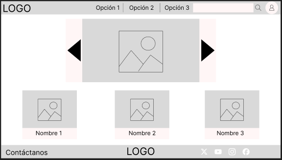

Link: https://www.figma.com/design/ZMtzm1Lg2yHIZmUBrWzUFm/Wireframe-FeatherBook?node-id=0-1&t=2aAIRpBSB2z1OD5v-1

### 4.3.2. Landing Page Mock-up

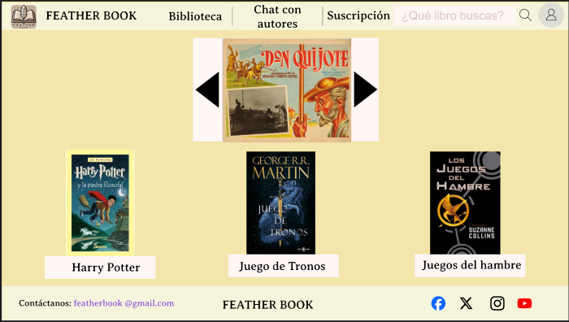

Link: https://www.figma.com/design/JBdXV4HvvmfwBZKd4pTOyD/Mockup-FeatherBook?node-id=0-1&t=O7fEH1EEkONzbaUX-1

## 4.4. Web Applications UX/UI Design
A continuación mostraremos la elaboración del diseño el cual fue elaborado considerando los puntos anteriores.
### 4.4.1. Web Applications Wireflow Diagrams
* User Story #1: Como lector, quiero descubrir nuevos libros según mis intereses para poder leer contenido relevante y atractivo.
* User Story #2: Como lector, quiero buscar libros por género, autor y palabras clave, para encontrar contenido que me interese rápidamente.
* User Story #5: Como lector, quiero ver mi historial de lecturas para revisar los libros que he leído y encontrar títulos anteriores fácilmente.
* User Story #8: Como lector, quiero asistir a eventos en línea con autores para hacer preguntas y conocer más sobre los libros que leo.
* User Story #16: Como autor, quiero interactuar con mis lectores a través de comentarios y eventos en línea para aumentar mi conexión con la audiencia.

### 4.4.2. Web Applications Mock-ups
* En la Biliotecca se muestran recomendaciones de libros según tus preferencias y también podrás usar filtros para buscar libros.
  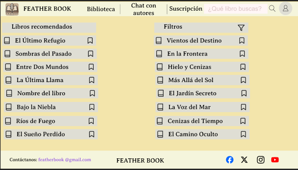

* En el Historial de libros leidos podrás encontrar los nombres de los libros que hallas leido.
  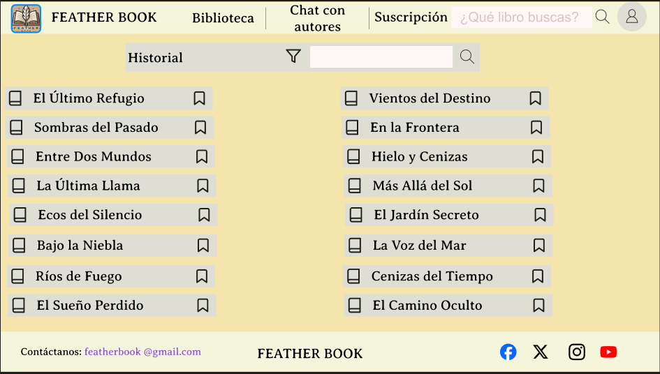

* Gracias al chat con los autores se puede interactuar con ellos.
  

### 4.4.3. Web Applications User Flow Diagrams
Link: https://miro.com/app/board/uXjVK_h4GSo=/?share_link_id=760400135792
## 4.5. Web Applications Prototyping
## 4.6. Domain-Driven Software Architecture
El Domain Driven Design (DDD) busca lograr una comprensión común del dominio que define el área del problema. Este enfoque promueve una mejor colaboración entre desarrolladores y expertos del dominio. DDD no se limita únicamente al uso de un lenguaje común, sino que también incluye un conjunto de patrones, prácticas y diagramas arquitectónicos del sistema, cuyo objetivo es alinear el software con el dominio y fortalecer la visión compartida que propone DDD.
### 4.6.1. Software Architecture Context Diagram
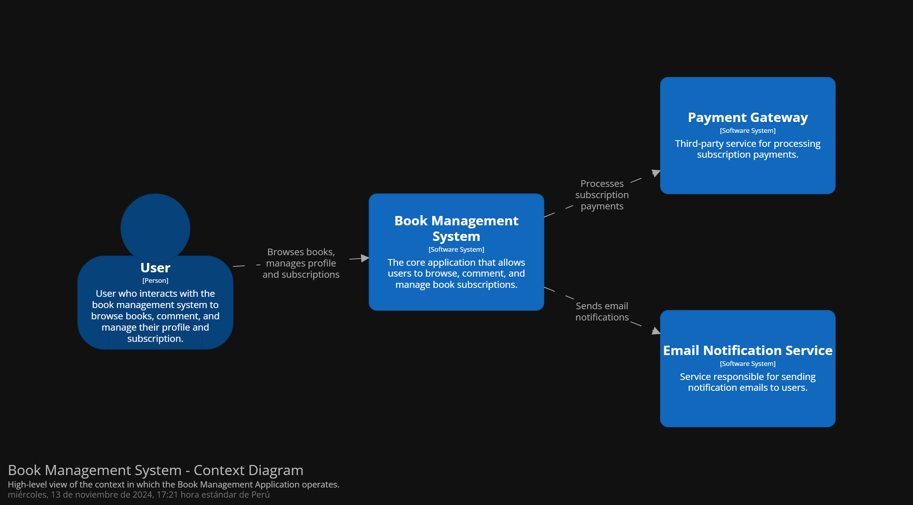

### 4.6.2. Software Architecture Container Diagrams
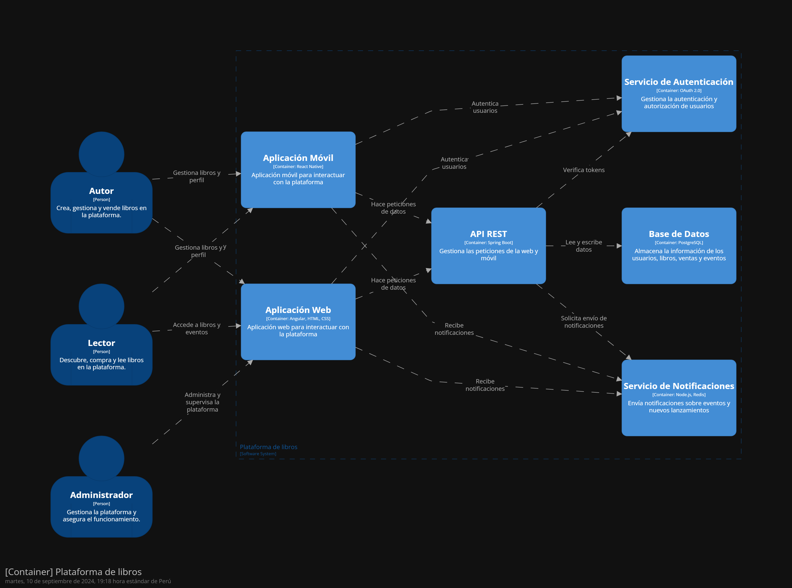

### 4.6.3. Software Architecture Components Diagrams
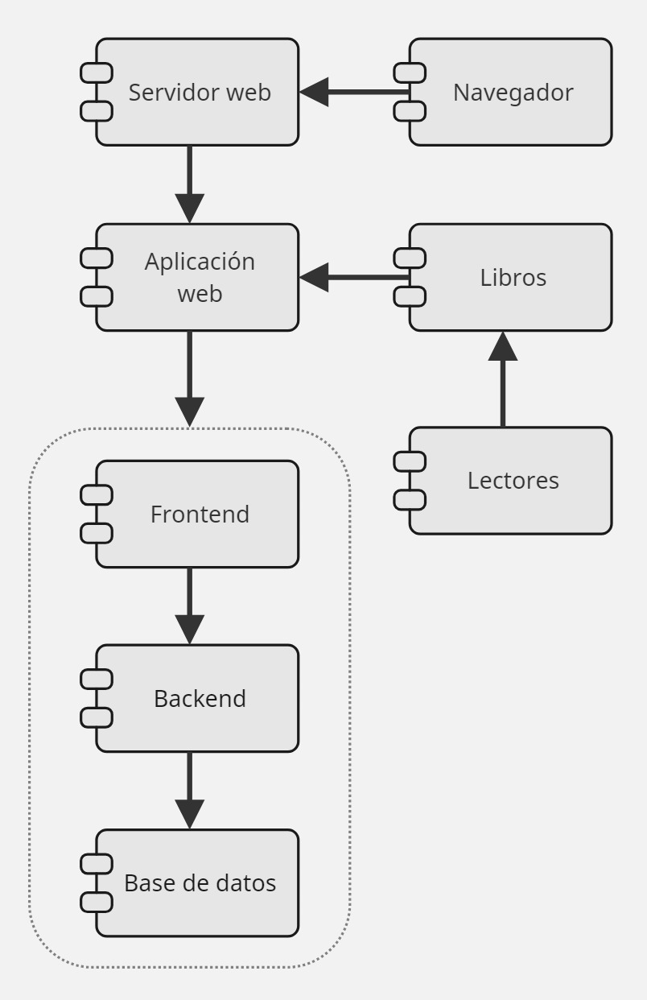

## 4.7. Software Object-Oriented Design
### 4.7.1. Class Diagrams
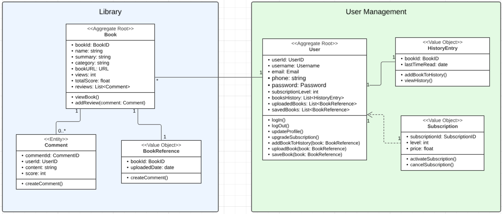

### 4.7.2. Class Dictionary
# Clases y Atributos en Inglés

Class User:

| Name             | Attribute Type | Description                                     |
|------------------|----------------|-------------------------------------------------|
| userID           | int            | ID del usuario                                  |
| fullName         | string         | Nombre completo del usuario                     |
| email            | string         | Correo del usuario                              |
| password         | string         | Contraseña del usuario                          |
| registrationDate | date           | Fecha en la que se registró en la aplicación    |
| subscription     | string         | Tipo de suscripción                             |

Class Author:

| Name            | Attribute Type   | Description                                           |
|-----------------|------------------|-------------------------------------------------------|
| authorID        | int              | ID del autor                                          |
| user            | User             | Usuario registrado como autor                         |
| biography       | string           | Biografía del autor                                   |
| publishedBooks  | List<Book>       | Lista de libros publicados                            |
| royalties       | List<Transaction>| Regalías transferidas al autor en la preventa         |

Class History:

| Name          | Attribute Type  | Description                                      |
|---------------|-----------------|--------------------------------------------------|
| historyID     | int             | ID del historial del usuario                     |
| user          | User            | Usuario al que le pertenece el historial         |
| readBooks     | List <Book>     | Lista de los libros leídos                       |

Class Book:

| Name              | Attribute Type | Description                                       |
|-------------------|----------------|---------------------------------------------------|
| bookID            | int            | ID del libro                                      |
| title             | string         | Título del libro                                  |
| genre             | string         | Género del libro                                  |
| author            | Author         | Autor del libro                                   |
| publicationDate   | date           | Fecha de publicación del libro                    |
| summary           | string         | Un pequeño resumen del libro                      |
| rating            | float          | Media de estrellas que le da el usuario al libro  |
| comments          | List<Comment>  | Lista de los comentarios de los usuarios          |

Class Comment:

| Name         | Attribute Type | Description                                    |
|--------------|----------------|------------------------------------------------|
| commentID    | int            | ID del comentario dejado                       |
| user         | User           | Usuario que comentó                            |
| content      | string         | Contenido del comentario                       |
| commentDate  | date           | Fecha en la que se publicó el comentario       |

Class Recommendation:

| Name               | Attribute Type | Description                                 |
|--------------------|----------------|---------------------------------------------|
| recommendationID   | int            | ID de la lista de recomendación             |
| user               | User           | Usuario al que se le hace la recomendación  |
| recommendedBooks   | List<Book>     | Lista de libros recomendados                |

Class Transaction:

| Name           | Attribute Type | Description                                    |
|----------------|----------------|------------------------------------------------|
| transactionID  | int            | ID de la transacción hecha                     |
| user           | User           | Usuario que realizó la transacción             |
| amount         | float          | Monto de la transacción                        |
| date           | date           | Fecha en la que se realizó la transacción      |

Class Subscription:

| Name           | Attribute Type | Description                                    |
|----------------|----------------|------------------------------------------------|
| subscriptionID | int            | ID de la suscripción                           |
| level          | string         | Nivel de suscripción del usuario               |
| price          | float          | Precio de la suscripción                       |

## 4.8. Database Design
### 4.8.1. Database Diagram
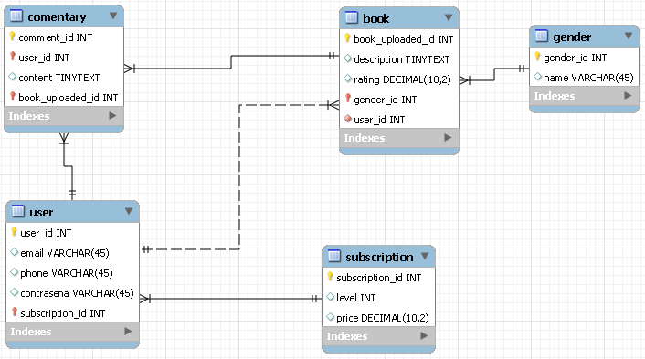

# Capítulo V: Product Implementation, Validation & Deployment
## 5.1. Software Configuration Management
### 5.1.1. Software Development Environment Configuration
En esta sección menionaremos los distintos productos de software que utilizó nuestro equipo de desarrollo para poder llevar acabo las actividades relacionadas con la elaboración de nuestro proyecto.

**Project Management**

Google Meet (https://meet.google.com/): Google Meet es una plataforma de videoconferencias desarrollada por Google que permite realizar a los usuarios reuniones a distancia. Esta herramienta nos facilita la comunicación entre los integrantes para poder desarrollar nuestro proyecto.

**Requirements Managements**

Trello (https://trello.com/): Es un software diseñado para la gestión de proyectos que facilita el poder asignar y organizar las tareas que se tienen que realizar. Fue utilizado para poder desarrollar el Product Backlog.

**Product UX/UI Design**

UXPressia (https://uxpressia.com/): Es una herramienta en línea que permite a los equipos de trabajo el poder identificar y comprender los problemas, necesidades y comportamientos de los usuarios en relación a la solución de software que se está desarrollando mediante el uso de plantillas. Se utilizó esta herramienta para la elaboración de las User Persons, Empathy Maps, Journey Maps e Impact Maps.

Figma (https://www.figma.com/): Figma es una herramienta de edición en línea donde se pueden diseñar y hacer prototipos de páginas web en tiempo real. En nuestro proyecto se utilizó para la realización de los wireframes, mock-ups y los desktop and mobile application prototype del proyecto.

Miro (https://miro.com/): Miro es una plataforma colaborativa online en el cual permite poder crear y usar pizarras digitales personalizadas en tiempo real con los miembros de nuestro equipo de trabajo. Miro cuenta con diferentes herramientas para la elaboración de mapeos, diagramas, flujos de trabajo, etc. Se utilizó para la realización de los As-Is y Tob-Be Scenario Maps.

**Software Development**

Landing Page: Para la creación de nuestra landing page se utilizaron las tecnologías base para el desarrollo web las cuales son: HTML5, CSS3 y JavaScript.

GitHub (https://github.com/): Es una plataforma en línea donde se pueden alojar múltiples proyectos mediante repositorios. Estos utilizan un sistema de control de versiones llamado Git. GitHub nos permite trabajar de manera colaborativa teniendo un seguimiento detallado de los avances en el proyecto.

Git (https://git-scm.com/): Se trata de un softwarepara el control de versiones el cual se instala de manera local y nos permite tener un historial de cambios que realiza cada integrante del grupo en el proyecto, esto lo hace mediante commits. También es utilizado para poder trabajar de manera colaborativa en repositorios que se encuentren subidos en GitHub.

WebStorm: Este es un entorno de desarrollo, el cual nos permite trabajar con HTML, CSS, Javascript y con múltiples frameworks como por ejemplo Angular.

**Software Deployment**

Netlify (https://www.netlify.com/): Es una plataforma que se encarga del despliegue de páginas y aplicaciones web integrandose mediante repositorios en Git. Se utilizó para poder hospedar la landing page del proyecto.

**Software Documentation**

Vertabelo (https://vertabelo.com/): Es una herramienta online que facilita a los usuarios a poder realizar diseños, creaciones y gestión de bases de datos de manera colaborativa. Se utilizó para el diseño de la base de datos del proyecto.

LucidChart (https://lucid.app/): Es una plataforma online que cuenta con múltiples opciones que nos permiten la creación de diagramas de clases, mapas mentales, flujos y más mediante el uso de plantillas y tableros que nos ofrece esta herramienta con edición en tiempo real. Fue utilizado para el desarrollo del diagrama de clases UML, así como los Wireflows y User Flows.

Structurizr (https://www.structurizr.com/): Es una plataforma que permite el modelado de diagramas de arquitectura de software mediante código. Structurizr fue utilizado para crear el modelo C4 de nuestro proyecto.

**Software Testing**

GitHub Pages (https://pages.github.com/): Es un servicio que ofrece GitHub que nos permite el poder publicar un sitio web a partir de un repositorio, cabe destacar que solo nos permitirá alojar sitios web estáticos con archivos HTML, CSS y JavaScript.

Markdown: Es un lenguaje de marcado ligero el cual nos permite documentar diversos proyectos. En cuanto a nuestro equipo, utilizamos este lenguaje para poder redactar el informe de nuestro proyecto y en los archivos README en el repositorio de la organización.

### 5.1.2. Source Code Management
En este apartado se detallará los medios que se usaron para hacer el seguimiento de las modificaciones, así como la semántica y la nomenclatura que se utilizará para la realización de los commits. Para el sistema de control de versiones del informe, landing page, web service y front-end se utilizó Git, el cual se encuentra alojado en GitHub.
- Url de la organizacion: https://github.com/UPC-pre-SI729-2402-SW56-Grupo1/Report

**Semantic Versioning**

La Semantic Versioning es un conjunto de reglas que nos permitirá poder gestionar correctamente la numeración de versiones en nuestro proyecto. La versión principal se incrementará cuando los cambios agregados no sean compatibles con las versiones anteriores.

|release-1.0.5|
|---|
|release-2.1.3|
|release-2.2.1|

**Conventional commits**

Para nuestro proyecto se utilizará el estándar de commits convencionales para que podamos mantener un historial de cambios limpio y ordenado. Los commits se dividirán en los siguientes tipos:
- **feat**: Se utilizará para las nuevas funcionalidades.
- **fix**: Se utilizará para la corrección de errores.
- **chore**: Se utilizará para los cambios en el código que no afecten la funcionalidad.
- **refactor**: Se utilizará para los cambios en el código que no afecten la funcionalidad.

### 5.1.3. Source Code Style Guide & Conventions
Para poder desarrollar nuestro proyecto, hemos requerido de algunas nomenclaturas, referencias y lenguajes para su solución.

Tecnologias: Utilizaremos las tecnologías HTML5, CSS3 y JavaScript para el desarrollo de nuestra la landing page.

- **HTML:** Para el lenguaje HTML, Hemos planteado utilizar las convenciones que se encuentran descritas en la guía “HTML Style Guide and Coding Conventions”
  - Usar los nombres de los elementos en minúsculas.
  - Cerrar todos los elementos HTML.
  - Usar los nombres de los atributos en minúsculas.
  - Usar atributos en imágenes.
  - Evitar las líneas de código demasiado largas.
  - Usar una sintaxis simple para los enlaces, para las hojas de estilo y para poder cargar script externos.

- **CSS:** Para el lenguaje CSS, hemos utilizado las siguientes prácticas para poder alcanzar un código coherente, sostenible y ordenado
  
  - Utilizar las minúsculas y los guiones para los nombres de propiedades.
  - Utilizar un espacio después de los dos puntos y un punto y coma para poder separar pares de propiedad-valor.
  - Agrupar las reglas de CSS relacionadas y separarlas con una línea en blanco.
  - Utilizar los nombres de las clases que sean descriptivas y reflejen el propósito del elemento.
  - Separar los nombres de las clases y su ID con un guión.

**Convenciones de idioma:** Se hizo el uso del idioma inglés para poder elaborar nuestro código, esto incluye la parte de la landing page.

**Conventional commits**

Para nuestro proyecto, se utilizó este estándar para poder garantizar una fácil comprensión de nuestros registros. Por lo tanto, nos hemos decidido por la siguiente estructura: 
`
<Type>[Scope opcional]:<Descripcion>`

- Type: Indica el tipo de commit que se realizó por un miembro del equipo.
- Scope: Define el alcance que tenga el commit.
- Descripción: Hace una descripción breve del cambio realizado por algún integrante.

### 5.1.4. Software Deployment Configuration

En esta entrega, hemos finalizado nuestra Landing Page y configurado su despliegue de la siguiente manera:

Repositorio GitHub: El código de la Landing Page está alojado en un repositorio específico dentro de nuestra comunidad pública en GitHub.

Vercel: Utilizamos la aplicación Vercel para desplegar la página. Esto nos permite una visualización clara y accesible para los usuarios.

Esta configuración nos brinda un método eficiente y transparente para el despliegue de nuestro proyecto, asegurando una experiencia óptima para nuestros usuarios.

## 5.2. Landing Page, Services & Applications Implementation
### 5.2.1 Sprint 1
#### 5.2.1.1. Sprint Planning 1
<table style="border-collapse: collapse; width: 100%;"><tbody>
<tr><td style="border:1pt solid #000000;padding:5pt;vertical-align:top;"><strong>Sprint #</strong></td><td style="border:1pt solid #000000;padding:5pt;vertical-align:top;"><strong>Sprint 1</strong></td></tr>
<tr><td style="border:1pt solid #000000;padding:5pt;vertical-align:top;" colspan="2"><strong>Sprint Planning Background</strong></td></tr>
<tr><td style="border:1pt solid #000000;padding:5pt;vertical-align:top;">Date</td><td style="border:1pt solid #000000;padding:5pt;vertical-align:top;">2024-09-05</td></tr>
<tr><td style="border:1pt solid #000000;padding:5pt;vertical-align:top;">Time</td><td style="border:1pt solid #000000;padding:5pt;vertical-align:top;">10:00 AM</td></tr>
<tr><td style="border:1pt solid #000000;padding:5pt;vertical-align:top;">Location</td><td style="border:1pt solid #000000;padding:5pt;vertical-align:top;">Google Meet</td></tr>
<tr><td style="border:1pt solid #000000;padding:5pt;vertical-align:top;">Prepared By</td><td style="border:1pt solid #000000;padding:5pt;vertical-align:top;">Cristian Iparraguirre, Diego Rioja</td></tr>
<tr><td style="border:1pt solid #000000;padding:5pt;vertical-align:top;">Attendees (to planning meeting)</td><td style="border:1pt solid #000000;padding:5pt;vertical-align:top;">Cristian Iparraguirre, Diego Rioja, Roy Fernández, Anaely Burga, Franz La Torre</td></tr>
<tr><td style="border:1pt solid #000000;padding:5pt;vertical-align:top;" colspan="2"><strong>Sprint Goal &amp; User Stories</strong></td></tr>
<tr><td style="border:1pt solid #000000;padding:5pt;vertical-align:top;">Sprint 1 Goal</td><td style="border:1pt solid #000000;padding:5pt;vertical-align:top;">Crear la estructura básica de la plataforma, incluyendo la página de inicio y el sistema de registro de usuarios.</td></tr>
<tr><td style="border:1pt solid #000000;padding:5pt;vertical-align:top;">Sprint 1 Velocity</td><td style="border:1pt solid #000000;padding:5pt;vertical-align:top;"><strong>20</strong></td></tr>
<tr><td style="border:1pt solid #000000;padding:5pt;vertical-align:top;">Sum of Story Points</td><td style="border:1pt solid #000000;padding:5pt;vertical-align:top;"><strong>18</strong></td></tr>
</tbody></table>

#### 5.2.1.2. Sprint Backlog 1
<table style="border-collapse: collapse; width: 100%;"><tbody>
<tr><td style="border:1pt solid #000000;padding:5pt;vertical-align:top;" colspan="8">SPRINT 1</td></tr>
<tr><td style="border:1pt solid #000000;padding:5pt;vertical-align:top;" colspan="2">User Story</td><td style="border:1pt solid #000000;padding:5pt;vertical-align:top;" colspan="6">Work/Tasks</td></tr>
<tr><td style="border:1pt solid #000000;padding:5pt;vertical-align:top;">ID</td><td style="border:1pt solid #000000;padding:5pt;vertical-align:top;">Title</td><td style="border:1pt solid #000000;padding:5pt;vertical-align:top;">ID</td><td style="border:1pt solid #000000;padding:5pt;vertical-align:top;">Title</td><td style="border:1pt solid #000000;padding:5pt;vertical-align:top;">Description</td><td style="border:1pt solid #000000;padding:5pt;vertical-align:top;">Estimation</td><td style="border:1pt solid #000000;padding:5pt;vertical-align:top;">Assigned to</td><td style="border:1pt solid #000000;padding:5pt;vertical-align:top;">Status (To-do/In-Progress/To-review/Done)</td></tr>

<tr><td style="border:1pt solid #000000;padding:5pt;vertical-align:top;" rowspan="2">US-01</td><td style="border:1pt solid #000000;padding:5pt;vertical-align:top;" rowspan="2"><strong>Descubrimiento de libros</strong></td><td style="border:1pt solid #000000;padding:5pt;vertical-align:top;">T1</td><td style="border:1pt solid #000000;padding:5pt;vertical-align:top;"><strong>Diseño del motor de recomendaciones</strong></td><td style="border:1pt solid #000000;padding:5pt;vertical-align:top;">Desarrollar la función que permita a los usuarios descubrir libros basados en sus intereses.</td><td style="border:1pt solid #000000;padding:5pt;vertical-align:top;">4h</td><td style="border:1pt solid #000000;padding:5pt;vertical-align:top;">Cristian Iparraguirre, Anaely Burga</td><td style="border:1pt solid #000000;padding:5pt;vertical-align:top;">Done</td></tr>

<tr><td style="border:1pt solid #000000;padding:5pt;vertical-align:top;">T2</td><td style="border:1pt solid #000000;padding:5pt;vertical-align:top;"><strong>Integración con la base de datos de libros</strong></td><td style="border:1pt solid #000000;padding:5pt;vertical-align:top;">Conectar el motor de recomendaciones con la base de datos para obtener información relevante de los libros.</td><td style="border:1pt solid #000000;padding:5pt;vertical-align:top;">5h</td><td style="border:1pt solid #000000;padding:5pt;vertical-align:top;">Roy Fernández, Diego Rioja</td><td style="border:1pt solid #000000;padding:5pt;vertical-align:top;">Done</td></tr>

<tr><td style="border:1pt solid #000000;padding:5pt;vertical-align:top;" rowspan="2">US-02</td><td style="border:1pt solid #000000;padding:5pt;vertical-align:top;" rowspan="2"><strong>Búsqueda avanzada de libros</strong></td><td style="border:1pt solid #000000;padding:5pt;vertical-align:top;">T3</td><td style="border:1pt solid #000000;padding:5pt;vertical-align:top;"><strong>Implementación de filtros de búsqueda</strong></td><td style="border:1pt solid #000000;padding:5pt;vertical-align:top;">Crear los filtros por género, autor y palabras clave en el buscador avanzado.</td><td style="border:1pt solid #000000;padding:5pt;vertical-align:top;">6h</td><td style="border:1pt solid #000000;padding:5pt;vertical-align:top;">Franz La Torre, Anaely Burga</td><td style="border:1pt solid #000000;padding:5pt;vertical-align:top;">Done</td></tr>

<tr><td style="border:1pt solid #000000;padding:5pt;vertical-align:top;">T4</td><td style="border:1pt solid #000000;padding:5pt;vertical-align:top;"><strong>Validación de los resultados de búsqueda</strong></td><td style="border:1pt solid #000000;padding:5pt;vertical-align:top;">Validar que los resultados coincidan correctamente con los parámetros de búsqueda ingresados.</td><td style="border:1pt solid #000000;padding:5pt;vertical-align:top;">3h</td><td style="border:1pt solid #000000;padding:5pt;vertical-align:top;">Cristian Iparraguirre</td><td style="border:1pt solid #000000;padding:5pt;vertical-align:top;">Done</td></tr>

<tr><td style="border:1pt solid #000000;padding:5pt;vertical-align:top;" rowspan="2">US-03</td><td style="border:1pt solid #000000;padding:5pt;vertical-align:top;" rowspan="2"><strong>Sincronización de progreso de lectura</strong></td><td style="border:1pt solid #000000;padding:5pt;vertical-align:top;">T5</td><td style="border:1pt solid #000000;padding:5pt;vertical-align:top;"><strong>Sincronización entre dispositivos</strong></td><td style="border:1pt solid #000000;padding:5pt;vertical-align:top;">Desarrollar la sincronización del progreso de lectura en dispositivos móviles y web.</td><td style="border:1pt solid #000000;padding:5pt;vertical-align:top;">7h</td><td style="border:1pt solid #000000;padding:5pt;vertical-align:top;">Diego Rioja, Roy Fernández</td><td style="border:1pt solid #000000;padding:5pt;vertical-align:top;">Done</td></tr>

<tr><td style="border:1pt solid #000000;padding:5pt;vertical-align:top;">T6</td><td style="border:1pt solid #000000;padding:5pt;vertical-align:top;"><strong>Pruebas de sincronización</strong></td><td style="border:1pt solid #000000;padding:5pt;vertical-align:top;">Validar que el progreso de lectura se sincronice correctamente en diferentes dispositivos.</td><td style="border:1pt solid #000000;padding:5pt;vertical-align:top;">5h</td><td style="border:1pt solid #000000;padding:5pt;vertical-align:top;">Cristian Iparraguirre</td><td style="border:1pt solid #000000;padding:5pt;vertical-align:top;">Done</td></tr>

<tr><td style="border:1pt solid #000000;padding:5pt;vertical-align:top;" rowspan="2">US-04</td><td style="border:1pt solid #000000;padding:5pt;vertical-align:top;" rowspan="2"><strong>Descarga de libros</strong></td><td style="border:1pt solid #000000;padding:5pt;vertical-align:top;">T7</td><td style="border:1pt solid #000000;padding:5pt;vertical-align:top;"><strong>Implementación de descarga de libros</strong></td><td style="border:1pt solid #000000;padding:5pt;vertical-align:top;">Desarrollar la funcionalidad que permita a los usuarios descargar libros en dispositivos.</td><td style="border:1pt solid #000000;padding:5pt;vertical-align:top;">4h</td><td style="border:1pt solid #000000;padding:5pt;vertical-align:top;">Roy Fernández, Franz La Torre</td><td style="border:1pt solid #000000;padding:5pt;vertical-align:top;">Done</td></tr>

<tr><td style="border:1pt solid #000000;padding:5pt;vertical-align:top;">T8</td><td style="border:1pt solid #000000;padding:5pt;vertical-align:top;"><strong>Pruebas de descarga sin conexión</strong></td><td style="border:1pt solid #000000;padding:5pt;vertical-align:top;">Realizar pruebas para validar que los libros se puedan leer sin conexión a internet.</td><td style="border:1pt solid #000000;padding:5pt;vertical-align:top;">3h</td><td style="border:1pt solid #000000;padding:5pt;vertical-align:top;">Cristian Iparraguirre</td><td style="border:1pt solid #000000;padding:5pt;vertical-align:top;">Done</td></tr>
</tbody></table>

#### 5.2.1.3. Development Evidence for Sprint Review
| Repository                    | Branch                   | Commit ID | Commit Message                                                   | Commit Message Body | Commited On (Date) |
|-------------------------------|--------------------------|-----------|------------------------------------------------------------------|---------------------|--------------------|
| LandingPage-ConnectionLink     | feature/footer            | b28816c   | Update Footer                                                | -                   | 08/09/2024         |
| LandingPage-ConnectionLink     | feature/contact           | d429bb8   | Update Contact                                               | -                   | 08/09/2024         |
| LandingPage-ConnectionLink     | feature/prices            | 9ad3e6b   | feat: add Prices                                              | -                   | 09/09/2024         |
| LandingPage-ConnectionLink     | feature/features-section  | a624c36   | feat: add FeatureCard Component and Features Component with Tailwind | -               | 07/09/2024         |
| LandingPage-ConnectionLink     | feature/testimonials      | a16c0c0   | feat: add TestimonialCard Component and Testimonials Component with Tailwind Styles | - | 10/09/2024         |
| LandingPage-ConnectionLink     | feature/about             | 7e85194   | Update About                                                 | -                   | 09/09/2024         |
| LandingPage-ConnectionLink     | feature/hero              | 56ab21c   | Update Hero                                                  | -                   | 09/09/2024         |
| LandingPage-ConnectionLink     | feature/service           | c663461   | feat: Service section added                                       | -                   | 12/09/2024         |
| LandingPage-ConnectionLink     | feature/navbar            | 1d527f8   | feat: Navbar added                                                | -                   | 10/09/2024         |

#### 5.2.1.4. Testing Suite Evidence for Sprint Review
En este sprint se realizaron pruebas Unitarias (Unit Tests) para las funcionalidades de **Descubrimiento de libros** (US-01) y **Búsqueda avanzada de libros** (US-02). Además, se realizaron pruebas de integración (Integration Tests) para la sincronización entre el frontend y el backend del sistema de búsqueda.

##### Unit Tests

Los Unit Tests fueron diseñados para probar las clases y comportamientos relacionados con el motor de recomendaciones y los filtros de búsqueda avanzada.
* **Clases relacionadas con los Unit Tests:**  
  RecommendationEngine: Valida que las recomendaciones sean generadas correctamente en función de los intereses del usuario.

  SearchFilters: Valida que los filtros de búsqueda devuelvan resultados acordes a los parámetros de búsqueda (género, autor, palabras clave).

##### Integration Tests
Se realizaron pruebas de integración entre el frontend y el backend del sistema de búsqueda de libros. Las pruebas se enfocaron en la comunicación adecuada entre el motor de búsqueda y la base de datos.

##### Repositorio y Commits relacionados con Testing:
| Repository                  | Branch         | Commit ID | Commit Message                                                   | Commit Message Body | Commited On (Date) |
|-----------------------------|----------------|-----------|------------------------------------------------------------------|---------------------|--------------------|
| FeatherBokk-Service        | feature/tests  | b123456   | feat: add Unit Tests for Recommendation Engine                   | Added Unit Tests for recommendation logic | 05/09/2024 |
| FeatherBokk-Service        | feature/tests  | c789012   | test: add integration tests for Search Filters                   | Added Integration Tests for search filters | 06/09/2024 |
| FeatherBokk-Frontend          | feature/tests  | d345678   | test: add UI tests for search results                            | Added UI Tests for Search Results page | 07/09/2024 |
| FeatherBokk-Backend           | feature/tests  | e901234   | feat: integration tests between search system and database       | Validated communication between search system and database | 08/09/2024 |

#### 5.2.1.5. 
Aquí mostraremos todas las secciones que conforman la Landing page que hemos implementado durante el sprint. Durante el Sprint 1, se realizaron las siguientes tareas de ejecución:

Desarrollo de la Landing Page: El equipo de desarrollo trabajó en la creación y diseño de la Landing Page, implementando las características y funcionalidades requeridas según las User Stories definidas para este sprint.

Control de versiones: Se utilizó Git como sistema de control de versiones para colaborar en el desarrollo y realizar un seguimiento de los cambios realizados en el código.

Configuración del entorno de desarrollo: Se configuraron las herramientas necesarias, como WebStorm, para facilitar el desarrollo.

Almacenamiento del proyecto en GitHub: Se creó un repositorio en GitHub para almacenar el proyecto en la nube y permitir la colaboración entre los miembros del equipo.

Realización de commits: Se utilizaron GitHub Desktop y Git para realizar commits y mantener un historial de versiones del proyecto.

Con estas tareas completadas con éxito, se lograron los objetivos establecidos para el Sprint 1 de la Landing Page. <a href="https://www.figma.com/design/JBdXV4HvvmfwBZKd4pTOyD/Mockup-FeatherBook?node-id=0-1&t=O7fEH1EEkONzbaUX-1">Figma</a>

#### 5.2.1.6. Services Documentation Evidence for Sprint Review
Para alcanzar exitosamente los objetivos de este Sprint 1 el equipo tuvo que documentarse sobre las tecnologías que se iban a implementar. Es por ello que a continuación se detalla la documentación a la que se acudió: Html y CSS:Son dos tecnologías fundamentales para la creación y el diseño de sitios web. Aquí te proporciono una breve descripción de cada uno.
Angular: Angular se desarrolla principalmente utilizando TypeScript, que es un superconjunto tipado de JavaScript. TypeScript agrega un sistema de tipos estáticos al lenguaje, lo que ayuda a detectar errores en tiempo de compilación y proporciona un mejor soporte para herramientas de desarrollo. <a href="https://angular.io/guide/styleguide">Angular</a>
WebStorm: Es un entorno de desarrollo que nos permitirá trabajar con typeScript. <a href="https://www.jetbrains.com/es-es/webstorm/learn/">Jetbrains</a>

#### 5.2.1.7. Software Deployment Evidence for Sprint Review
Para el sprint presentado de la landing page se optó por varias herramientas para su desarrollo y despliegue en la web de manera pública.

Git: Se utilizó para el control de versiones del código fuente.
GitFlow: Se utilizó para ver el avance de los integrantes del equipo.
GitHub: Se utilizó para crear el repositorio de la landing page, donde se subió el código fuente.
Vercel: Se utilizó esta herramienta ya que nos ofrece un despliegue sin costo de manera rápida y fácil, además que se puede vincular directamente con el repositorio de GitHub.

#### 5.2.1.8. Team Collaboration Insights during Sprint

### 5.2.2. Sprint 2
#### 5.2.2.1. Sprint Planning 2
<table style="border-collapse: collapse; width: 100%;"><tbody>
<tr><td style="border:1pt solid #000000;padding:5pt;vertical-align:top;"><strong>Sprint #</strong></td><td style="border:1pt solid #000000;padding:5pt;vertical-align:top;"><strong>Sprint 2</strong></td></tr>
<tr><td style="border:1pt solid #000000;padding:5pt;vertical-align:top;" colspan="2"><strong>Sprint Planning Background</strong></td></tr>
<tr><td style="border:1pt solid #000000;padding:5pt;vertical-align:top;">Date</td><td style="border:1pt solid #000000;padding:5pt;vertical-align:top;">2024-09-17</td></tr>
<tr><td style="border:1pt solid #000000;padding:5pt;vertical-align:top;">Time</td><td style="border:1pt solid #000000;padding:5pt;vertical-align:top;">11:00 AM</td></tr>
<tr><td style="border:1pt solid #000000;padding:5pt;vertical-align:top;">Location</td><td style="border:1pt solid #000000;padding:5pt;vertical-align:top;">Google Meet</td></tr>
<tr><td style="border:1pt solid #000000;padding:5pt;vertical-align:top;">Prepared By</td><td style="border:1pt solid #000000;padding:5pt;vertical-align:top;">Cristian Iparraguirre, Diego Rioja</td></tr>
<tr><td style="border:1pt solid #000000;padding:5pt;vertical-align:top;">Attendees (to planning meeting)</td><td style="border:1pt solid #000000;padding:5pt;vertical-align:top;">Cristian Iparraguirre, Diego Rioja, Roy Fernández, Anaely Burga, Franz La Torre</td></tr>
<tr><td style="border:1pt solid #000000;padding:5pt;vertical-align:top;" colspan="2"><strong>Sprint Goal &amp; User Stories</strong></td></tr>
<tr><td style="border:1pt solid #000000;padding:5pt;vertical-align:top;">Sprint 2 Goal</td><td style="border:1pt solid #000000;padding:5pt;vertical-align:top;">Finalizar el diseño y la implementación del frontend, incluyendo la página de inicio, página de registro y la página de listado de servicios.</td></tr>
<tr><td style="border:1pt solid #000000;padding:5pt;vertical-align:top;">Sprint 2 Velocity</td><td style="border:1pt solid #000000;padding:5pt;vertical-align:top;"><strong>25</strong></td></tr>
<tr><td style="border:1pt solid #000000;padding:5pt;vertical-align:top;">Sum of Story Points</td><td style="border:1pt solid #000000;padding:5pt;vertical-align:top;"><strong>20</strong></td></tr>
</tbody></table>

#### 5.2.2.2. Sprint Backlog 2
<table style="border-collapse: collapse; width: 100%;"><tbody>
<tr><td style="border:1pt solid #000000;padding:5pt;vertical-align:top;" colspan="8">SPRINT 2</td></tr>
<tr><td style="border:1pt solid #000000;padding:5pt;vertical-align:top;" colspan="2">User Story</td><td style="border:1pt solid #000000;padding:5pt;vertical-align:top;" colspan="6">Work/Tasks</td></tr>
<tr><td style="border:1pt solid #000000;padding:5pt;vertical-align:top;">ID</td><td style="border:1pt solid #000000;padding:5pt;vertical-align:top;">Title</td><td style="border:1pt solid #000000;padding:5pt;vertical-align:top;">ID</td><td style="border:1pt solid #000000;padding:5pt;vertical-align:top;">Title</td><td style="border:1pt solid #000000;padding:5pt;vertical-align:top;">Description</td><td style="border:1pt solid #000000;padding:5pt;vertical-align:top;">Estimation</td><td style="border:1pt solid #000000;padding:5pt;vertical-align:top;">Assigned to</td><td style="border:1pt solid #000000;padding:5pt;vertical-align:top;">Status (To-do/In-Progress/To-review/Done)</td></tr>

<tr><td style="border:1pt solid #000000;padding:5pt;vertical-align:top;" rowspan="2">US-05</td><td style="border:1pt solid #000000;padding:5pt;vertical-align:top;" rowspan="2"><strong>Historial de lecturas</strong></td><td style="border:1pt solid #000000;padding:5pt;vertical-align:top;">T1</td><td style="border:1pt solid #000000;padding:5pt;vertical-align:top;"><strong>Desarrollo de vista del historial</strong></td><td style="border:1pt solid #000000;padding:5pt;vertical-align:top;">Crear la interfaz del historial donde los usuarios pueden ver los libros leídos anteriormente.</td><td style="border:1pt solid #000000;padding:5pt;vertical-align:top;">3h</td><td style="border:1pt solid #000000;padding:5pt;vertical-align:top;">Anaely Burga, Diego Rioja</td><td style="border:1pt solid #000000;padding:5pt;vertical-align:top;">To-do</td></tr>

<tr><td style="border:1pt solid #000000;padding:5pt;vertical-align:top;">T2</td><td style="border:1pt solid #000000;padding:5pt;vertical-align:top;"><strong>Pruebas de historial</strong></td><td style="border:1pt solid #000000;padding:5pt;vertical-align:top;">Validar que el historial de lecturas se actualice correctamente con los libros leídos.</td><td style="border:1pt solid #000000;padding:5pt;vertical-align:top;">2h</td><td style="border:1pt solid #000000;padding:5pt;vertical-align:top;">Cristian Iparraguirre</td><td style="border:1pt solid #000000;padding:5pt;vertical-align:top;">To-do</td></tr>

<tr><td style="border:1pt solid #000000;padding:5pt;vertical-align:top;" rowspan="2">US-06</td><td style="border:1pt solid #000000;padding:5pt;vertical-align:top;" rowspan="2"><strong>Reseñas y calificaciones de libros</strong></td><td style="border:1pt solid #000000;padding:5pt;vertical-align:top;">T3</td><td style="border:1pt solid #000000;padding:5pt;vertical-align:top;"><strong>Formulario de reseñas</strong></td><td style="border:1pt solid #000000;padding:5pt;vertical-align:top;">Crear el formulario para que los usuarios dejen reseñas y calificaciones.</td><td style="border:1pt solid #000000;padding:5pt;vertical-align:top;">4h</td><td style="border:1pt solid #000000;padding:5pt;vertical-align:top;">Roy Fernández, Franz La Torre</td><td style="border:1pt solid #000000;padding:5pt;vertical-align:top;">In-Progress</td></tr>

<tr><td style="border:1pt solid #000000;padding:5pt;vertical-align:top;">T4</td><td style="border:1pt solid #000000;padding:5pt;vertical-align:top;"><strong>Validación de reseñas</strong></td><td style="border:1pt solid #000000;padding:5pt;vertical-align:top;">Realizar pruebas para asegurar que las reseñas se guarden y muestren correctamente.</td><td style="border:1pt solid #000000;padding:5pt;vertical-align:top;">3h</td><td style="border:1pt solid #000000;padding:5pt;vertical-align:top;">Diego Rioja</td><td style="border:1pt solid #000000;padding:5pt;vertical-align:top;">To-do</td></tr>

<tr><td style="border:1pt solid #000000;padding:5pt;vertical-align:top;" rowspan="2">US-07</td><td style="border:1pt solid #000000;padding:5pt;vertical-align:top;" rowspan="2"><strong>Clubes de lectura virtuales</strong></td><td style="border:1pt solid #000000;padding:5pt;vertical-align:top;">T5</td><td style="border:1pt solid #000000;padding:5pt;vertical-align:top;"><strong>Creación de sala de lectura</strong></td><td style="border:1pt solid #000000;padding:5pt;vertical-align:top;">Desarrollar la funcionalidad para crear salas de lectura virtual.</td><td style="border:1pt solid #000000;padding:5pt;vertical-align:top;">5h</td><td style="border:1pt solid #000000;padding:5pt;vertical-align:top;">Anaely Burga, Cristian Iparraguirre</td><td style="border:1pt solid #000000;padding:5pt;vertical-align:top;">To-do</td></tr>

<tr><td style="border:1pt solid #000000;padding:5pt;vertical-align:top;">T6</td><td style="border:1pt solid #000000;padding:5pt;vertical-align:top;"><strong>Pruebas de interacción en la sala</strong></td><td style="border:1pt solid #000000;padding:5pt;vertical-align:top;">Validar que los usuarios puedan interactuar en la sala de lectura en tiempo real.</td><td style="border:1pt solid #000000;padding:5pt;vertical-align:top;">4h</td><td style="border:1pt solid #000000;padding:5pt;vertical-align:top;">Franz La Torre</td><td style="border:1pt solid #000000;padding:5pt;vertical-align:top;">In-Progress</td></tr>

<tr><td style="border:1pt solid #000000;padding:5pt;vertical-align:top;" rowspan="2">US-08</td><td style="border:1pt solid #000000;padding:5pt;vertical-align:top;" rowspan="2"><strong>Eventos en línea con autores</strong></td><td style="border:1pt solid #000000;padding:5pt;vertical-align:top;">T7</td><td style="border:1pt solid #000000;padding:5pt;vertical-align:top;"><strong>Programación de eventos</strong></td><td style="border:1pt solid #000000;padding:5pt;vertical-align:top;">Implementar la programación de eventos en línea con autores.</td><td style="border:1pt solid #000000;padding:5pt;vertical-align:top;">6h</td><td style="border:1pt solid #000000;padding:5pt;vertical-align:top;">Diego Rioja, Roy Fernández</td><td style="border:1pt solid #000000;padding:5pt;vertical-align:top;">In-Progress</td></tr>

<tr><td style="border:1pt solid #000000;padding:5pt;vertical-align:top;">T8</td><td style="border:1pt solid #000000;padding:5pt;vertical-align:top;"><strong>Pruebas de eventos en vivo</strong></td><td style="border:1pt solid #000000;padding:5pt;vertical-align:top;">Validar que los eventos en vivo se ejecuten correctamente y se pueda interactuar con los autores.</td><td style="border:1pt solid #000000;padding:5pt;vertical-align:top;">5h</td><td style="border:1pt solid #000000;padding:5pt;vertical-align:top;">Anaely Burga</td><td style="border:1pt solid #000000;padding:5pt;vertical-align:top;">To-do</td></tr>
</tbody></table>

#### 5.2.2.3. Development Evidence for Sprint Review
| Repository                    | Branch                   | Commit ID | Commit Message                                                   | Commit Message Body | Commited On (Date) |
|-------------------------------|--------------------------|-----------|------------------------------------------------------------------|---------------------|--------------------|
| FeatherBokk-Frontend     | feature/footer            | b28816c   | Update Footer                                                | -                   | 08/09/2024         |
| FeatherBokk-Frontend     | feature/contact           | d429bb8   | Update Contact                                               | -                   | 08/09/2024         |
| FeatherBokk-Frontend     | feature/header            | 9ad3e6b   | feat: add Header                                              | -                   | 09/09/2024         |
| FeatherBokk-Frontend     | feature/cards  | a624c36   | feat: add FeatureCard Component and Features Component with Tailwind | -               | 07/09/2024         |
| FeatherBokk-Frontend     | feature/testimonials      | a16c0c0   | feat: add TestimonialCard Component and Testimonials Component with Tailwind Styles | - | 10/09/2024         |
| FeatherBokk-Frontend     | feature/about             | 7e85194   | Update About                                                 | -                   | 09/09/2024         |
| FeatherBokk-Frontend     | feature/preview              | 56ab21c   | Update Preview                                                  | -                   | 09/09/2024         |
| FeatherBokk-Frontend     | feature/service           | c663461   | feat: Service section added                                       | -                   | 12/09/2024         |
| FeatherBokk-Frontend     | feature/navbar            | 1d527f8   | feat: Navbar added                                                | -                   | 10/09/2024         |

#### 5.2.2.4. Testing Suite Evidence for Sprint Review
En este sprint se llevaron a cabo pruebas unitarias para las funcionalidades de **Sincronización de progreso de lectura** (US-03) y **Descarga de libros** (US-04). También se realizaron pruebas de aceptación (Acceptance Tests) bajo el enfoque BDD para validar la experiencia de descarga de libros sin conexión.

##### Unit Tests

Los Unit Tests fueron diseñados para probar las clases relacionadas con la sincronización de lectura entre dispositivos y la correcta descarga de libros.
* **Clases relacionadas con los Unit Tests:**  
  ReadingSyncManager: Valida que el progreso de lectura se sincronice correctamente entre dispositivos (móviles y web).

  BookDownloadManager: Valida que los libros se descarguen correctamente y que se puedan leer sin conexión.

##### Acceptance Tests
Se realizaron pruebas de aceptación utilizando BDD para verificar el flujo completo de descarga de libros y sincronización de progreso.

##### Repositorio y Commits relacionados con Testing:
| Repository                  | Branch         | Commit ID | Commit Message                                                   | Commit Message Body | Commited On (Date) |
|-----------------------------|----------------|-----------|------------------------------------------------------------------|---------------------|--------------------|
| FeatherBokk-SyncService      | feature/tests  | f234567   | feat: add Unit Tests for ReadingSyncManager                      | Added Unit Tests for synchronization between devices | 12/09/2024 |
| FeatherBokk-SyncService      | feature/tests  | g789012   | test: add tests for book download functionality                  | Added Tests for downloading books | 13/09/2024 |
| FeatherBokk-Frontend         | feature/tests  | h345678   | feat: UI tests for progress sync and offline reading             | Added UI tests for offline book reading and progress sync | 14/09/2024 |
| FeatherBokk-Backend          | feature/tests  | i901234   | feat: acceptance tests for download and sync flow                | Added BDD Tests for the download and sync flow | 15/09/2024 |

#### 5.2.2.5. Execution Evidence for Sprint Review
Aquí mostraremos todas las secciones que conforman la página web que hemos implementado durante el sprint.
Durante el Sprint 2, se realizaron las siguientes tareas de ejecución:

1. **Desarrollo de la Página Web:** El equipo de desarrollo trabajó en la creación y diseño de la página web, implementando las características y funcionalidades requeridas según las User Stories definidas para este sprint.

2. **Control de versiones:** Se utilizó Git como sistema de control de versiones para colaborar en el desarrollo y realizar un seguimiento de los cambios realizados en el código.

3. **Configuración del entorno de desarrollo:** Se configuraron las herramientas necesarias, como WebStorm, para facilitar el desarrollo en TypeScript.

4. **Almacenamiento del proyecto en GitHub:** Se creó un repositorio en GitHub para almacenar el proyecto en la nube y permitir la colaboración entre los miembros del equipo.

5. **Realización de commits:** Se utilizaron GitHub Desktop y Git para realizar commits y mantener un historial de versiones del proyecto.

Con estas tareas completadas con éxito, se lograron los objetivos establecidos para el Sprint 2 de la página web.

#### 5.2.2.6. Services Documentation Evidence for Sprint Review
Para alcanzar exitosamente los objetivos de este Sprint 1 el equipo tuvo que documentarse sobre las tecnologías que se iban a implementar. Es por ello que a continuación se detalla la documentación a la que se acudió: Html y CSS:Son dos tecnologías fundamentales para la creación y el diseño de sitios web. Aquí te proporciono una breve descripción de cada uno.
Angular: Angular se desarrolla principalmente utilizando TypeScript, que es un superconjunto tipado de JavaScript. TypeScript agrega un sistema de tipos estáticos al lenguaje, lo que ayuda a detectar errores en tiempo de compilación y proporciona un mejor soporte para herramientas de desarrollo. <a href="https://angular.io/guide/styleguide">Angular</a>

WebStorm: Es un entorno de desarrollo que nos permitirá trabajar con typeScript. <a href="https://www.jetbrains.com/es-es/webstorm/learn/">Jetbrains</a>

#### 5.2.2.7. Software Deployment Evidence for Sprint Review
Los objetivos fueron exitosamente alcanzados para el Sprint 2 de la página web. Por ello para esta sección “Software Deployment Evidence” nos centraremos en explicar las tecnologías que utilizamos, la creación de cuentas de repositorio y la configuración del ambiente de desarrollo. En esta entrega se usaron las tecnologías:
HTML: Es un lenguaje de marcado de Hipertexto el cual nos ayudó a la maquetación de la página web.
CSS: Lenguaje que no ayudó con el apartado visual de la página web.
El software usado para el desarrollo de la página web fue:
 - Git: Es un sistema de control de versiones que nos ayudó a trabajar en equipo para el desarrollo de la página web.
 - GitHub: Nos ayudó a almacenar nuestro proyecto en la nube.
 - GitHub Desktop: Software de escritorio que nos permitió realizar los commits a nuestro repositorio alojado en Github.

#### 5.2.2.8. Team Collaboration Insights during Sprint
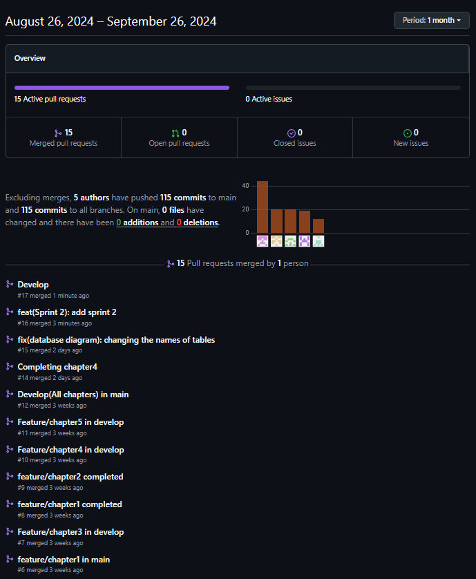

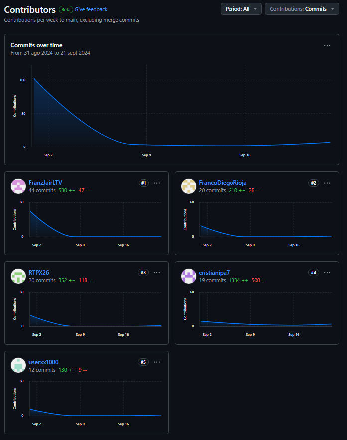

## 5.3. Validation Interviews
### 5.3.1. Diseño de Entrevistas
### 5.3.2. Registro de Entrevistas
### 5.3.3. Evaluaciones según heurísticas
## 5.4. Video About-the-Product
# Conclusiones
## Conclusiones y recomendaciones
## Video About-the-Team
# Bibliografía
# Anexos
