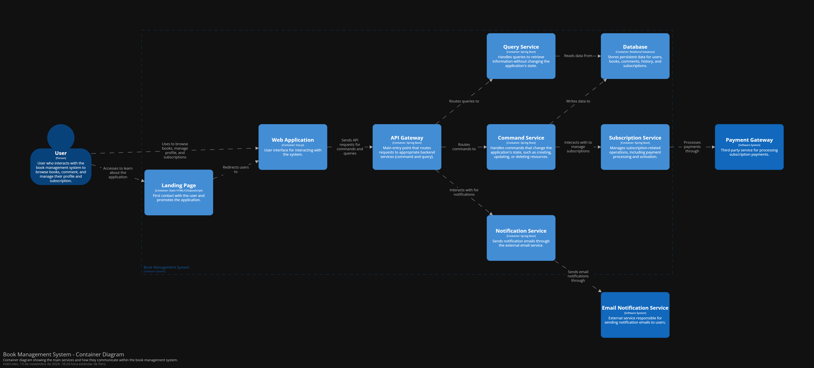

<h2>Universidad Peruana de Ciencias Aplicadas</h2>

<h2>Informe del Trabajo Final</h2>

<h3>Curso: Desarrollo de Aplicaciones Open Source</h3>
<h3>Carrera: Ingeniería de Software </h3>
<h3>Sección: SW56</h3>
<h3>Profesor: Efraín Ricardo Bautista Ubillús</h3>

<strong>Startup:</strong> XXXXXXX

<strong>Producto:</strong> XXXXXXX

<h3>Integrantes:</h3>

<ul>
  <li>Iparraguirre Rueda, Cristian Luis (u202113111)</li>
  <li>Rioja Nuñez, Franco Diego (u202221597)</li>
  <li>XXXXXXX (XXXXXXX)</li>
  <li>Burga Loarte, Anaely (u202118264)</li>
  <li>XXXXXXX (XXXXXXX)</li>
</ul>

**<h3>Septiembre, 2024</h3>**

# Registro de Versiones del Informe

| Versión | Fecha | Autor                                                                                                     | Descripción de modificación |
|--------------|--------------|-----------------------------------------------------------------------------------------------------------|--------------|
| TB1           | 04/09/2024      | - Iparraguirre Rueda, Cristian Luis - Rioja Nuñez, Franco Diego - XXXXXXX - XXXXXXX - XXXXXXX | Implementación del capítulo 1 al 5      |

# Project Report Collaboration Insights

# Contenido
- [Registro de Versiones del Informe](#registro-de-versiones-del-informe)
- [Project Report Collaboration Insights](#project-report-collaboration-insights)
- [Contenido](#contenido)
- [Student Outcome](#student-outcome)
- [Capítulo I: Introducción](#capítulo-i-introducción)
  - [1.1. Startup Profile](#11-startup-profile)
    - [1.1.1. Descripción de la Startup](#111-descripción-de-la-startup)
    - [1.1.2. Perfiles de integrantes del equipo](#112-perfiles-de-integrantes-del-equipo)
  - [1.2. Solution Profile](#12-solution-profile)
    - [1.2.1. Antecedentes y problemática](#121-antecedentes-y-problemática)
    - [1.2.2. Lean UX Process](#122-lean-ux-process)
      - [1.2.2.1. Lean UX Problem Statements](#1221-lean-ux-problem-statements)
      - [1.2.2.2. Lean UX Assumptions](#1222-lean-ux-assumptions)
      - [1.2.2.3. Lean UX Hypothesis Statements](#1223-lean-ux-hypothesis-statements)
      - [1.2.2.4. Lean UX Canvas](#1224-lean-ux-canvas)
  - [1.3. Segmentos objetivo](#13-segmentos-objetivo)
- [Capítulo II: Requirements Elicitation \& Analysis](#capítulo-ii-requirements-elicitation--analysis)
  - [2.1. Competidores](#21-competidores)
    - [2.1.1. Análisis competitivo](#211-análisis-competitivo)
    - [2.1.2. Estrategias y tácticas frente a competidores](#212-estrategias-y-tácticas-frente-a-competidores)
  - [2.2. Entrevistas](#22-entrevistas)
    - [2.2.1. Diseño de entrevistas](#221-diseño-de-entrevistas)
    - [2.2.2. Registro de entrevistas](#222-registro-de-entrevistas)
    - [2.2.3. Análisis de entrevistas](#223-análisis-de-entrevistas)
  - [2.3. Needfinding](#23-needfinding)
    - [2.3.1. User Personas](#231-user-personas)
    - [2.3.2. User Task Matrix](#232-user-task-matrix)
    - [2.3.3. User Journey Mapping](#233-user-journey-mapping)
    - [2.3.4. Empathy Mapping](#234-empathy-mapping)
    - [2.3.5. As-is Scenario Mapping](#235-as-is-scenario-mapping)
  - [2.4. Ubiquitous Language](#24-ubiquitous-language)
- [Capítulo III: Requirements Specification](#capítulo-iii-requirements-specification)
  - [3.1. To-Be Scenario Mapping](#31-to-be-scenario-mapping)
  - [3.2. User Stories](#32-user-stories)
  - [3.3. Impact Mapping](#33-impact-mapping)
  - [3.4. Product Backlog](#34-product-backlog)
- [Capítulo IV: Product Design](#capítulo-iv-product-design)
  - [4.1. Style Guidelines](#41-style-guidelines)
    - [4.1.1. General Style Guidelines](#411-general-style-guidelines)
    - [4.1.2. Web Style Guidelines](#412-web-style-guidelines)
  - [4.2. Information Architecture](#42-information-architecture)
    - [4.2.1. Organization Systems](#421-organization-systems)
    - [4.2.2. Labeling Systems](#422-labeling-systems)
    - [4.2.3. SEO Tags and Meta Tags](#423-seo-tags-and-meta-tags)
    - [4.2.4. Searching Systems](#424-searching-systems)
    - [4.2.5. Navigation Systems](#425-navigation-systems)
  - [4.3. Landing Page UI Design](#43-landing-page-ui-design)
    - [4.3.1. Landing Page Wireframe](#431-landing-page-wireframe)
    - [4.3.2. Landing Page Mock-up](#432-landing-page-mock-up)
  - [4.4. Web Applications UX/UI Design](#44-web-applications-uxui-design)
    - [4.4.1. Web Applications Wireflow Diagrams](#441-web-applications-wireflow-diagrams)
    - [4.4.2. Web Applications Mock-ups](#442-web-applications-mock-ups)
    - [4.4.3. Web Applications User Flow Diagrams](#443-web-applications-user-flow-diagrams)
  - [4.5. Web Applications Prototyping](#45-web-applications-prototyping)
  - [4.6. Domain-Driven Software Architecture](#46-domain-driven-software-architecture)
    - [4.6.1. Software Architecture Context Diagram](#461-software-architecture-context-diagram)
    - [4.6.2. Software Architecture Container Diagrams](#462-software-architecture-container-diagrams)
    - [4.6.3. Software Architecture Components Diagrams](#463-software-architecture-components-diagrams)
  - [4.7. Software Object-Oriented Design](#47-software-object-oriented-design)
    - [4.7.1. Class Diagrams](#471-class-diagrams)
    - [4.7.2. Class Dictionary](#472-class-dictionary)
  - [4.8. Database Design](#48-database-design)
    - [4.8.1. Database Diagram](#481-database-diagram)
- [Capítulo V: Product Implementation, Validation \& Deployment](#capítulo-v-product-implementation-validation--deployment)
  - [5.1. Software Configuration Management](#51-software-configuration-management)
    - [5.1.1. Software Development Environment Configuration](#511-software-development-environment-configuration)
    - [5.1.2. Source Code Management](#512-source-code-management)
    - [5.1.3. Source Code Style Guide \& Conventions](#513-source-code-style-guide--conventions)
    - [5.1.4. Software Deployment Configuration](#514-software-deployment-configuration)
  - [5.2. Landing Page, Services \& Applications Implementation](#52-landing-page-services--applications-implementation)
    - [5.2.X. Sprint n](#52x-sprint-n)
      - [5.2.X.1. Sprint Planning n](#52x1-sprint-planning-n)
      - [5.2.X.2. Sprint Backlog n](#52x2-sprint-backlog-n)
      - [5.2.X.3. Development Evidence for Sprint Review](#52x3-development-evidence-for-sprint-review)
      - [5.2.X.4. Testing Suite Evidence for Sprint Review](#52x4-testing-suite-evidence-for-sprint-review)
      - [5.2.X.5. Execution Evidence for Sprint Review](#52x5-execution-evidence-for-sprint-review)
      - [5.2.X.6. Services Documentation Evidence for Sprint Review](#52x6-services-documentation-evidence-for-sprint-review)
      - [5.2.X.7. Software Deployment Evidence for Sprint Review](#52x7-software-deployment-evidence-for-sprint-review)
      - [5.2.X.8. Team Collaboration Insights during Sprint](#52x8-team-collaboration-insights-during-sprint)
  - [5.3. Validation Interviews](#53-validation-interviews)
    - [5.3.1. Diseño de Entrevistas](#531-diseño-de-entrevistas)
    - [5.3.2. Registro de Entrevistas](#532-registro-de-entrevistas)
    - [5.3.3. Evaluaciones según heurísticas](#533-evaluaciones-según-heurísticas)
  - [5.4. Video About-the-Product](#54-video-about-the-product)
- [Conclusiones](#conclusiones)
  - [Conclusiones y recomendaciones](#conclusiones-y-recomendaciones)
  - [Video About-the-Team](#video-about-the-team)
- [Bibliografía](#bibliografía)
- [Anexos](#anexos)

# Student Outcome
| Criterio Específico | Acciones realizadas | Conclusiones |
|---------|---------|---------|
| Comunica oralmente sus ideas y/o resultados con objetividad a público de diferentes especialidades y niveles jerárquicos, en el marco del desarrollo de un proyecto en ingeniería. | **TB1**   *Nombre integrante*   - XXXXXXX  *Nombre integrante*   - XXXXXXX  *Nombre integrante*   - XXXXXXX   *Nombre integrante*   - XXXXXXX  *Nombre integrante*   - XXXXXXX   | XXXXXXX |
| Comunica en forma escrita ideas y/o resultados con objetividad a público de diferentes especialidades y niveles jerárquicos, en el marco del desarrollo de un proyecto en ingeniería. | **TB1**   *Nombre integrante*   - XXXXXXX  *Nombre integrante*   - XXXXXXX  *Nombre integrante*   - XXXXXXX  *Nombre integrante*   - XXXXXXX  *Nombre integrante*   - XXXXXXX   | XXXXXXX |

# Capítulo I: Introducción
## 1.1. Startup Profile
### 1.1.1. Descripción de la Startup

### 1.1.2. Perfiles de integrantes del equipo
<TABLE BORDER>
	<TR>
		<TH><h2>Intregantes</h2></TH> 
		<TH><h2>Descripción</h2></TH>
		<TH><h2>Conocimientos</h2></TH>
	</TR>
  <TR>
		<td style="text-align: center" align="center">
 Cristian Luis Iparraguirre Rueda - U202113111   
</td> 
		<td style="text-align: center" align="center">Soy una persona con habilidades de aprendizaje rápido, lo que me permite optimizar tanto mi trabajo individual como en equipo para alcanzar los objetivos establecidos. Tengo experiencia trabajando en equipo, contribuyendo con ideas creativas y soluciones prácticas. Me apasiona aprender sobre nuevas tecnologías y mantengo una actitud perseverante en el desarrollo de cualquier proyecto.</td>
		<td style="text-align: center" align="center">Tengo conocimientos sólidos en C++, Java, Python, SQL y NoSQL, así como en el desarrollo web con HTML, CSS y JavaScript. Mi enfoque está en la resolución de problemas a través de la programación y en el manejo de bases de datos. Disfruto aprendiendo y explorando nuevas tecnologías, lo que me permite optimizar mis proyectos para que se completen de manera innovadora y efectiva.</td>
	</TR>
	<TR>
		<td style="text-align: center" align="center">
 Franco Diego Rioja Nuñez - U202221597  
</td>
		<td style="text-align: center" align="center">XXXXXXX</td>
		<td style="text-align: center" align="center">XXXXXXX</td>
	</TR>
  	<TR>
		<td style="text-align: center" align="center">
 XXXXXXX - XXXXXXX  
</td> 
		<td style="text-align: center" align="center">XXXXXXX</td>
		<td style="text-align: center" align="center">XXXXXXX</td>
	</TR>
    <TR>
		<td style="text-align: center" align="center">
 XXXXXXX - XXXXXXX  
</td> 
		<td style="text-align: center" align="center">XXXXXXX</td>
		<td style="text-align: center" align="center">XXXXXXX</td>
	</TR>
    <TR>
		<td style="text-align: center" align="center">
 XXXXXXX - XXXXXXX  
</td> 
		<td style="text-align: center" align="center">XXXXXXX</td>
		<td style="text-align: center" align="center">XXXXXXX</td>
	</TR>
</TABLE>

## 1.2. Solution Profile
### 1.2.1. Antecedentes y problemática
### 1.2.2. Lean UX Process
#### 1.2.2.1. Lean UX Problem Statements
#### 1.2.2.2. Lean UX Assumptions
#### 1.2.2.3. Lean UX Hypothesis Statements
#### 1.2.2.4. Lean UX Canvas
## 1.3. Segmentos objetivo
# Capítulo II: Requirements Elicitation & Analysis
## 2.1. Competidores
### 2.1.1. Análisis competitivo
### 2.1.2. Estrategias y tácticas frente a competidores
## 2.2. Entrevistas
### 2.2.1. Diseño de entrevistas
### 2.2.2. Registro de entrevistas
### 2.2.3. Análisis de entrevistas
## 2.3. Needfinding
### 2.3.1. User Personas
### 2.3.2. User Task Matrix
### 2.3.3. User Journey Mapping
### 2.3.4. Empathy Mapping
### 2.3.5. As-is Scenario Mapping
## 2.4. Ubiquitous Language
# Capítulo III: Requirements Specification
## 3.1. To-Be Scenario Mapping
## 3.2. User Stories
## 3.3. Impact Mapping
## 3.4. Product Backlog
# Capítulo IV: Product Design
## 4.1. Style Guidelines
### 4.1.1. General Style Guidelines
Para esta sección se seleccionarán los colores y fuentes que se usaremos para elaborar la aplicación web. Elegimos una paleta de colores atractiva, funcional y agradable de leer:

* Colores primarios: Beige, marfil y blanco roto
* Color del texto: Gris oscuro 
* Decoración y botones: Cobre

  

* Estilo de letras: Averia Serif Libre

  

### 4.1.2. Web Style Guidelines
* Para la barra de navegación optamos por un estilo sobrio y sofisticado, centrado enla usabilidad y la esttética limpia.

  

* En el footer pondremos nuestras redes sociales, además de una opción que permitira abrir una pestaña para que nos contacten.

  

## 4.2. Information Architecture
En esta sección definiremos cómo se organizará y presentará el contenido de nuestra aplicación web, con el objetivo de facilitar la navegación y la búsqueda de información. Nos enfocaremos en asegurar que los usuarios puedan interactuar con los productos de manera intuitiva y eficiente, a través de decisiones estratégicas en la estructura de la información y los sistemas de navegación y búsqueda.
### 4.2.1. Organization Systems

<table border="1">
  <thead>
    <tr>
      <th colspan="6"><strong>FeatherBook</strong></th>
    </tr>
  </thead>
  <tbody>
    <tr>
      <td colspan="2" style="text-align:center;"><strong>Funcionalidad</strong></td>
      <td style="text-align:center;"><strong>Tipo de esquema de categorización</strong></td>
    </tr>
    <tr>
      <td colspan="2" style="text-align:center;">Acceso a una sección básica de libros, artículos y otros contenidos</td>
      <td style="text-align:center;">Jerárquico (para organizar los contenidos por tipo como libros y artículos) y por Tópicos (para categorizar por géneros o temas).</td>
    </tr>
     <tr>
      <td colspan="2" style="text-align:center;">Ver los comentarios más destacados y calificación dejados por cada libro</td>
      <td style="text-align:center;">Cronológico (para ordenar comentarios por fecha).</td>
    </tr>
      <tr>
      <td colspan="2" style="text-align:center;">Acceso a foros de un libro en específico </td>
      <td style="text-align:center;">Jerárquico (para organizar foros dentro de libros específicos). </td>
    </tr>
      <tr>
      <td colspan="2" style="text-align:center;"> Recomendaciones de libros o artículos según géneros leídos</td>
      <td style="text-align:center;">Por Tópicos (para categorizar por géneros literarios). </td>
    </tr>
    <tr>
      <td colspan="2" style="text-align:center;">Comentar y calificar libros </td>
      <td style="text-align:center;">Cronológico (para ordenar comentarios por fecha).</td>
    </tr>
    <tr>
      <td colspan="2" style="text-align:center;">Poder hablar con el autor del libro, solo aquellos autores que deseen </td>
      <td style="text-align:center;">Por Audiencia (organizar los autores disponibles y su disponibilidad).</td>
    </tr>
     <tr>
      <td colspan="2" style="text-align:center;">Descuentos exclusivos en libros solo para miembros</td>
      <td style="text-align:center;">Jerárquico (organizar por categorías de membresía).</td>
    </tr>
     <tr>
      <td colspan="2" style="text-align:center;">Preventa exclusiva y acceso anticipado a los nuevos títulos de libros</td>
      <td style="text-align:center;">Cronológico (para organizar por fechas de lanzamiento).</td>
    </tr>
    <tr>
      <td colspan="2" style="text-align:center;">Biblioteca de libros leídos</td>
      <td style="text-align:center;">Jerárquico (para organizar los libros por categorías como género y autor) y Cronológico (para ordenar los libros por la fecha en que fueron leídos).</td>
    </tr>
  </tbody>
</table>

### 4.2.2. Labeling Systems

<table border="1">
  <thead>
    <tr>
      <th colspan="6"><strong>FeatherBook</strong></th>
    </tr>
  </thead>
  <tbody>
    <tr>
      <td colspan="2" style="text-align:center;">Biblioteca</td>
      <td style="text-align:center;">En este partado se podrá visualizar los libros que se estan leyendo.</td>
    </tr>
     <tr>
      <td colspan="2" style="text-align:center;">Recomendaciones</td>
      <td style="text-align:center;">Aquí se podrá ver los libros que se le recomiendan al usuario de acuerdo a los generos de libros leídos.</td>
    </tr>
      <tr>
      <td colspan="2" style="text-align:center;">Suscripción </td>
      <td style="text-align:center;">En este apartado se visualizaran los planes y beneficios por cada nivel de suscripción. </td>
    </tr>
      <tr>
      <td colspan="2" style="text-align:center;"> Barra de búsqueda</td>
      <td style="text-align:center;">Esta opción permite al usuario el buscar un libro en específico. </td>
    </tr>
    <tr>
      <td colspan="2" style="text-align:center;">Usuario </td>
      <td style="text-align:center;">En este apartado se le permitirá iniciar sesión y cerrar sesión, ver su información y su foto de perfil.</td>
    </tr>
    <tr>
      <td colspan="2" style="text-align:center;">Contáctanos </td>
      <td style="text-align:center;">En este apartado podrán visualizar nuestro correo para contactarnos.</td>
    </tr>
     <tr>
      <td colspan="2" style="text-align:center;">Redes sociales del footer</td>
      <td style="text-align:center;">En este apartado podrán visualizar nuestras redes sociales.</td>
    </tr>
  </tbody>
</table>

### 4.2.3. SEO Tags and Meta Tags

Para nustra aplicación web se definieron los siguientes SEO Tags and Meta Tags:
* Title: "FeatherBook | Explora Libros y Artículos Online"
* Meta Description: "Descubre libros, artículos y reseñas en FeatherBook. Accede a recomendaciones personalizadas y foros de discusión."
* Keywords: "libros online, reseñas de libros, foros de libros, recomendaciones de lectura"
* Author: "FeatherBook Team"

### 4.2.4. Searching Systems

Para facilitar la búsqueda de contenido dentro de nuestra aplicación, hemos implementado una barra de búsqueda, complementada por una barra de navegación. Esta combinación permitirá a los usuarios encontrar rápidamente la información que necesitan y navegar de manera eficiente a través de las diferentes secciones de la aplicación.

### 4.2.5. Navigation Systems

Para la navegación, hemos optado por una Barra de Navegación Superior (Top Navigation Bar). Esta barra permitirá a los usuarios moverse entre diferentes pestañas mediante accesos directos a las principales secciones de la aplicación.

## 4.3. Landing Page UI Design
### 4.3.1. Landing Page Wireframe

Link: https://www.figma.com/design/ZMtzm1Lg2yHIZmUBrWzUFm/Wireframe-FeatherBook?node-id=0-1&t=2aAIRpBSB2z1OD5v-1

### 4.3.2. Landing Page Mock-up

Link: https://www.figma.com/design/JBdXV4HvvmfwBZKd4pTOyD/Mockup-FeatherBook?node-id=0-1&t=O7fEH1EEkONzbaUX-1

## 4.4. Web Applications UX/UI Design
A continuación mostraremos la elaboración del diseño el cual fue elaborado considerando los puntos anteriores.
### 4.4.1. Web Applications Wireflow Diagrams
* User Story #1: Como lector, quiero descubrir nuevos libros según mis intereses para poder leer contenido relevante y atractivo.
* User Story #2: Como lector, quiero buscar libros por género, autor y palabras clave, para encontrar contenido que me interese rápidamente.
* User Story #5: Como lector, quiero ver mi historial de lecturas para revisar los libros que he leído y encontrar títulos anteriores fácilmente.
* User Story #8: Como lector, quiero asistir a eventos en línea con autores para hacer preguntas y conocer más sobre los libros que leo.
* User Story #16: Como autor, quiero interactuar con mis lectores a través de comentarios y eventos en línea para aumentar mi conexión con la audiencia.

### 4.4.2. Web Applications Mock-ups
* En la Biliotecca se muestran recomendaciones de libros según tus preferencias y también podrás usar filtros para buscar libros.
  

* En el Historial de libros leidos podrás encontrar los nombres de los libros que hallas leido.
  

* Gracias al chat con los autores se puede interactuar con ellos.
  

### 4.4.3. Web Applications User Flow Diagrams
Link: https://miro.com/app/board/uXjVK_h4GSo=/?share_link_id=760400135792
## 4.5. Web Applications Prototyping
## 4.6. Domain-Driven Software Architecture
El Domain Driven Design (DDD) busca lograr una comprensión común del dominio que define el área del problema. Este enfoque promueve una mejor colaboración entre desarrolladores y expertos del dominio. DDD no se limita únicamente al uso de un lenguaje común, sino que también incluye un conjunto de patrones, prácticas y diagramas arquitectónicos del sistema, cuyo objetivo es alinear el software con el dominio y fortalecer la visión compartida que propone DDD.
### 4.6.1. Software Architecture Context Diagram

### 4.6.2. Software Architecture Container Diagrams

### 4.6.3. Software Architecture Components Diagrams

## 4.7. Software Object-Oriented Design
### 4.7.1. Class Diagrams

### 4.7.2. Class Dictionary
## 4.8. Database Design
### 4.8.1. Database Diagram
# Capítulo V: Product Implementation, Validation & Deployment
## 5.1. Software Configuration Management
### 5.1.1. Software Development Environment Configuration
### 5.1.2. Source Code Management
### 5.1.3. Source Code Style Guide & Conventions
### 5.1.4. Software Deployment Configuration
## 5.2. Landing Page, Services & Applications Implementation
### 5.2.X. Sprint n
#### 5.2.X.1. Sprint Planning n
#### 5.2.X.2. Sprint Backlog n
#### 5.2.X.3. Development Evidence for Sprint Review
#### 5.2.X.4. Testing Suite Evidence for Sprint Review
#### 5.2.X.5. Execution Evidence for Sprint Review
#### 5.2.X.6. Services Documentation Evidence for Sprint Review
#### 5.2.X.7. Software Deployment Evidence for Sprint Review
#### 5.2.X.8. Team Collaboration Insights during Sprint
## 5.3. Validation Interviews
### 5.3.1. Diseño de Entrevistas
### 5.3.2. Registro de Entrevistas
### 5.3.3. Evaluaciones según heurísticas
## 5.4. Video About-the-Product
# Conclusiones
## Conclusiones y recomendaciones
## Video About-the-Team
# Bibliografía
# Anexos
