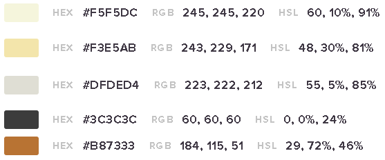

<h2>Universidad Peruana de Ciencias Aplicadas</h2>

<h2>Informe del Trabajo Final</h2>

<h3>Curso: Desarrollo de Aplicaciones Open Source</h3>
<h3>Carrera: Ingeniería de Software </h3>
<h3>Sección: SW56</h3>
<h3>Profesor: Efraín Ricardo Bautista Ubillús</h3>

<strong>Startup:</strong> XXXXXXX

<strong>Producto:</strong> XXXXXXX

<h3>Integrantes:</h3>

<ul>
  <li>Iparraguirre Rueda, Cristian Luis (u202113111)</li>
  <li>Fernández Remón Roy (U20221B778)</li>
  <li>Rioja Nuñez, Franco Diego (u202221597)</li>
  <li>Burga Loarte, Anaely (u202118264)</li>
  <li>La Torre Valle, Franz Jair (u202012378)</li>
</ul>

**<h3>Septiembre, 2024</h3>**

# Registro de Versiones del Informe

| Versión | Fecha | Autor                                                                                                     | Descripción de modificación |
|--------------|--------------|-----------------------------------------------------------------------------------------------------------|--------------|
| TB1           | 04/09/2024      | - Iparraguirre Rueda, Cristian Luis - Rioja Nuñez, Franco Diego - Fenández Remón Roy - XXXXXXX - La Torre Valle, Franz Jair | Implementación del capítulo 1 al 5      |

# Project Report Collaboration Insights

# Contenido
- [Registro de Versiones del Informe](#registro-de-versiones-del-informe)
- [Project Report Collaboration Insights](#project-report-collaboration-insights)
- [Contenido](#contenido)
- [Student Outcome](#student-outcome)
- [Capítulo I: Introducción](#capítulo-i-introducción)
  - [1.1. Startup Profile](#11-startup-profile)
    - [1.1.1. Descripción de la Startup](#111-descripción-de-la-startup)
    - [1.1.2. Perfiles de integrantes del equipo](#112-perfiles-de-integrantes-del-equipo)
  - [1.2. Solution Profile](#12-solution-profile)
    - [1.2.1. Antecedentes y problemática](#121-antecedentes-y-problemática)
    - [1.2.2. Lean UX Process](#122-lean-ux-process)
      - [1.2.2.1. Lean UX Problem Statements](#1221-lean-ux-problem-statements)
      - [1.2.2.2. Lean UX Assumptions](#1222-lean-ux-assumptions)
      - [1.2.2.3. Lean UX Hypothesis Statements](#1223-lean-ux-hypothesis-statements)
      - [1.2.2.4. Lean UX Canvas](#1224-lean-ux-canvas)
  - [1.3. Segmentos objetivo](#13-segmentos-objetivo)
- [Capítulo II: Requirements Elicitation \& Analysis](#capítulo-ii-requirements-elicitation--analysis)
  - [2.1. Competidores](#21-competidores)
    - [2.1.1. Análisis competitivo](#211-análisis-competitivo)
    - [2.1.2. Estrategias y tácticas frente a competidores](#212-estrategias-y-tácticas-frente-a-competidores)
  - [2.2. Entrevistas](#22-entrevistas)
    - [2.2.1. Diseño de entrevistas](#221-diseño-de-entrevistas)
    - [2.2.2. Registro de entrevistas](#222-registro-de-entrevistas)
    - [2.2.3. Análisis de entrevistas](#223-análisis-de-entrevistas)
  - [2.3. Needfinding](#23-needfinding)
    - [2.3.1. User Personas](#231-user-personas)
    - [2.3.2. User Task Matrix](#232-user-task-matrix)
    - [2.3.3. User Journey Mapping](#233-user-journey-mapping)
    - [2.3.4. Empathy Mapping](#234-empathy-mapping)
    - [2.3.5. As-is Scenario Mapping](#235-as-is-scenario-mapping)
  - [2.4. Ubiquitous Language](#24-ubiquitous-language)
- [Capítulo III: Requirements Specification](#capítulo-iii-requirements-specification)
  - [3.1. To-Be Scenario Mapping](#31-to-be-scenario-mapping)
      - [Segmento: Lectores](#segmento-lectores)
      - [Segmento: Autores](#segmento-autores)
  - [3.2. User Stories](#32-user-stories)
  - [3.3. Impact Mapping](#33-impact-mapping)
  - [3.4. Product Backlog](#34-product-backlog)
- [Product Backlog](#product-backlog)
- [Capítulo IV: Product Design](#capítulo-iv-product-design)
  - [4.1. Style Guidelines](#41-style-guidelines)
    - [4.1.1. General Style Guidelines](#411-general-style-guidelines)
    - [4.1.2. Web Style Guidelines](#412-web-style-guidelines)
  - [4.2. Information Architecture](#42-information-architecture)
    - [4.2.1. Organization Systems](#421-organization-systems)
    - [4.2.2. Labeling Systems](#422-labeling-systems)
    - [4.2.3. SEO Tags and Meta Tags](#423-seo-tags-and-meta-tags)
    - [4.2.4. Searching Systems](#424-searching-systems)
    - [4.2.5. Navigation Systems](#425-navigation-systems)
  - [4.3. Landing Page UI Design](#43-landing-page-ui-design)
    - [4.3.1. Landing Page Wireframe](#431-landing-page-wireframe)
    - [4.3.2. Landing Page Mock-up](#432-landing-page-mock-up)
  - [4.4. Web Applications UX/UI Design](#44-web-applications-uxui-design)
    - [4.4.1. Web Applications Wireframes](#441-web-applications-wireframes)
    - [4.4.2. Web Applications Wireflow Diagrams](#442-web-applications-wireflow-diagrams)
    - [4.4.2. Web Applications Mock-ups](#442-web-applications-mock-ups)
    - [4.4.3. Web Applications User Flow Diagrams](#443-web-applications-user-flow-diagrams)
  - [4.5. Web Applications Prototyping](#45-web-applications-prototyping)
  - [4.6. Domain-Driven Software Architecture](#46-domain-driven-software-architecture)
    - [4.6.1. Software Architecture Context Diagram](#461-software-architecture-context-diagram)
    - [4.6.2. Software Architecture Container Diagrams](#462-software-architecture-container-diagrams)
    - [4.6.3. Software Architecture Components Diagrams](#463-software-architecture-components-diagrams)
  - [4.7. Software Object-Oriented Design](#47-software-object-oriented-design)
    - [4.7.1. Class Diagrams](#471-class-diagrams)
    - [4.7.2. Class Dictionary](#472-class-dictionary)
  - [4.8. Database Design](#48-database-design)
    - [4.8.1. Database Diagram](#481-database-diagram)
- [Capítulo V: Product Implementation, Validation \& Deployment](#capítulo-v-product-implementation-validation--deployment)
  - [5.1. Software Configuration Management](#51-software-configuration-management)
    - [5.1.1. Software Development Environment Configuration](#511-software-development-environment-configuration)
    - [5.1.2. Source Code Management](#512-source-code-management)
    - [5.1.3. Source Code Style Guide \& Conventions](#513-source-code-style-guide--conventions)
    - [5.1.4. Software Deployment Configuration](#514-software-deployment-configuration)
  - [5.2. Landing Page, Services \& Applications Implementation](#52-landing-page-services--applications-implementation)
    - [5.2.X. Sprint n](#52x-sprint-n)
      - [5.2.X.1. Sprint Planning n](#52x1-sprint-planning-n)
      - [5.2.X.2. Sprint Backlog n](#52x2-sprint-backlog-n)
      - [5.2.X.3. Development Evidence for Sprint Review](#52x3-development-evidence-for-sprint-review)
      - [5.2.X.4. Testing Suite Evidence for Sprint Review](#52x4-testing-suite-evidence-for-sprint-review)
      - [5.2.X.5. Execution Evidence for Sprint Review](#52x5-execution-evidence-for-sprint-review)
      - [5.2.X.6. Services Documentation Evidence for Sprint Review](#52x6-services-documentation-evidence-for-sprint-review)
      - [5.2.X.7. Software Deployment Evidence for Sprint Review](#52x7-software-deployment-evidence-for-sprint-review)
      - [5.2.X.8. Team Collaboration Insights during Sprint](#52x8-team-collaboration-insights-during-sprint)
  - [5.3. Validation Interviews](#53-validation-interviews)
    - [5.3.1. Diseño de Entrevistas](#531-diseño-de-entrevistas)
    - [5.3.2. Registro de Entrevistas](#532-registro-de-entrevistas)
    - [5.3.3. Evaluaciones según heurísticas](#533-evaluaciones-según-heurísticas)
  - [5.4. Video About-the-Product](#54-video-about-the-product)
- [Conclusiones](#conclusiones)
  - [Conclusiones y recomendaciones](#conclusiones-y-recomendaciones)
  - [Video About-the-Team](#video-about-the-team)
- [Bibliografía](#bibliografía)
- [Anexos](#anexos)

# Student Outcome
| Criterio Específico | Acciones realizadas | Conclusiones |
|---------|---------|---------|
| Comunica oralmente sus ideas y/o resultados con objetividad a público de diferentes especialidades y niveles jerárquicos, en el marco del desarrollo de un proyecto en ingeniería. | **TB1**   *Nombre integrante*   - XXXXXXX  *Nombre integrante*   - XXXXXXX  *Nombre integrante*   - XXXXXXX   *Nombre integrante*   - XXXXXXX  *Nombre integrante*   - XXXXXXX   | XXXXXXX |
| Comunica en forma escrita ideas y/o resultados con objetividad a público de diferentes especialidades y niveles jerárquicos, en el marco del desarrollo de un proyecto en ingeniería. | **TB1**   *Nombre integrante*   - XXXXXXX  *Nombre integrante*   - XXXXXXX  *Nombre integrante*   - XXXXXXX  *Nombre integrante*   - XXXXXXX  *Nombre integrante*   - XXXXXXX   | XXXXXXX |

# Capítulo I: Introducción
## 1.1. Startup Profile
### 1.1.1. Descripción de la Startup

Feather Book es una startup innovadora que busca transformar la forma en que las personas disfrutan la lectura mediante el uso de tecnología avanzada. Nos especializamos en crear un entorno dinámico que 	conecta a autores y lectores, ofreciendo una experiencia de lectura más inmersiva y accesible. A través de herramientas como recomendaciones personalizadas, foros de libros y eventos exclusivos con 		autores. Nuestra plataforma ofrece una extensa variedad de libros electrónicos, audiolibros y contenido exclusivo disponible tanto en nuestra tienda como a través de nuestra suscripción premium. Con el lanzamiento de Feather Book, nuestra propuesta estrella, prometemos llevar la lectura digital a otro nivel, todo mientras garantizamos la máxima seguridad y privacidad para nuestros usuarios. Con Feather 	Book, leer nunca ha sido tan atractivo ni tan interactivo. 

<ul>
        <li>
            <b>Misión:</b>
        </li>
        En Feather Book, nuestra misión es inspirar y enriquecer la vida de las personas mediante la lectura. Nos esforzamos por ofrecer un acceso fácil y conveniente a una extensa variedad de contenidos 		literarios, al tiempo que apoyamos a autores emergentes y fomentamos su visibilidad. Nuestro objetivo es conectar a los lectores con experiencias significativas que fortalezcan y profundicen su amor por 	los libros, creando un espacio donde la pasión por la lectura pueda florecer y expandirse.
        <li>
            <b>Visión:</b>
        </li>
        Aspiramos a ser la plataforma líder en lectura digital, ofreciendo acceso a contenido literario de alta calidad. Queremos ser el destino preferido de los lectores para descubrir, compartir y disfrutar 	historias que los transporten a nuevos mundos.
</ul>

### 1.1.2. Perfiles de integrantes del equipo
<TABLE BORDER>
	<TR>
		<TH><h2>Intregantes</h2></TH> 
		<TH><h2>Descripción</h2></TH>
		<TH><h2>Conocimientos</h2></TH>
	</TR>
  <TR>
		<td style="text-align: center" align="center">
 Cristian Luis Iparraguirre Rueda - U202113111   
</td> 
		<td style="text-align: center" align="center">Soy una persona con habilidades de aprendizaje rápido, lo que me permite optimizar tanto mi trabajo individual como en equipo para alcanzar los objetivos establecidos. Tengo experiencia trabajando en equipo, contribuyendo con ideas creativas y soluciones prácticas. Me apasiona aprender sobre nuevas tecnologías y mantengo una actitud perseverante en el desarrollo de cualquier proyecto.</td>
		<td style="text-align: center" align="center">Tengo conocimientos sólidos en C++, Java, Python, SQL y NoSQL, así como en el desarrollo web con HTML, CSS y JavaScript. Mi enfoque está en la resolución de problemas a través de la programación y en el manejo de bases de datos. Disfruto aprendiendo y explorando nuevas tecnologías, lo que me permite optimizar mis proyectos para que se completen de manera innovadora y efectiva.</td>
	</TR>
	<TR>
		<td style="text-align: center" align="center">
 Franco Diego Rioja Nuñez - U202221597  
</td>
		<td style="text-align: center" align="center">XXXXXXX</td>
		<td style="text-align: center" align="center">XXXXXXX</td>
	</TR>
  	<TR>
		<td style="text-align: center" align="center">
 XXXXXXX - XXXXXXX  
</td> 
		<td style="text-align: center" align="center">XXXXXXX</td>
		<td style="text-align: center" align="center">XXXXXXX</td>
	</TR>
    <TR>
		<td style="text-align: center" align="center">
 XXXXXXX - XXXXXXX  
</td> 
		<td style="text-align: center" align="center">XXXXXXX</td>
		<td style="text-align: center" align="center">XXXXXXX</td>
	</TR>
    <TR>
		<td style="text-align: center" align="center">
 XXXXXXX - XXXXXXX  
</td> 
		<td style="text-align: center" align="center">XXXXXXX</td>
		<td style="text-align: center" align="center">XXXXXXX</td>
	</TR>
</TABLE>

## 1.2. Solution Profile
### 1.2.1. Antecedentes y problemática

    Según el INEI, el 91.3 % de las personas mayores de 6 años acceden a internet a través de un celular, el medio más utilizado para la lectura (82.7 %), seguido por periódicos (63.4 %), libros (47.3 %) y revistas (22.5 %) (Ministerio de Cultura, 2022). La Encuesta Nacional de Lectura (ENL) de 2022 revela que el 47.3 % de los ciudadanos leyó al menos un libro en el último año, mayormente en su casa (90 %), en el trabajo (30.3 %) o en transporte público (12.8 %). En promedio, los adultos leen 1.9 libros al año, de los cuales el 31.1 % son textos académicos y el 68.5 % son de interés personal.

Morales y Ramírez (2023) señalan que la falta de interés en la lectura se debe principalmente a la falta de tiempo y desinterés. En cuanto a los medios físicos, el 80 % de la población menciona desinterés, y solo el 7.4 % lo atribuye a razones económicas. En medios digitales, el 60 % indica falta de interés y el 30 % nunca ha utilizado plataformas virtuales, mientras que el 68.3 % menciona que no lee por falta de tiempo.
    <ul>
        <li>
            Who (Quién): La problemática involucra a las personas que día a día presentan inconvenientes, excusas o un total desinterés por la lectura voluntaria.
        </li>
        <li>
            What (Qué): El desafío es crear una plataforma digital que conecte de manera directa y efectiva a los usuarios con bibliotecas en línea, para poder leer lo que les sea conveniente.
        </li>
        <li>
            Where (Dónde): La problemática es relevante a nivel mundial, pero el proceso inicial de prueba e implementación se realizará en la ciudad de Lima, Perú. 
        </li>
        <li>
            When (Cuándo): La necesidad de una solución más eficaz para el acceso a medios de lectura se ha visto incrementado con la llegada de la pandemia y ante el alto nivel de analfabetismo en nuestro país.
        </li>
        <li>
            Why (Por qué): Se aborda esta problemática para facilitar el acceso a la información, mejorar la educación en el país y fomentar la lectura en todo el país
        </li>
        <li>
            How (Cómo): La solución implica el desarrollo de una plataforma de lectura, en que los usuarios vean fomentados sus hábitos de lectura mediante el uso de tecnologías que facilitan el acceso, la distribución 
            y la creación de contenidos. Para garantizar su sostenibilidad a largo plazo, se han establecido estrategias clave, como una suscripción premium que brindará a los usuarios acceso a contenido exclusivo, 
            funciones avanzadas y una experiencia sin publicidad. 
        </li>
        <li>
            How Much (Cuánto): La solución afecta tanto de manera individual como de manera colectiva. Además, se establecerán acuerdos con editores y autores para ofrecer una amplia variedad de títulos a precios competitivos.
            Los ingresos generados por las ventas en la tienda contribuirán significativamente a la sostenibilidad financiera de la aplicación.
        </li>
    </ul>

### 1.2.2. Lean UX Process
#### 1.2.2.1. Lean UX Problem Statements

	<ul>
		<li>
			A pesar del notable aumento en la popularidad de la lectura digital y la disponibilidad sin precedentes de una amplia diversidad de contenido, aún persisten numerosos obstáculos que dificultan que los lectores se comprometan con hábitos de lectura regulares y gratificantes. ¿Cómo podemos superar los desafíos que enfrentan los lectores en la era digital para fomentar hábitos de lectura consistentes y satisfactorios, aprovechando las ventajas de la tecnología y ofreciendo experiencias de lectura más atractivas y personalizadas?
		</li>
		<li>
			A pesar de la abundancia de opciones disponibles en el ámbito de la lectura digital, es común que muchos lectores experimenten una profunda frustración debido a la ausencia de interacción y comunidad que enriquezca su experiencia de lectura. ¿Cómo podemos mejorar la interacción y construir comunidad en la experiencia de lectura digital para satisfacer las necesidades de los lectores?
		</li>
		<li>
			A pesar del deseo de muchos lectores de interactuar directamente con sus autores favoritos, actualmente existe una brecha en la comunicación entre autores y lectores en el mundo digital. ¿Cómo podemos facilitar una conexión más significativa y directa entre autores y lectores a través de nuestra plataforma, ofreciendo funciones como sesiones de preguntas y respuestas en línea, eventos exclusivos y la posibilidad de enviar comentarios y preguntas directamente a los autores?
		</li>
		<li>
			Notamos que existen numerosas opciones de lectura digital disponibles, muchos lectores encuentran frustrante la falta de interacción y comunidad en torno a su experiencia de lectura. ¿Cómo podemos mejorar la participación y el compromiso de los lectores mediante la creación de una plataforma que facilite la formación de clubes de lectura virtuales, eventos con autores y discusiones en línea, todo mientras garantizamos la seguridad y privacidad de los usuarios?
		</li>
	</ul>

#### 1.2.2.2. Lean UX Assumptions
<b>Business Assumptions:</b>

    <ul>
        <li>
            Existe una necesidad en el mercado para una plataforma que fomente y motive los hábitos de lectura entre la población, lo que respalda la demanda de una plataforma como Feather Book.
        </li>
        <li>
            Los autores y lectores están dispuestos y son capaces de participar activamente en la plataforma, contribuyendo con contenido, colaboración y retroalimentación para enriquecer la experiencia de lectura.
        </li>
        <li>
            Nuestros usuarios estarán dispuestos a pagar por una suscripción premium que les brinde acceso a contenido exclusivo y funciones avanzadas, lo que generará ingresos recurrentes y fomentará la lealtad de los usuarios.
        </li>
        <li>
            La plataforma será capaz de operar con éxito a través de una combinación de recursos humanos y tecnológicos.
        </li>
        <li>
            Los usuarios estarán dispuestos a comprar libros electrónicos, audiolibros y otros productos relacionados con la lectura a través de la tienda integrada de Feather Book, lo que contribuirá significativamente a la sostenibilidad financiera de la aplicación.
        </li>
        <li>
            Los usuarios valoran altamente la seguridad y privacidad de sus datos personales, es por lo que la implementación de medidas robustas de seguridad en la aplicación garantizará la confianza y satisfacción de los usuarios.
        </li>
        <li>
            Feather Book respetará la originalidad y legalidad de los trabajos ofrecidos. Esto implica garantizar que todos los contenidos sean legales y no infrinjan derechos de autor, así como también fomentar la creación de contenido original y respetar los derechos de propiedad intelectual de autores y editores.
        </li>
        <li>
            El modelo de negocio incluye ingresos provenientes de suscripciones premium y ventas en la tienda integrada, es viable y sostenible a largo plazo, a su vez permitirá el crecimiento y mantenimiento de la plataforma.
        </li>
        <li>
            Nuestra competencia principal en el mercado son otras plataformas y aplicativos existentes que brindan servicios similares al nuestro como “Goodreads”, “Scribd” y “Audible”.
        </li>
        <li>
            Nuestro mayor riesgo es el control de la calidad del contenido y la falta de apoyo continuo por parte de autores y lectores.
        </li>
        <li>
            Resolveremos esto estableciendo verificaciones adecuadas de calidad de contenido. Además, se realizarán campañas de marketing, se promoverán algún tipo de reconocimientos y se obtendrán alianzas estratégicas con la industria editorial.
        </li>
    </ul>

 
<b>User Assumptions:</b>

    <ul>
        <li><b>¿Quién es nuestro usuario?</b></li>
        Nuestro usuario principal es un amante de la lectura, que puede variar en edad, género y preferencias de lectura.
        <li><b>¿Dónde encaja mi producto en su trabajo o vida?</b></li>
        Feather Book encaja en la vida de nuestro usuario al proporcionarles una plataforma conveniente y accesible para descubrir, acceder y disfrutar de una amplia gama de contenido de lectura. Puede ser utilizado en su tiempo libre en casa, durante viajes, en pausas en el trabajo, o en cualquier momento en que deseen sumergirse en una buena lectura.
        <li><b>¿Qué problemas tiene nuestro cliente y cómo se puede resolver?</b></li>
        Algunos usuarios pueden experimentar interrupciones en su experiencia de lectura debido a problemas como la falta de sincronización entre dispositivos o la dificultad para encontrar nuevos libros que les interesen. Esto se puede solucionar con la sincronización del progreso de lectura entre dispositivos, recomendaciones personalizadas basadas en intereses de lectura y la capacidad de interactuar con autores y otros lectores, lo que mejora la experiencia de lectura y ayuda a mantener a los usuarios comprometidos y satisfechos.
        <li><b>¿Cuándo y cómo es nuestro producto usado?</b></li>
        Se podrá acceder a nuestra plataforma por medio de la web a cualquier hora del día ofreciendo flexibilidad. Cada uno de los usuarios lo usará en momentos específicos, ya sea mientras viajan en transporte público, durante su tiempo libre en casa, o antes de ir a dormir.
        <li><b>¿Qué características son importantes?</b></li>
        En primer lugar, se debe priorizar la facilidad de uso de la plataforma. Luego, debemos garantizar su correcto funcionamiento para satisfacer a cada uno de los usuarios. Además, se debe enfocar la seguridad en cuanto a la información de usuarios, también se debe considerar su compatibilidad con diferentes sistemas y dispositivos. Finalmente, la plataforma debe ser escalable para manejar una amplia selección de títulos y a manera que crezca se expanda correctamente.
        <li><b>¿Cómo debe verse nuestro producto y cómo debe comportarse?</b></li>
        Nuestro producto debe tener una interfaz limpia y moderna, con un diseño atractivo y fácil de navegar. Además, debe comportarse de manera rápida y fluida evitando largos tiempos de espera. Igualmente, debe contar con medidas de seguridad y privacidad, guardando información de cada usuario.
    </ul>

 
<b>Business Outcomes:</b>

    <ul>
        <li>
            Generar un impacto positivo en hábitos de lectura y creatividad.
        </li>
        <li>
            Colaboraciones exitosas con autores y lectores.
        </li>
        <li>
            Aumento del impacto social y usuarios suscritos.
        </li>
        <li>
            Fortalecimiento de alianzas con la industria editorial.
        </li>
        <li>
            Generar ingresos mediante publicidad y nuestros usuarios premium.
        </li>
        <li>
            Divulgar la plataforma para ser usada como la principal en este rubro.
        </li>
    </ul>

 
<b>User Outcomes & Benefits:</b>

    <ul>
        <li>
            Acceso conveniente a una amplia variedad de contenido de lectura.
        </li>
        <li>
            Ahorro de tiempo y esfuerzo al evitar la necesidad de visitar librerías físicas para comprar libros.
        </li>
        <li>
            Descubrimiento de nuevos títulos y autores.
        </li>
        <li>
            Interacción con la comunidad de lectores y autores.
        </li>
        <li>
            Flexibilidad y portabilidad de momentos y lugares en donde se puede acceder a la plataforma.
        </li>
    </ul>

#### 1.2.2.3. Lean UX Hypothesis Statements

	
**Hipótesis 1:**

Creemos que los lectores necesitan una forma conveniente y atractiva de acceder a una amplia variedad de libros. Sabremos que hemos tenido éxito cuando nuestra aplicación se convierta en parte de su rutina diaria para descubrir y leer libros.

**Hipótesis 2:**

Creemos que los autores necesitan una plataforma que les permita alcanzar a una audiencia más amplia y aumentar las ventas de sus libros. Sabremos que hemos tenido éxito cuando los autores experimenten un aumento en las ventas y visibilidad de sus obras después de utilizar nuestra plataforma.

**Hipótesis 3:**

Creemos que los lectores necesitan una forma conveniente de comprar libros electrónicos y audiolibros. Sabremos que hemos tenido éxito cuando nuestra tienda integrada sea la principal opción para adquirir contenido de lectura digital.

**Hipótesis 4:**

Creemos que la privacidad y seguridad de los datos son fundamentales para los usuarios de Feather Book. Sabremos que hemos tenido éxito cuando implementamos medidas robustas de protección de datos y recibimos comentarios positivos sobre la seguridad de la plataforma.

**Hipótesis 5:**

Creemos que la suscripción premium será atractiva para los usuarios que buscan contenido exclusivo y una experiencia sin publicidad. Sabremos que hemos tenido éxito cuando una proporción significativa de usuarios opten por la suscripción premium.

#### 1.2.2.4. Lean UX Canvas
<table>
  <tr>
    <th>Lean UX Canvas</th>
    <th >Feather Book</th>
    <th>Fecha: 30/03/2004</th>
  </tr>
  <tr>
    <td>1. Problema de Negocio:
La comprensión lectora en el país ha ido en decadencia en los últimos años, afectando a chicos y grandes por igual, ya que los más chicos ven la lectura más como una obligación que una afición. Según el Banco Mundial (2021), en América Latina y el Caribe más del 60% de “niños de 10 años son incapaces de leer y comprender un relato simple”.
</td>
    <td rowspan=2>5. Ideas de Soluciones:
Implementación de un algoritmo que ayude a los usuarios a encontrar lecturas de su interés.
·         Añadir una opción de crear clubes de lectura virtuales para que nuestros usuarios puedan compartir sus gustos con los demás.
·         Diseñar una interfaz de usuario intuitiva y fácil de usar para la aplicación.
·         Establecer un modelo de negocio que incluya asociaciones con bibliotecas y escuelas.</td>
    <td>2. Resultados Comerciales:
Generar ingresos a través de asociaciones con bibliotecas, escuelas, editoriales y autores.
Gracias a las suscripciones se generarán recursos recurrentes, así como la implementación de una tienda virtual donde se podrán comprar libros electrónicos, audiolibros y otros productos relacionados con la lectura.

 </td>
  </tr>
  <tr>
    <td>3. Usuarios y Clientes:
Usuarios: Personas con ganas de fomentar un hábito de lectura o mejorar esos hábitos de lectura. Así como, estudiantes que necesitan lecturas para sus estudios.
Autores que quieran dar una visualización de sus trabajos o quieran llegar a una audiencia más amplia.
Clientes:
Instituciones que desean fomentar hábitos de lectura en sus estudiantes.
</td>
    <td>4. Beneficios del usuario:
·         Recomendación eficaz de lecturas ayudadas por los algoritmos.
·         Confianza en las recomendaciones de lecturas respaldadas por la aplicación.
·         Comodidad y flexibilidad.
·         Descubrimientos de nuevas lecturas y autores desconocidos.
·         Acceso a una amplia variedad de lecturas expandiendo su vocabulario.</td>
  </tr>
  <tr>
    <td>6. Hipótesis:
Creemos que, si nuestro aplicativo establece conexiones con bibliotecas importantes, proporcionaremos libros suficientes para empezar y así atraer a nuestros posibles usuarios de una gran variedad de edades.
</td>
    <td>7. ¿Qué es lo más importante que necesitamos aprender primero?
Lo más importante es establecer asociaciones con bibliotecas y escuelas para tener una cantidad decente de libros reconocidos y entretenidos de leer para todas las edades y así no infringir alguna ley de copyright.

</td>
    <td>8. ¿Cuál es la menor cantidad de trabajo que necesitamos hacer para resolver las dudas y para hacer lo siguiente más importante?
La menor cantidad de trabajo necesaria es definir nuestro problema principal y a qué apuntamos resolver y evaluar si es rentable nuestro modelo de negocio.
</td>
  </tr>
</table>

## 1.3. Segmentos objetivo

	Los segmentos objetivos consisten en un conjunto particular de individuos que comparten rasgos y requerimientos afines, estableciéndolos como un público objetivo atractivo para una compañía o marca.

**Segmento objetivo #1:** Lectores

Aspectos demográficos:
* Sexo: Masculino y femenino
* Edades: Personas entre 18 - 50 años.
* Nivel socioeconómico: Clases A,B y C (Alta, Media Alta y Media)

Aspectos psicográficos:

* Buscan una aplicación eficiente de lectura
* Buscan tener comunicación con otros lectores
* Buscan tener comunicación con autores

**Segmento objetivo #2:** Autores

Aspectos demográficos:

* Sexo: Masculino y femenino
* Edades: Personas entre 25 - 50 años.
* Nivel socioeconómico: Clases A,B y C (Alta, Media Alta y Media)

Aspectos psicográficos:

* Buscan una aplicación para publicar sus libros
* Buscan tener comunicación con otros autores
* Buscan tener comunicación con sus lectores

# Capítulo II: Requirements Elicitation & Analysis
## 2.1. Competidores
### 2.1.1. Análisis competitivo
### 2.1.2. Estrategias y tácticas frente a competidores
## 2.2. Entrevistas
### 2.2.1. Diseño de entrevistas
### 2.2.2. Registro de entrevistas
### 2.2.3. Análisis de entrevistas
## 2.3. Needfinding
### 2.3.1. User Personas
### 2.3.2. User Task Matrix
### 2.3.3. User Journey Mapping
### 2.3.4. Empathy Mapping
### 2.3.5. As-is Scenario Mapping
## 2.4. Ubiquitous Language
# Capítulo III: Requirements Specification
## 3.1. To-Be Scenario Mapping
#### Segmento: Lectores

#### Segmento: Autores

## 3.2. User Stories
<table>
    <thead>
      <tr>
        <th style="text-align: center;" align="center"><h2>User Story ID</h2></th>
        <th style="text-align: center;" align="center"><h2>Título</h2></th>
        <th style="text-align: center;" align="center"><h2>Descripción</h2></th>
        <th style="text-align: center;" align="center"><h2>Criterios de aceptación</h2></th>
        <th style="text-align: center;" align="center"><h2>Relacionado con (Epic ID)</h2></th>
      </tr>
    </thead>
    <tbody>
    <!-- US-01 -->
        <tr>
        <td style="text-align: center;" align="center"><b>US-01</b></td>
        <td style="text-align: center;" align="center">Descubrimiento de libros</td>
        <td align="justify">
          Como lector, quiero descubrir nuevos libros según mis intereses para poder leer contenido relevante y atractivo.
        </td>
        <td align="justify">
          <b>Escenario 1: Recomendaciones basadas en intereses</b>  
          <b>Given</b> que el lector accede a la plataforma, <b>when</b> elige la opción de recomendaciones, <b>then</b> recibe una lista de libros basada en sus intereses y actividad previa.
        </td>
        <td style="text-align: center;" align="center">EP01 - Descubrimiento de contenido</td>
      </tr>
    <!-- US-02 -->
        <tr>
        <td style="text-align: center;" align="center"><b>US-02</b></td>
        <td style="text-align: center;" align="center">Búsqueda avanzada de libros</td>
        <td align="justify">
          Como lector, quiero buscar libros por género, autor y palabras clave, para encontrar contenido que me interese rápidamente.
        </td>
        <td align="justify">
          <b>Escenario 1: Búsqueda con filtros avanzados</b>  
          <b>Given</b> que el lector abre la opción de búsqueda, <b>when</b> ingresa filtros como género, autor o palabras clave, <b>then</b> recibe una lista de libros que coincidan con sus filtros.
        </td>
        <td style="text-align: center;" align="center">EP01 - Descubrimiento de contenido</td>
      </tr>
    <!-- US-03 -->
        <tr>
        <td style="text-align: center;" align="center"><b>US-03</b></td>
        <td style="text-align: center;" align="center">Sincronización de lectura entre dispositivos</td>
        <td align="justify">
          Como lector, quiero que mi progreso de lectura se sincronice automáticamente entre dispositivos para poder continuar leyendo sin perder mi avance.
        </td>
        <td align="justify">
          <b>Escenario 1: Sincronización de progreso entre dispositivos</b>  
          <b>Given</b> que el lector cambia de dispositivo, <b>when</b> accede a la plataforma desde un nuevo dispositivo, <b>then</b> su progreso de lectura debe estar sincronizado automáticamente.
        </td>
        <td style="text-align: center;" align="center">EP02 - Experiencia de lectura</td>
      </tr>
    <!-- US-04 -->
        <tr>
        <td style="text-align: center;" align="center"><b>US-04</b></td>
        <td style="text-align: center;" align="center">Leer sin conexión</td>
        <td align="justify">
          Como lector, quiero poder descargar libros para leer sin conexión a internet, para poder seguir leyendo cuando no tengo acceso a una red.
        </td>
        <td align="justify">
          <b>Escenario 1: Descargar libros para lectura sin conexión</b>  
          <b>Given</b> que el lector selecciona un libro, <b>when</b> elige la opción de descargarlo, <b>then</b> el libro debe estar disponible en su dispositivo sin necesidad de conexión a internet.
        </td>
        <td style="text-align: center;" align="center">EP02 - Experiencia de lectura</td>
      </tr>
    <!-- US-05 -->
        <tr>
        <td style="text-align: center;" align="center"><b>US-05</b></td>
        <td style="text-align: center;" align="center">Ver historial de lecturas</td>
        <td align="justify">
          Como lector, quiero ver mi historial de lecturas para revisar los libros que he leído y encontrar títulos anteriores fácilmente.
        </td>
        <td align="justify">
          <b>Escenario 1: Visualización del historial de lecturas</b>  
          <b>Given</b> que el lector abre su perfil, <b>when</b> selecciona la opción de ver su historial, <b>then</b> se muestra una lista de todos los libros que ha leído en la plataforma.
        </td>
        <td style="text-align: center;" align="center">EP03 - Gestión del perfil</td>
      </tr>
    <!-- US-06 -->
        <tr>
        <td style="text-align: center;" align="center"><b>US-06</b></td>
        <td style="text-align: center;" align="center">Reseñar y calificar libros</td>
        <td align="justify">
          Como lector, quiero dejar reseñas y calificar libros que he leído para compartir mi opinión con otros usuarios.
        </td>
        <td align="justify">
          <b>Escenario 1: Publicación de reseña y calificación</b>  
          <b>Given</b> que el lector termina de leer un libro, <b>when</b> elige la opción de reseñar, <b>then</b> puede escribir su reseña y asignar una calificación que será visible para otros lectores.
        </td>
        <td style="text-align: center;" align="center">EP02 - Experiencia de lectura</td>
      </tr>
    <!-- US-07 -->
        <tr>
        <td style="text-align: center;" align="center"><b>US-07</b></td>
        <td style="text-align: center;" align="center">Unirse a clubes de lectura virtuales</td>
        <td align="justify">
          Como lector, quiero unirme a clubes de lectura virtuales para compartir mis experiencias de lectura con otros lectores.
        </td>
        <td align="justify">
          <b>Escenario 1: Unirse a un club de lectura</b>  
          <b>Given</b> que el lector busca interacción social, <b>when</b> accede a la sección de clubes de lectura, <b>then</b> puede unirse a un club existente o crear uno nuevo.
        </td>
        <td style="text-align: center;" align="center">EP04 - Interacción social</td>
      </tr>
    <!-- US-08 -->
        <tr>
        <td style="text-align: center;" align="center"><b>US-08</b></td>
        <td style="text-align: center;" align="center">Participar en eventos con autores</td>
        <td align="justify">
          Como lector, quiero asistir a eventos en línea con autores para hacer preguntas y conocer más sobre los libros que leo.
        </td>
        <td align="justify">
          <b>Escenario 1: Participación en eventos con autores</b>  
          <b>Given</b> que hay un evento de autor disponible, <b>when</b> el lector se inscribe al evento, <b>then</b> puede participar en sesiones de preguntas y respuestas con el autor.
        </td>
        <td style="text-align: center;" align="center">EP04 - Interacción social</td>
      </tr>
    <!-- US-09 -->
        <tr>
        <td style="text-align: center;" align="center"><b>US-09</b></td>
        <td style="text-align: center;" align="center">Recibir notificaciones personalizadas</td>
        <td align="justify">
          Como lector, quiero recibir notificaciones sobre nuevos lanzamientos y eventos relacionados con mis intereses para estar informado de novedades relevantes.
        </td>
        <td align="justify">
          <b>Escenario 1: Notificaciones basadas en intereses</b>  
          <b>Given</b> que el lector tiene preferencias definidas, <b>when</b> hay una novedad que coincide con sus intereses, <b>then</b> recibe una notificación en la plataforma y por email.
        </td>
        <td style="text-align: center;" align="center">EP03 - Gestión del perfil</td>
      </tr>
    <!-- US-10 -->
        <tr>
        <td style="text-align: center;" align="center"><b>US-10</b></td>
        <td style="text-align: center;" align="center">Guardar libros en lista de deseos</td>
        <td align="justify">
          Como lector, quiero guardar libros en una lista de deseos para comprarlos o leerlos más tarde.
        </td>
        <td align="justify">
          <b>Escenario 1: Guardar libros en lista de deseos</b>  
          <b>Given</b> que el lector ve un libro que le interesa, <b>when</b> selecciona la opción de guardarlo, <b>then</b> el libro queda registrado en su lista de deseos dentro de la plataforma.
        </td>
        <td style="text-align: center;" align="center">EP03 - Gestión del perfil</td>
      </tr>
    <!-- US-11 -->
        <tr>
        <td style="text-align: center;" align="center"><b>US-11</b></td>
        <td style="text-align: center;" align="center">Compartir progreso de lectura</td>
        <td align="justify">
          Como lector, quiero compartir mi progreso de lectura en redes sociales para mostrar a mis amigos qué estoy leyendo.
        </td>
        <td align="justify">
          <b>Escenario 1: Compartir progreso de lectura</b>  
          <b>Given</b> que el lector quiere compartir su progreso, <b>when</b> selecciona la opción de compartir, <b>then</b> puede publicar una actualización en redes sociales con el título y avance.
        </td>
        <td style="text-align: center;" align="center">EP04 - Interacción social</td>
      </tr>
    <!-- US-12 -->
          <tr>
      <td style="text-align: center;" align="center"><b>US-12</b></td>
      <td style="text-align: center;" align="center">Crear perfil de autor</td>
      <td align="justify">Como autor, quiero crear un perfil donde pueda mostrar mi biografía y enlaces a mis redes sociales para conectar con mis lectores.</td>
      <td align="justify">
        <b>Escenario 1: Creación de perfil de autor</b>  
        <b>Given</b> que el autor está registrado en la plataforma, <b>when</b> elige la opción de crear perfil, <b>then</b> puede ingresar su biografía y enlaces a redes sociales que serán visibles para los lectores.
      </td>
      <td style="text-align: center;" align="center">EP01 - Gestión de perfil</td>
    </tr>
    <!-- US-13 -->
    <tr>
      <td style="text-align: center;" align="center"><b>US-13</b></td>
      <td style="text-align: center;" align="center">Subir libros</td>
      <td align="justify">Como autor, quiero subir mis libros a la plataforma para que los lectores puedan comprarlos o leerlos.</td>
      <td align="justify">
        <b>Escenario 1: Subida de libro a la plataforma</b>  
        <b>Given</b> que el autor quiere distribuir su libro, <b>when</b> accede a la opción de subir libro, <b>then</b> puede cargar el archivo del libro y sus metadatos (título, sinopsis, género, etc.).
      </td>
      <td style="text-align: center;" align="center">EP02 - Gestión de publicaciones</td>
    </tr>
    <!-- US-14 -->
    <tr>
      <td style="text-align: center;" align="center"><b>US-14</b></td>
      <td style="text-align: center;" align="center">Gestionar precios y descuentos</td>
      <td align="justify">Como autor, quiero gestionar los precios de mis libros y aplicar descuentos para incentivar a los lectores a comprarlos.</td>
      <td align="justify">
        <b>Escenario 1: Ajustar precio de libros</b>  
        <b>Given</b> que el autor tiene libros en la plataforma, <b>when</b> accede a la opción de gestión de precios, <b>then</b> puede establecer o modificar el precio de sus libros. 
        <b>Escenario 2: Aplicar descuentos</b>  
        <b>Given</b> que el autor quiere aplicar descuentos, <b>when</b> accede a la opción de promociones, <b>then</b> puede configurar descuentos temporales en sus libros.
      </td>
      <td style="text-align: center;" align="center">EP02 - Gestión de publicaciones</td>
    </tr>
    <!-- US-15 -->
    <tr>
      <td style="text-align: center;" align="center"><b>US-15</b></td>
      <td style="text-align: center;" align="center">Ver estadísticas de ventas</td>
      <td align="justify">Como autor, quiero ver estadísticas de ventas de mis libros para analizar el rendimiento de mis publicaciones.</td>
      <td align="justify">
        <b>Escenario 1: Visualización de estadísticas de ventas</b>  
        <b>Given</b> que el autor tiene libros vendidos, <b>when</b> accede a la sección de estadísticas, <b>then</b> puede ver gráficos y datos de ventas, ganancias y tendencias de sus libros.
      </td>
      <td style="text-align: center;" align="center">EP03 - Análisis de rendimiento</td>
    </tr>
    <!-- US-16 -->
    <tr>
      <td style="text-align: center;" align="center"><b>US-16</b></td>
      <td style="text-align: center;" align="center">Interactuar con lectores</td>
      <td align="justify">Como autor, quiero interactuar con mis lectores a través de comentarios y eventos en línea para aumentar mi conexión con la audiencia.</td>
      <td align="justify">
        <b>Escenario 1: Interacción en comentarios</b>  
        <b>Given</b> que el lector comenta en un libro, <b>when</b> el autor revisa el comentario, <b>then</b> puede responder o reaccionar al comentario del lector. 
        <b>Escenario 2: Participar en eventos en línea</b>  
        <b>Given</b> que el autor organiza un evento, <b>when</b> los lectores se registran, <b>then</b> puede interactuar con ellos en sesiones de preguntas y respuestas.
      </td>
      <td style="text-align: center;" align="center">EP04 - Interacción social</td>
    </tr>
    <!-- US-17 -->
    <tr>
      <td style="text-align: center;" align="center"><b>US-17</b></td>
      <td style="text-align: center;" align="center">Promocionar nuevos lanzamientos</td>
      <td align="justify">Como autor, quiero promocionar mis nuevos lanzamientos en la plataforma para que mis seguidores y nuevos lectores se enteren de mis nuevas publicaciones.</td>
      <td align="justify">
        <b>Escenario 1: Promoción de nuevos lanzamientos</b>  
        <b>Given</b> que el autor tiene un nuevo libro disponible, <b>when</b> accede a la opción de promocionar, <b>then</b> la plataforma notifica a los lectores interesados sobre el nuevo lanzamiento.
      </td>
      <td style="text-align: center;" align="center">EP02 - Gestión de publicaciones</td>
    </tr>
    <!-- US-18 -->
    <tr>
      <td style="text-align: center;" align="center"><b>US-18</b></td>
      <td style="text-align: center;" align="center">Configurar versión gratuita</td>
      <td align="justify">Como autor, quiero configurar una versión gratuita limitada de mis libros para que los lectores puedan probar antes de comprar.</td>
      <td align="justify">
        <b>Escenario 1: Configurar acceso a versión gratuita</b>  
        <b>Given</b> que el autor tiene un libro subido, <b>when</b> accede a la opción de versiones gratuitas, <b>then</b> puede configurar un fragmento del libro para ofrecerlo como muestra gratuita a los lectores.
      </td>
      <td style="text-align: center;" align="center">EP02 - Gestión de publicaciones</td>
    </tr>
    <!-- US-19 -->
    <tr>
      <td style="text-align: center;" align="center"><b>US-19</b></td>
      <td style="text-align: center;" align="center">Recibir retroalimentación privada</td>
      <td align="justify">Como autor, quiero recibir retroalimentación privada de mis lectores para mejorar mis libros o procesos creativos sin que sea visible públicamente.</td>
      <td align="justify">
        <b>Escenario 1: Recepción de retroalimentación privada</b>  
        <b>Given</b> que un lector desea dar retroalimentación, <b>when</b> envía un mensaje privado al autor, <b>then</b> el autor recibe un mensaje privado accesible solo para él.
      </td>
      <td style="text-align: center;" align="center">EP04 - Interacción social</td>
    </tr>
    <!-- US-20 -->
    <tr>
      <td style="text-align: center;" align="center"><b>US-20</b></td>
      <td style="text-align: center;" align="center">Participar en entrevistas</td>
      <td align="justify">Como autor, quiero participar en entrevistas y eventos destacados en la plataforma para aumentar mi visibilidad y alcanzar nuevos lectores.</td>
      <td align="justify">
        <b>Escenario 1: Participación en entrevistas y eventos</b>  
        <b>Given</b> que la plataforma organiza una entrevista o evento destacado, <b>when</b> el autor es invitado a participar, <b>then</b> puede interactuar con los lectores y compartir su experiencia creativa, alcanzando a nuevos lectores.
      </td>
      <td style="text-align: center;" align="center">EP04 - Interacción social</td>
    </tr>
    <!-- US-21 -->
    <tr>
      <td style="text-align: center;" align="center"><b>US-21</b></td>
      <td style="text-align: center;" align="center">Generar reportes de regalías</td>
      <td align="justify">Como autor, quiero generar reportes de regalías para tener claridad sobre mis ingresos por ventas de libros en la plataforma.</td>
      <td align="justify">
        <b>Escenario 1: Generación de reportes de regalías</b>  
        <b>Given</b> que el autor tiene ventas en la plataforma, <b>when</b> accede a la opción de reportes de regalías, <b>then</b> puede descargar un reporte detallado de sus ingresos por ventas y pagos pendientes.
      </td>
      <td style="text-align: center;" align="center">EP03 - Análisis de rendimiento</td>
    </tr>
    <!-- US-22 -->
    <tr>
      <td style="text-align: center;" align="center"><b>US-22</b></td>
      <td style="text-align: center;" align="center">Colaborar con otros autores</td>
      <td align="justify">Como autor, quiero colaborar con otros autores en proyectos conjuntos para escribir libros de forma colaborativa o compartir ideas y recursos.</td>
      <td align="justify">
        <b>Escenario 1: Colaboración entre autores</b>  
        <b>Given</b> que el autor busca colaboración, <b>when</b> accede a la sección de colaboración, <b>then</b> puede conectarse con otros autores interesados y trabajar juntos en proyectos o compartir recursos creativos.
      </td>
      <td style="text-align: center;" align="center">EP04 - Interacción social</td>
    </tr>
    </tbody>
</table>

## 3.3. Impact Mapping

## 3.4. Product Backlog
# Product Backlog

| # Orden | User Story Id | Título                           | Descripción                                                                                                         | Story Points (1 / 2 / 3 / 5 / 8) |
|---------|---------------|----------------------------------|---------------------------------------------------------------------------------------------------------------------|---------------------------------|
| 1       | US-01         | Descubrimiento de libros          | Como lector, quiero descubrir nuevos libros según mis intereses para poder leer contenido relevante y atractivo.    | 5                               |
| 2       | US-02         | Búsqueda avanzada de libros       | Como lector, quiero buscar libros por género, autor y palabras clave, para encontrar contenido que me interese rápidamente. | 5                               |
| 3       | US-03         | Sincronización de progreso de lectura | Como lector, quiero que mi progreso de lectura se sincronice automáticamente entre dispositivos para poder continuar leyendo sin perder mi avance. | 8                               |
| 4       | US-04         | Descarga de libros                | Como lector, quiero poder descargar libros para leer sin conexión a internet, para poder seguir leyendo cuando no tengo acceso a una red. | 5                               |
| 5       | US-05         | Historial de lecturas             | Como lector, quiero ver mi historial de lecturas para revisar los libros que he leído y encontrar títulos anteriores fácilmente. | 3                               |
| 6       | US-06         | Reseñas y calificaciones de libros | Como lector, quiero dejar reseñas y calificar libros que he leído para compartir mi opinión con otros usuarios.     | 3                               |
| 7       | US-07         | Clubes de lectura virtuales       | Como lector, quiero unirme a clubes de lectura virtuales para compartir mis experiencias de lectura con otros lectores. | 5                               |
| 8       | US-08         | Eventos en línea con autores      | Como lector, quiero asistir a eventos en línea con autores para hacer preguntas y conocer más sobre los libros que leo. | 5                               |
| 9       | US-09         | Notificaciones de novedades       | Como lector, quiero recibir notificaciones sobre nuevos lanzamientos y eventos relacionados con mis intereses para estar informado de novedades relevantes. | 3                               |
| 10      | US-10         | Lista de deseos                   | Como lector, quiero guardar libros en una lista de deseos para comprarlos o leerlos más tarde.                      | 3                               |
| 11      | US-11         | Compartir progreso en redes sociales | Como lector, quiero compartir mi progreso de lectura en redes sociales para mostrar a mis amigos qué estoy leyendo. | 2                               |
| 12      | US-12         | Perfil de autor                   | Como autor, quiero crear un perfil donde pueda mostrar mi biografía y enlaces a mis redes sociales para conectar con mis lectores. | 5                               |
| 13      | US-13         | Subida de libros                  | Como autor, quiero subir mis libros a la plataforma para que los lectores puedan comprarlos o leerlos.               | 8                               |
| 14      | US-14         | Gestión de precios y descuentos   | Como autor, quiero gestionar los precios de mis libros y aplicar descuentos para incentivar a los lectores a comprarlos. | 5                               |
| 15      | US-15         | Estadísticas de ventas            | Como autor, quiero ver estadísticas de ventas de mis libros para analizar el rendimiento de mis publicaciones.       | 5                               |
| 16      | US-16         | Interacción con lectores          | Como autor, quiero interactuar con mis lectores a través de comentarios y eventos en línea para aumentar mi conexión con la audiencia. | 5                               |
| 17      | US-17         | Promoción de nuevos lanzamientos  | Como autor, quiero promocionar mis nuevos lanzamientos en la plataforma para que mis seguidores y nuevos lectores se enteren de mis nuevas publicaciones. | 5                               |
| 18      | US-18         | Versión gratuita limitada         | Como autor, quiero configurar una versión gratuita limitada de mis libros para que los lectores puedan probar antes de comprar. | 5                               |
| 19      | US-19         | Retroalimentación privada         | Como autor, quiero recibir retroalimentación privada de mis lectores para mejorar mis libros o procesos creativos sin que sea visible públicamente. | 3                               |
| 20      | US-20         | Participación en entrevistas y eventos | Como autor, quiero participar en entrevistas y eventos destacados en la plataforma para aumentar mi visibilidad y alcanzar nuevos lectores. | 5                               |
| 21      | US-21         | Reportes de regalías              | Como autor, quiero generar reportes de regalías para tener claridad sobre mis ingresos por ventas de libros en la plataforma. | 3                               |
| 22      | US-22         | Colaboración en proyectos conjuntos | Como autor, quiero colaborar con otros autores en proyectos conjuntos para escribir libros de forma colaborativa o compartir ideas y recursos. | 5                               |

# Capítulo IV: Product Design
## 4.1. Style Guidelines
### 4.1.1. General Style Guidelines
Para esta sección se seleccionarán los colores y fuentes que se usaremos para elaborar la aplicación web. Elegimos una paleta de colores atractiva, funcional y agradable de leer:

* Colores primarios: Beige, marfil y blanco roto
* Color del texto: Gris oscuro 
* Decoración y botones: Cobre

  

### 4.1.2. Web Style Guidelines

## 4.2. Information Architecture
### 4.2.1. Organization Systems
### 4.2.2. Labeling Systems
### 4.2.3. SEO Tags and Meta Tags
### 4.2.4. Searching Systems
### 4.2.5. Navigation Systems
## 4.3. Landing Page UI Design
### 4.3.1. Landing Page Wireframe
### 4.3.2. Landing Page Mock-up
## 4.4. Web Applications UX/UI Design
### 4.4.1. Web Applications Wireframes
### 4.4.2. Web Applications Wireflow Diagrams
### 4.4.2. Web Applications Mock-ups
### 4.4.3. Web Applications User Flow Diagrams
## 4.5. Web Applications Prototyping
## 4.6. Domain-Driven Software Architecture
### 4.6.1. Software Architecture Context Diagram
### 4.6.2. Software Architecture Container Diagrams
### 4.6.3. Software Architecture Components Diagrams
## 4.7. Software Object-Oriented Design
### 4.7.1. Class Diagrams
### 4.7.2. Class Dictionary
## 4.8. Database Design
### 4.8.1. Database Diagram
# Capítulo V: Product Implementation, Validation & Deployment
## 5.1. Software Configuration Management
### 5.1.1. Software Development Environment Configuration
En esta sección menionaremos los distintos productos de software que utilizó nuestro equipo de desarrollo para poder llevar acabo las actividades relacionadas con la elaboración de nuestro proyecto.

**Project Management**

Google Meet (https://meet.google.com/): Google Meet es una plataforma de videoconferencias desarrollada por Google que permite realizar a los usuarios reuniones a distancia. Esta herramienta nos facilita la comunicación entre los integrantes para poder desarrollar nuestro proyecto.

**Requirements Managements**

Trello (https://trello.com/): Es un software diseñado para la gestión de proyectos que facilita el poder asignar y organizar las tareas que se tienen que realizar. Fue utilizado para poder desarrollar el Product Backlog.

**Product UX/UI Design**

UXPressia (https://uxpressia.com/): Es una herramienta en línea que permite a los equipos de trabajo el poder identificar y comprender los problemas, necesidades y comportamientos de los usuarios en relación a la solución de software que se está desarrollando mediante el uso de plantillas. Se utilizó esta herramienta para la elaboración de las User Persons, Empathy Maps, Journey Maps e Impact Maps.

Figma (https://www.figma.com/): Figma es una herramienta de edición en línea donde se pueden diseñar y hacer prototipos de páginas web en tiempo real. En nuestro proyecto se utilizó para la realización de los wireframes, mock-ups y los desktop and mobile application prototype del proyecto.

Miro (https://miro.com/): Miro es una plataforma colaborativa online en el cual permite poder crear y usar pizarras digitales personalizadas en tiempo real con los miembros de nuestro equipo de trabajo. Miro cuenta con diferentes herramientas para la elaboración de mapeos, diagramas, flujos de trabajo, etc. Se utilizó para la realización de los As-Is y Tob-Be Scenario Maps.

**Software Development**

Landing Page: Para la creación de nuestra landing page se utilizaron las tecnologías base para el desarrollo web las cuales son: HTML5, CSS3 y JavaScript.

GitHub (https://github.com/): Es una plataforma en línea donde se pueden alojar múltiples proyectos mediante repositorios. Estos utilizan un sistema de control de versiones llamado Git. GitHub nos permite trabajar de manera colaborativa teniendo un seguimiento detallado de los avances en el proyecto.

Git (https://git-scm.com/): Se trata de un softwarepara el control de versiones el cual se instala de manera local y nos permite tener un historial de cambios que realiza cada integrante del grupo en el proyecto, esto lo hace mediante commits. También es utilizado para poder trabajar de manera colaborativa en repositorios que se encuentren subidos en GitHub.

WebStorm: Este es un entorno de desarrollo, el cual nos permite trabajar con HTML, CSS, Javascript y con múltiples frameworks como por ejemplo Angular.

**Software Deployment**

Netlify (https://www.netlify.com/): Es una plataforma que se encarga del despliegue de páginas y aplicaciones web integrandose mediante repositorios en Git. Se utilizó para poder hospedar la landing page del proyecto.

**Software Documentation**

Vertabelo (https://vertabelo.com/): Es una herramienta online que facilita a los usuarios a poder realizar diseños, creaciones y gestión de bases de datos de manera colaborativa. Se utilizó para el diseño de la base de datos del proyecto.

LucidChart (https://lucid.app/): Es una plataforma online que cuenta con múltiples opciones que nos permiten la creación de diagramas de clases, mapas mentales, flujos y más mediante el uso de plantillas y tableros que nos ofrece esta herramienta con edición en tiempo real. Fue utilizado para el desarrollo del diagrama de clases UML, así como los Wireflows y User Flows.

Structurizr (https://www.structurizr.com/): Es una plataforma que permite el modelado de diagramas de arquitectura de software mediante código. Structurizr fue utilizado para crear el modelo C4 de nuestro proyecto.

**Software Testing**

GitHub Pages (https://pages.github.com/): Es un servicio que ofrece GitHub que nos permite el poder publicar un sitio web a partir de un repositorio, cabe destacar que solo nos permitirá alojar sitios web estáticos con archivos HTML, CSS y JavaScript.

Markdown: Es un lenguaje de marcado ligero el cual nos permite documentar diversos proyectos. En cuanto a nuestro equipo, utilizamos este lenguaje para poder redactar el informe de nuestro proyecto y en los archivos README en el repositorio de la organización.

### 5.1.2. Source Code Management
En este apartado se detallará los medios que se usaron para hacer el seguimiento de las modificaciones, así como la semántica y la nomenclatura que se utilizará para la realización de los commits. Para el sistema de control de versiones del informe, landing page, web service y front-end se utilizó Git, el cual se encuentra alojado en GitHub.
- Url de la organizacion: https://github.com/UPC-pre-SI729-2402-SW56-Grupo1/Report

**Semantic Versioning**

La Semantic Versioning es un conjunto de reglas que nos permitirá poder gestionar correctamente la numeración de versiones en nuestro proyecto. La versión principal se incrementará cuando los cambios agregados no sean compatibles con las versiones anteriores.

|release-1.0.5|
|---|
|release-2.1.3|
|release-2.2.1|

**Conventional commits**

Para nuestro proyecto se utilizará el estándar de commits convencionales para que podamos mantener un historial de cambios limpio y ordenado. Los commits se dividirán en los siguientes tipos:
- **feat**: Se utilizará para las nuevas funcionalidades.
- **fix**: Se utilizará para la corrección de errores.
- **chore**: Se utilizará para los cambios en el código que no afecten la funcionalidad.
- **refactor**: Se utilizará para los cambios en el código que no afecten la funcionalidad.

### 5.1.3. Source Code Style Guide & Conventions
Para poder desarrollar nuestro proyecto, hemos requerido de algunas nomenclaturas, referencias y lenguajes para su solución.

Tecnologias: Utilizaremos las tecnologías HTML5, CSS3 y JavaScript para el desarrollo de nuestra la landing page.

- **HTML:** Para el lenguaje HTML, Hemos planteado utilizar las convenciones que se encuentran descritas en la guía “HTML Style Guide and Coding Conventions”
  - Usar los nombres de los elementos en minúsculas.
  - Cerrar todos los elementos HTML.
  - Usar los nombres de los atributos en minúsculas.
  - Usar atributos en imágenes.
  - Evitar las líneas de código demasiado largas.
  - Usar una sintaxis simple para los enlaces, para las hojas de estilo y para poder cargar script externos.

- **CSS:** Para el lenguaje CSS, hemos utilizado las siguientes prácticas para poder alcanzar un código coherente, sostenible y ordenado
  
  - Utilizar las minúsculas y los guiones para los nombres de propiedades.
  - Utilizar un espacio después de los dos puntos y un punto y coma para poder separar pares de propiedad-valor.
  - Agrupar las reglas de CSS relacionadas y separarlas con una línea en blanco.
  - Utilizar los nombres de las clases que sean descriptivas y reflejen el propósito del elemento.
  - Separar los nombres de las clases y su ID con un guión.

**Convenciones de idioma:** Se hizo el uso del idioma inglés para poder elaborar nuestro código, esto incluye la parte de la landing page.

**Conventional commits**

Para nuestro proyecto, se utilizó este estándar para poder garantizar una fácil comprensión de nuestros registros. Por lo tanto, nos hemos decidido por la siguiente estructura: 
`
<Type>[Scope opcional]:<Descripcion>`

- Type: Indica el tipo de commit que se realizó por un miembro del equipo.
- Scope: Define el alcance que tenga el commit.
- Descripción: Hace una descripción breve del cambio realizado por algún integrante.

### 5.1.4. Software Deployment Configuration
## 5.2. Landing Page, Services & Applications Implementation
### 5.2.X. Sprint n
#### 5.2.X.1. Sprint Planning n
#### 5.2.X.2. Sprint Backlog n
#### 5.2.X.3. Development Evidence for Sprint Review
#### 5.2.X.4. Testing Suite Evidence for Sprint Review
#### 5.2.X.5. Execution Evidence for Sprint Review
#### 5.2.X.6. Services Documentation Evidence for Sprint Review
#### 5.2.X.7. Software Deployment Evidence for Sprint Review
#### 5.2.X.8. Team Collaboration Insights during Sprint
## 5.3. Validation Interviews
### 5.3.1. Diseño de Entrevistas
### 5.3.2. Registro de Entrevistas
### 5.3.3. Evaluaciones según heurísticas
## 5.4. Video About-the-Product
# Conclusiones
## Conclusiones y recomendaciones
## Video About-the-Team
# Bibliografía
# Anexos
